# 在CGI中精通3D光線的秘訣與技巧

瞭解3D光線以及如何建立不同的光線條件，以完全改變電腦產生的場景以及物件在場景中的外觀。

我們透過感官感知周圍世界：我們聽到、感覺、嗅覺、看到。 我們可以看見，因為我們的眼睛正在擷取由稱為光子的基本粒子帶給我們的資訊。 這些資訊由大腦處理以產生影像。 我們解釋為物件顏色、光澤、半透明或金屬品質都是光子與物件表面之間互動的產物。

電腦產生的3D場景中的光力學遵循相同的光子散射自然原理，透過稱為光線追蹤的過程。 光線會跳出形狀，並與它們的材質互動，有效地定義物件在最終影像中的顯示方式。 光源會顯示3D場景中任何內容的尺寸。

有些材質較其他材質對光線條件更為敏感。 以金屬為例：chrome物件基本上反映了周圍的一切。 如果光線移動、變亮或變大，所有資訊都會以鏡面般的細節直接顯示在鉻表面上，因此在不同的光線狀況下，其外觀會完全不同。

發出的霓虹LED

## 如何使用3D光源來建立有效的3D彩現

建立3D轉譯器的程式絕非完全相同，但這些是最常見的步驟：

1. 物件建立或贏取
1. 場景元件
1. 設定場景框架
1. **照明**
1. 原物料建立或指定
1. 色彩演算

當您進入光源階段時，最好先設定光源再使用材料。 要執行此操作，可以為整個場景指定中性灰色、霧面材質。 如此一來，您就能更清楚的看到並瞭解光源如何影響場景中的物件剪影。 材質完成後，光線可能需要進一步調整。

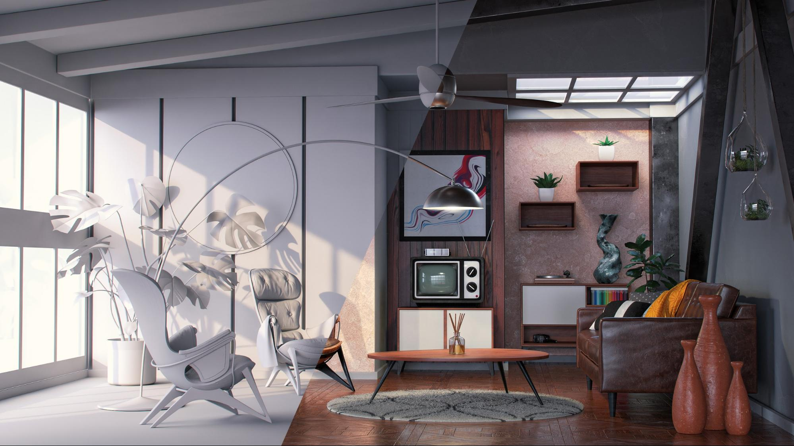

您最好一次操作一個指示燈。 作用中光源應該是場景中唯一可見的光，而所有其他光源應該暫時關閉。 如此一來，您就可以看到特定光線如何影響場景，並透過處理其屬性（例如位置、方向、強度等）來變更該效果。

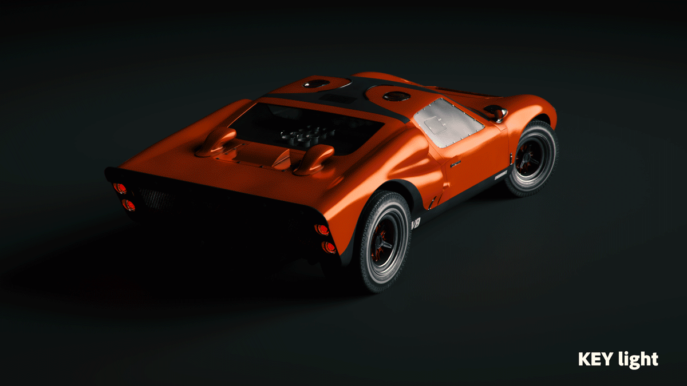

另一個有用的技巧是使用閃亮的金屬材料（鉻或鏡子）來建立球面。 這個「鏡球」會有效反射其周圍的整個場景，因此您可以輕鬆判斷光源的位置、方向或大小。 在環境光線的情況下，您可在鏡球中看到其反射，這有助於設定其在空間中的定向。

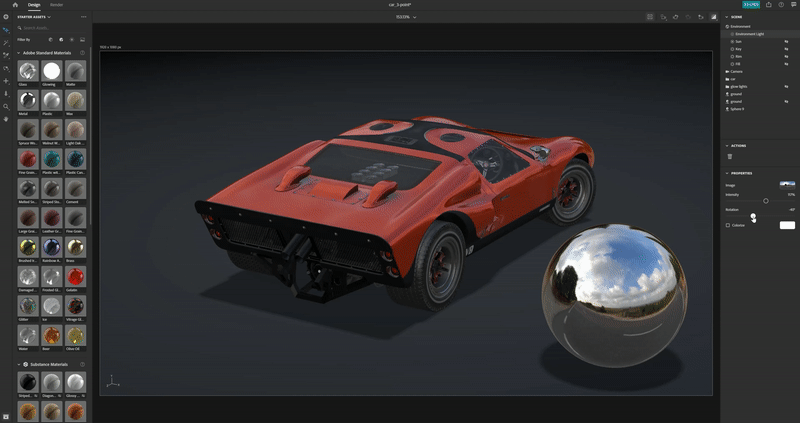

## Adobe [!DNL Dimension]中的光源型別

### 環境燈

環境光是等矩形（球狀）影像，會環繞在整個場景周圍。 顧名思義，這些光用來模擬整個環境，包括儲存在其中的光源。

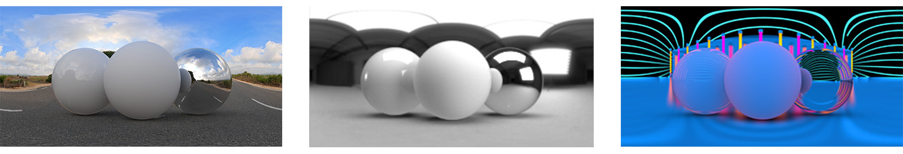

當您在[[!DNL Dimension]](https://www.adobe.com/products/dimension.html)中建立新場景時，將會為您建立預設的環境光。 這就是您能夠立即實際看到場景中任何內容的原因。 Adobe [!DNL Dimension] Starter Assets包含特定數量的環境指示燈，您可以立即試用。 此外，[Adobe [!DNL Stock]](https://stock.adobe.com/search?filters[content_type：3d]=1&filters[3d_type_id][0]=2&load_type=3d+lp)提供大量精選的環境光。

環境燈光會產生非常逼真的效果，可以節省您許多時間。 為了以手動方式達到類似效果，您必須實際在3D中建立整個環境（包括各種光源），這是相當大量的工作。

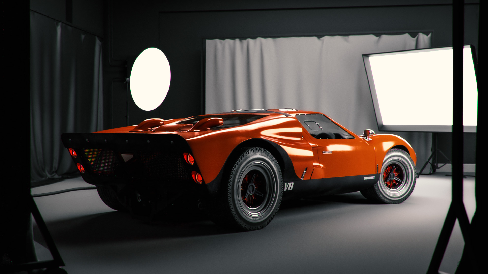

有許多方式可建立環境光，包括從3D場景擷取、從像片擷取以及使用引數系統。 如果環境光是從3D場景中製作的，則程式簡單明瞭。 輸出影像必須是32位元，才能擷取場景中所有光源的光線資訊。 3D相機需要使用等矩形投影（以輸出球面影像）。

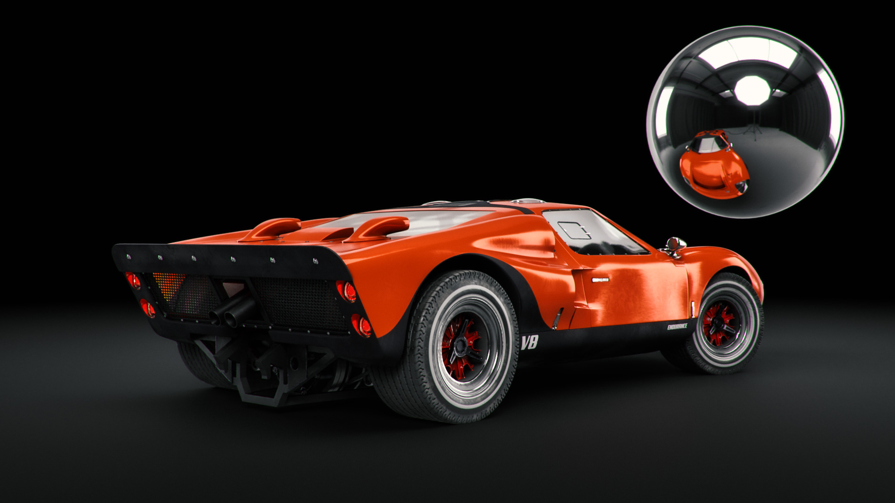

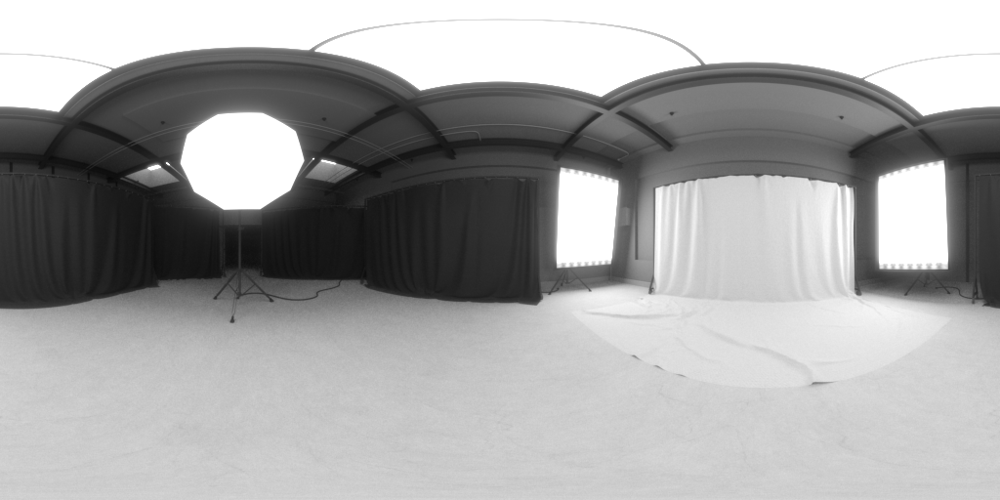

您也可以透過擷取真實世界的像片來建立環境光。 此工作流程需要360攝影機（例如[Ricoh Theta Z1](https://theta360.com/en/about/theta/z1.html)）。 然後使用相機來設定曝光範圍，或拍攝同一環境的多個鏡頭，拍攝範圍包含不同的曝光值（從曝光不足到過度曝光）。 這些快照接著可用來建構32位元影像，通常稱為HDR （高動態範圍的簡稱）。 組裝這類影像的一種方式是在Photoshop中使用「合併為HDR」功能。 內嵌的曝光範圍會變成intensity屬性。

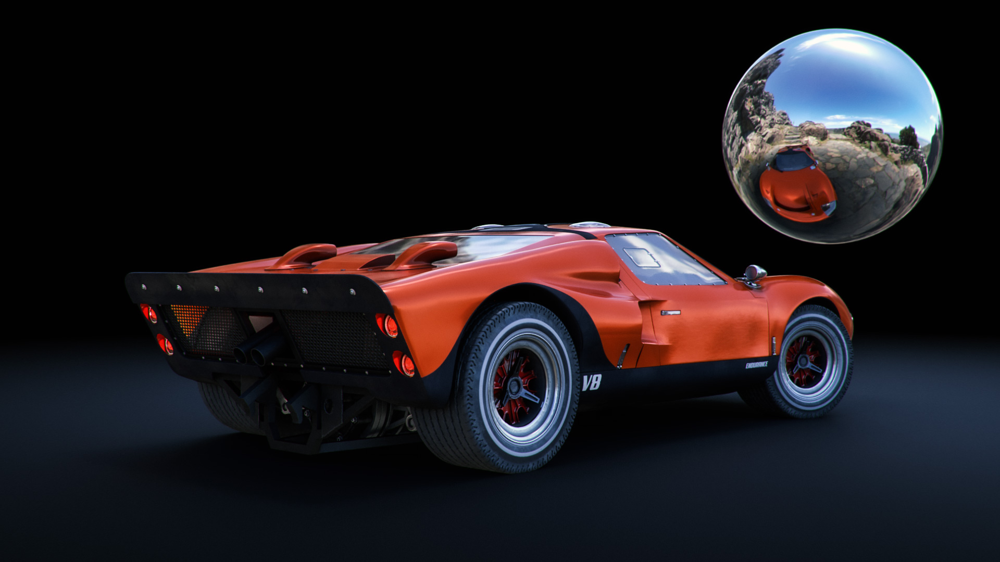

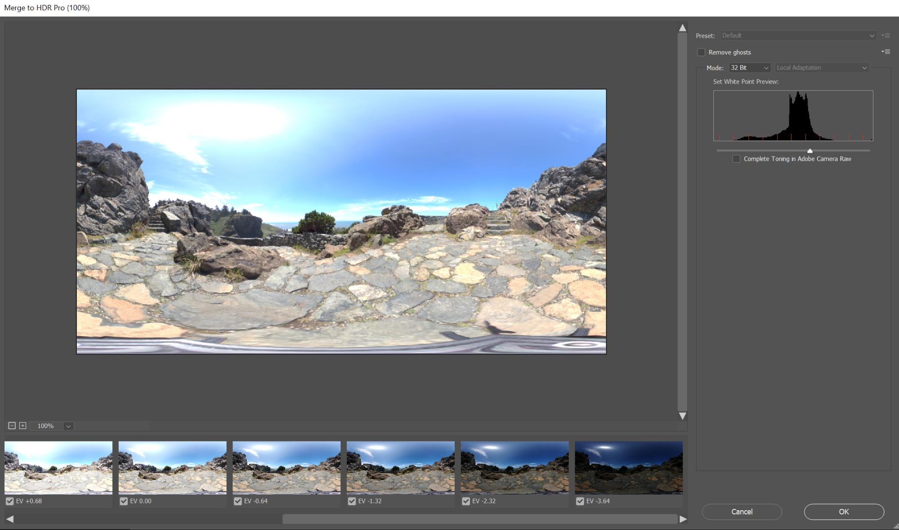

在這兩種情況下，光源（及其強度）都會「烘烤」到這些影像中，並且會在[!DNL Dimension]中使用後發出光。

在這些方法中，您已擷取所有您需要的光線、反射和細節，但3D應用程式可讓您繼續在3D空間中編輯它們，因此您可以調整光線旋轉以及變更整體強度和顏色。

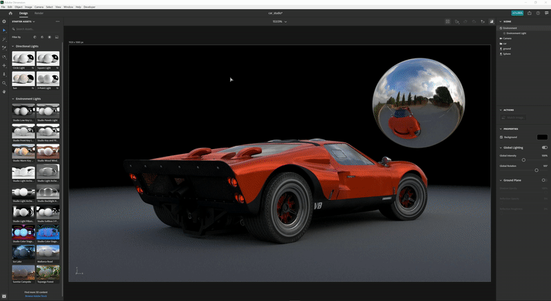

### 方向光

除了從360度發射光的環境光，還有隻從一個方向發射光的定向光。 它們用於模擬手電筒和其他型別的光源，這些光源來自定義良好的發射器，並且其形狀可以是圓形或正方形。

使用方向燈可讓您完全控制燈光設定。 使用這些燈光照亮場景的方式與傳統攝影相同，在傳統攝影中，每個燈光都可以獨立控制，讓您建立自己的虛擬攝影燈光。 最常用的光源設定之一是3點光源系統。

[!DNL Dimension]有一個便利的動作，即「點亮對準」，讓您只要按一下並拖曳橫跨3D物件即可控制旋轉與高度。 如此一來，您就可以動態地引導光線。 這些引數也可以手動調整。

您可以變更定向光源的顏色和強度，以及調整光源的形狀 — 使其圓形或矩形、拉伸或變大。 最後，您可以柔化光源的邊緣。

![在Adobe [!DNL Dimension]](assets/Mastering3dlighting_12.gif)中修改方向光的形狀

如果您使光源小於物件，則陰影會更銳利，具有更清晰的輪廓，因為光線無法通過亮物件。 較大的光源會產生較柔和的陰影，因為在此情況下，光線會來自物件的所有側（在下圖中為紅色），從而建立陰影陣列。 這些陰影會因來自相反方向的射線而變軟。

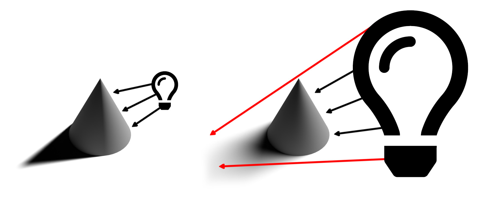

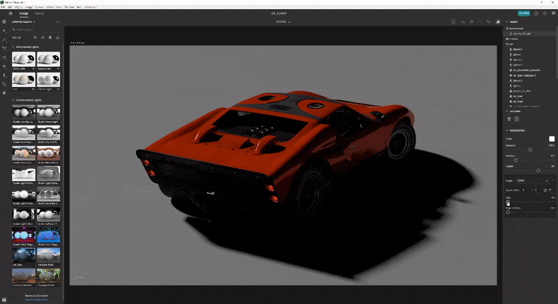

### 太陽和天空

太陽光是一種特殊的定向光。 設定它的過程非常類似一般的方向光，但是這種光會自動隨著高度改變顏色；當它接近地平線（低高度角度值）時，它會逐漸變暖以模擬日落。 也可以使用預設集來變更顏色。 同時，雲度會影響陰影柔軟度。

![在Adobe的3D汽車模型上操控陽光照明的照明屬性[!DNL Dimension]](assets/Mastering3dlighting_15.gif)

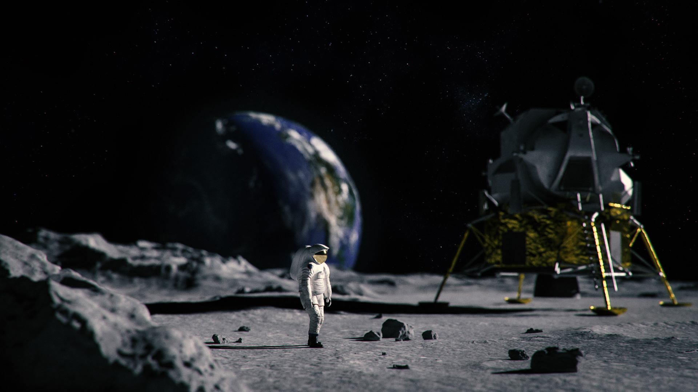

我們可以使用環境光來模擬天空，也可以使用任何以天空為特色的環境光。 現在，我們必須將陽光（以[!DNL Dimension]製作）與太陽對齊，以環境光線擷取。 快速的方法是建立球體，並為其指定金屬材料；這將為我們提供環境的即時反射，因此我們可以使用「瞄準點」光線將陽光與太陽對齊。

如果環境燈具有陰天的特徵，則可以使用cloudiness屬性來更符合這些條件。

![在Adobe [!DNL Dimension]](assets/Mastering3dlighting_17.gif)的3D汽車模型上操控天空環境照明的雲度屬性

太陽光和天空環境光配對後，您可以使用「全域旋轉」屬性一起旋轉它們。

### 物件光源

透過開啟物件材質的「光暈」屬性，可以將物件轉換為光源。 如此一來，您就可以建立燈泡、霓虹燈、Softbox以及各種熒幕和顯示器等物件。

使用這種照明方式的主要優點在於強度會降低，因此會產生非常自然的結果。 這對於產品視覺效果或其他攝影棚型場景非常有用。

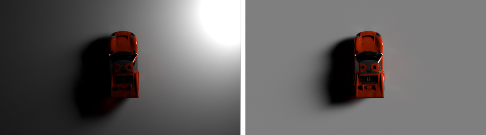

您可以使用變形工具，將發光物件放大或縮小來控制陰影的柔和度。 讓它變大也會增加光強度。

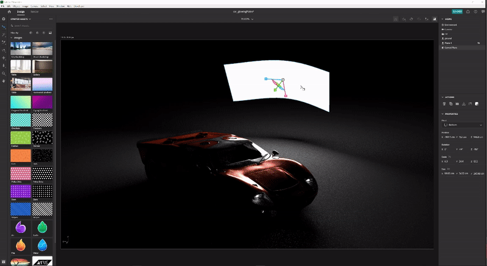

與我們之前涵蓋的光源型別不同，除了純色以外，這些光源還可以利用紋理。 紋理可以附加至其材質的基本顏色，而光強度則透過光暈滑桿來控制。

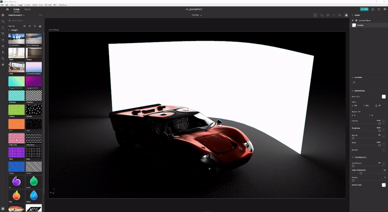

## 有效3D光線的範例

### 產品照明

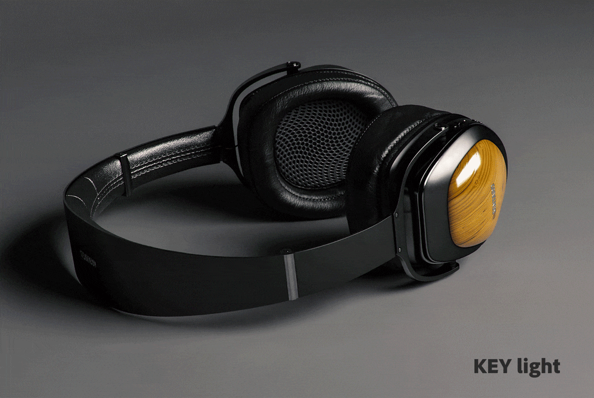

設定產品快照的燈光有許多攝影技巧。 我們將使用其中一個最常用的設定，即3點光源系統。

此設定包含三個光源：

1. **金鑰燈：**&#x200B;已用為主要來源，這大約會從相機方向發光

   

1. **邊緣光源：**&#x200B;方向與金鑰相反，用來顯示主體的剪影。

   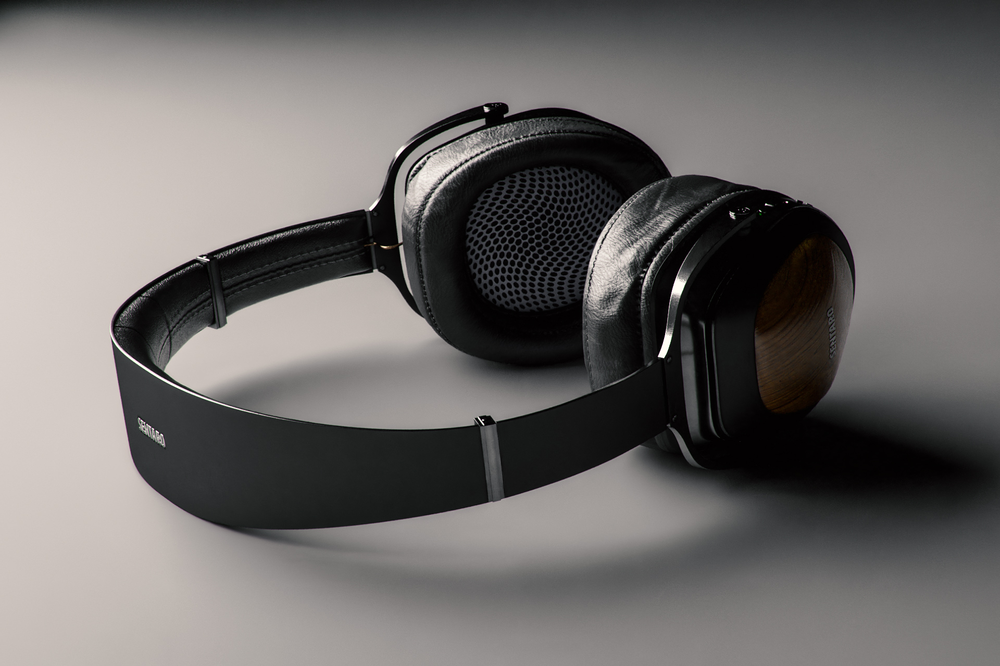

1. **填色光源：**&#x200B;較不密集，並且用於填色較暗的區域，這用於前兩個光源無法到達的區域。

   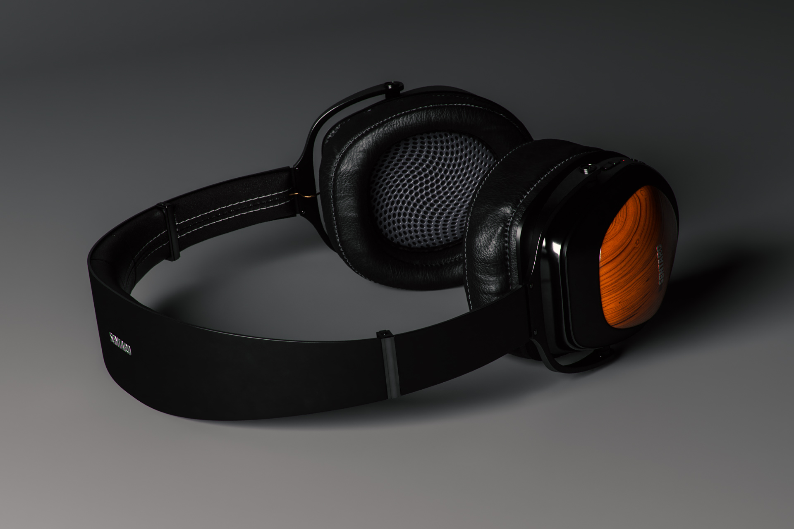

在[!DNL Dimension]中建立3點光源的方法有兩種 — 使用方向光（個別新增到場景或使用3點光源預設）或透過發光物件。

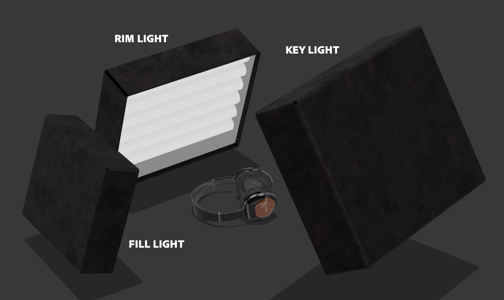

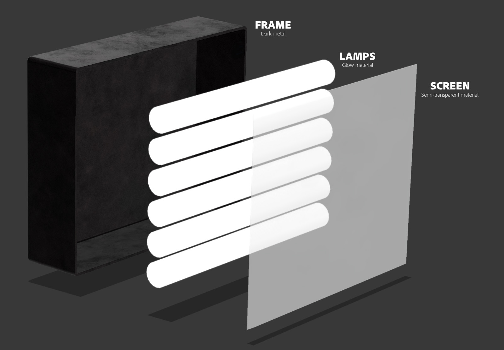

### Creative照明

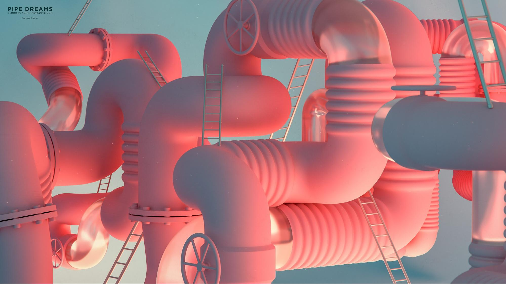

Creative照明用於實體精確度並非主要目標的地方。 這包括各種抽象和超現實的場景，因此我們的想象力沒有真正的界限。

在上面的範例中，這個想法是描繪一個夢幻般的環境：糖果、粉色和光滑的表面。 照明系統由三個發光板組成（兩個在側邊，而主要一個從底部發光）。 所有的發光板都非常大，因此會建立非常平滑的陰影和亮部。 光源會著色，該顏色會傳輸到場景中指定給物件的材質中。

場景的主旨（管路）被壁幾何完全包圍。 這會導致光線來回跳動，並以有趣的方式混合在一起。 使用冷色調和溫暖色調時通常會產生很好的對比（這種技巧有時用於肖像攝影）。

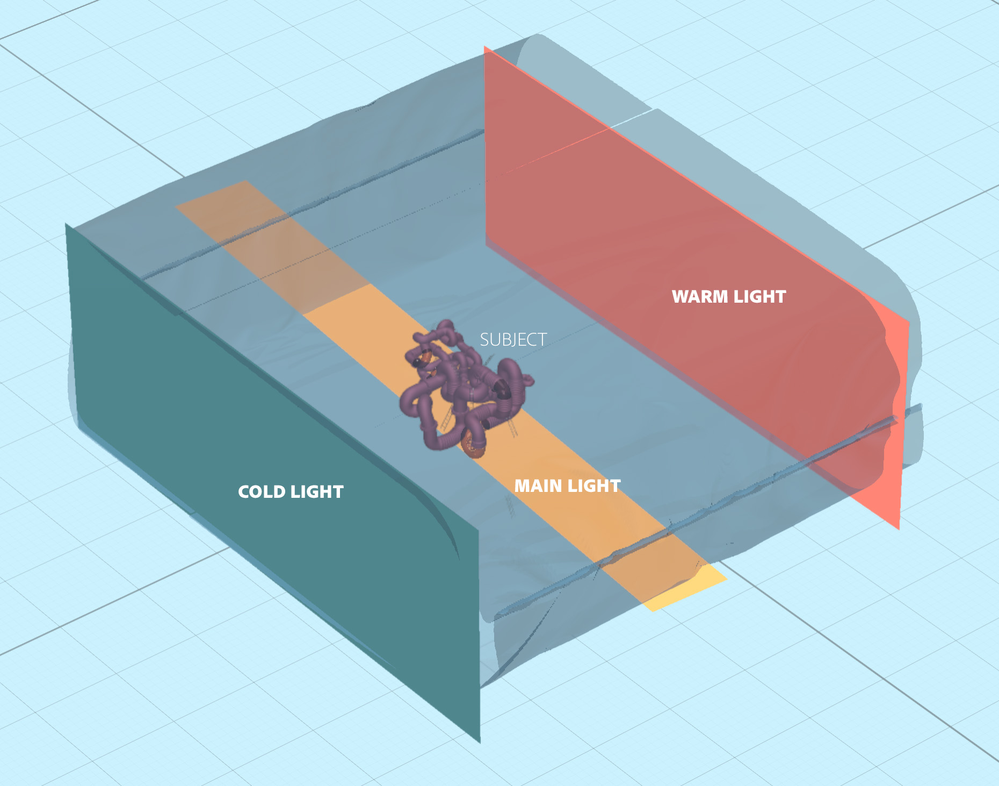

### 內部視覺效果

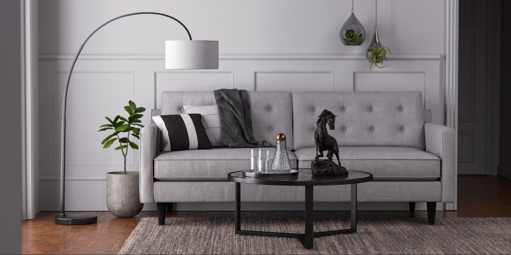

建立3D內部視覺效果時，會遵循一組特定規則，幾乎永遠可確保產生良好的結果。 在此使用案例中，我們將僅考慮自然光（無人造光源，如燈）。

首先，類似的場景需要在封閉環境中。 如同現實生活一樣，室內也需要牆壁、地板、天花板和窗戶。 這樣可以確保光線會透過視窗，然後在周圍彈回（透過稱為光線追蹤的程式）。 這種行為會產生非常自然的照明(例如，被遮蔽的區域（如轉角）會變暗)。

由於場景幾乎完全被建築幾何所包圍，因此我們將看到非常少的照明，而且幾乎不會看到來自環境光的反射。 不過，在此案例中，我們實際上是在建置我們自己的環境，也就是內部本身。 因此，光線會透過跳出場景中的物件和周圍的牆壁來與場景中的物件反應。 物件只會彼此反射，而周圍的牆壁也會反射。 不過，建議加入以天空為特色的環境光。 這將會增加一些擴散藍色填色。

設定此光源最簡單的方法是使用具有發光材料的平面。 在此使用案例中，我們有三個平面，它們覆蓋內部的所有開口。

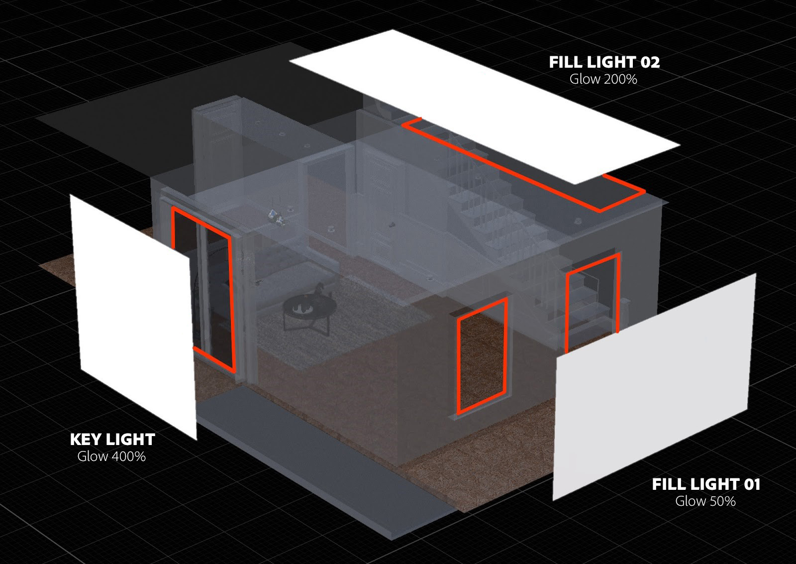

光的強度是由平面材料上的光暈屬性所控制。 您可以新增顏色或甚至紋理，以用來投射有趣的陰影。 使用光暈材質也會提供光強度衰減，這對於室內照明相當重要。

### 戶外照明

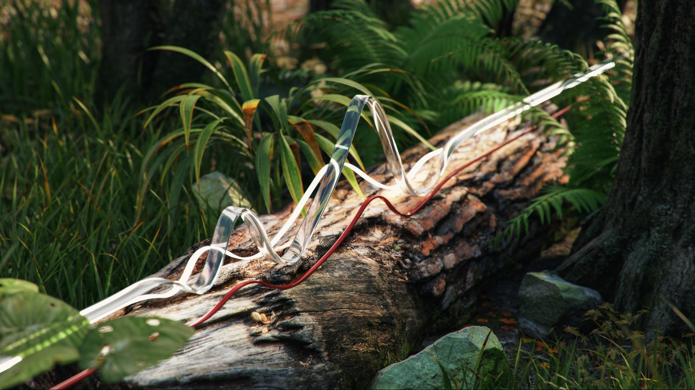

建立戶外照明相當簡單明瞭，最終可以使用日光和天空光系統（請參閱上文）。 請務必正確搭配陽光與天空環境光，同時注意方向與雲度值。

這個場景本身在其中扮演了重要的角色。 若要產生令人注目的結果，請使用場景中的物件作為與光線互動的催化劑。 在上面所示的森林演算中，物件（各種植物、原木和樹木）彼此靠近放置。

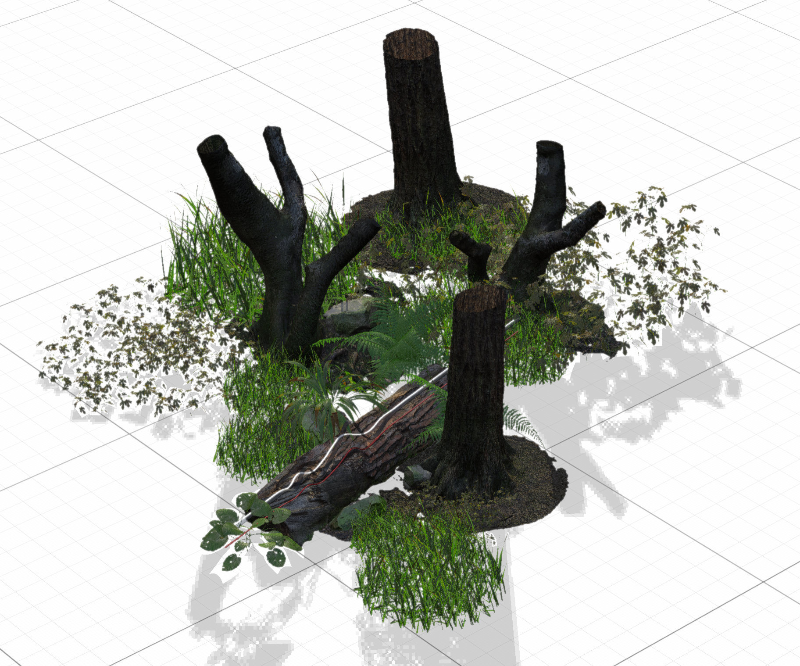

這表示當光線在物件之間跳出時，會有許多複雜的光線追蹤互動。 著色斑點會如預期般變暗，而暴露區域仍保持明亮。

![在3D場景中使用Adobe中的「全域旋轉」[!DNL Dimension]來重新定向Sun和Sky Light系統](assets/Mastering3dlighting_34.gif)

我希望本概述能說明在各種情況下掌握3D光線的重要性。 您應已準備好開始產生更有說服力的結果。

快樂的燈光！ 立即下載Dimension的[最新版本](https://creativecloud.adobe.com/apps/download/Dimension)。
