# 使用3D呈現和合成技術創作如像片般逼真的虛擬攝影

![使用Adobe設計的像片逼真的虛擬像片範例拼貼[!DNL Dimension]](assets/Photorealistic_1.png)

看看上圖，假設您所看到的一切都是真實的，那您會原諒。 然而，隨著如像片般逼真的3D影像在呈現方面的技術進步，要判斷什麼是真實什麼是虛擬變得前所未有的困難。 在此案例中，影像是真實、攝影和演算3D內容的混合 — 而這正是公司正在投資的3D設計型別。

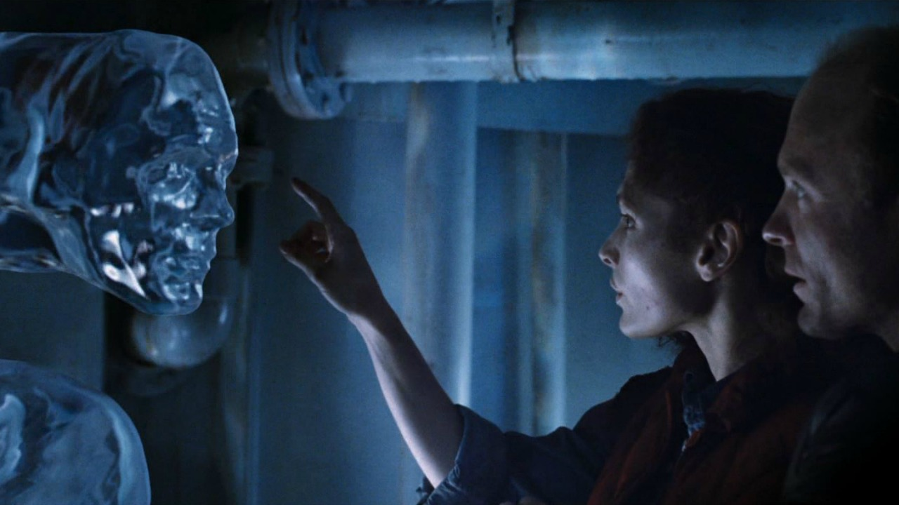

這種將3D模型分層，或將3D模型「合成」成影像或視訊的技巧並不新鮮，事實上其來源可以追溯到VFX的早期（早在1980年代）。 令人興奮的新功能是，這項技術已成為[Adobe [!DNL Dimension]](https://www.adobe.com/products/dimension.html)使用者的強大工具，也是攝影師有趣的新工作流程。

## 在Adobe [!DNL Dimension]中建立複合影像背後的技術

![在Adobe [!DNL Dimension]複合物中編輯金屬球模型的平面](assets/Photorealistic_3.png)

Adobe [!DNL Dimension]可讓使用者使用Adobe AI，直接在應用程式中順暢地結合2D與3D元素。 以此方式合成元素的主要優點在於，它turbo將完全實現的3D場景替換為背景影像（可從現實中擷取），可加快建立逼真外觀影像的流程。

![&#x200B; Adobe中的「符合影像」功能[!DNL Dimension]會分析背景影像，並估計用來擷取該影像的攝影機的焦距和位置](assets/Photorealistic_4.gif)

「符合影像」功能會分析背景影像，並估計用來擷取該影像的相機的焦距和位置。 接著會在[!DNL Dimension]場景中建立3D攝影機，可用來在與背景影像相同的透視內呈現3D元素，以便將它們複合在一起。

但相機框架中並未擷取的所有內容，又該怎麼辦？  擷取影像的完整環境非常重要，因為它會定義影像內的一切外觀。 影像中的物件會反射其周圍世界的光，包括相機後面的所有物件。 因此，為了使圖層式3D元素真正與影像背景混合，它們需要完全反映拍攝影像的環境中的光線。

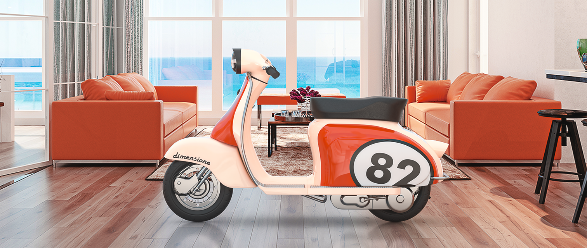

「比對影像」會嘗試「幻覺」拍攝背景影像的照明環境。 這項工作令人印象深刻，可以在短時間內產生優異的結果，但是與背景影像一起擷取環境將可產生更逼真的結果。 此方法甚至可用來訓練Adobe AI。

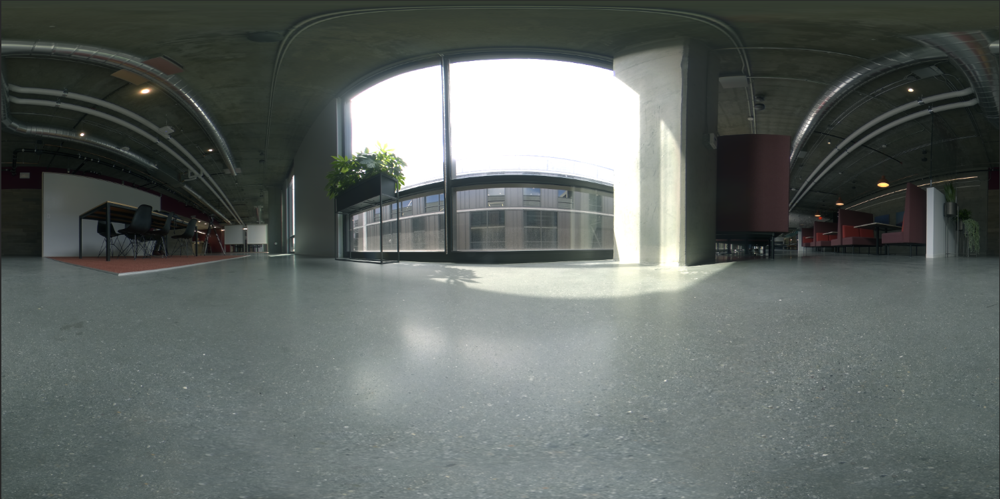

進入360° HDR全景影像的世界。 這些影像長期用於3D圖形，以加速整個世界照明環境的照明效果。 過去擷取它們的程式相當複雜，因為需要高水準的知識和專業裝置。 隨著360度攝影機的出現，建立這些影像的可能性變得前所未有。

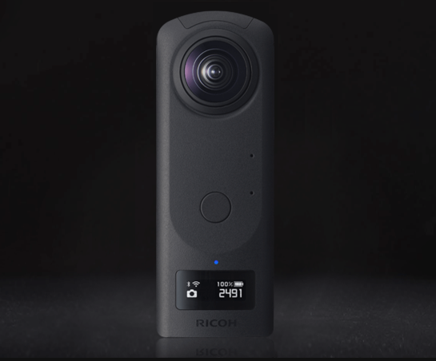

Ricoh Theta、Gopro MAX和Insta 360等相機可擷取360張全景。 Ricoh Theta內建了自動曝光支架，這是擷取流程的關鍵部分。 這樣可以減少擷取HDR的時間和精力，讓攝影師更容易操作。

## 建立如像片般逼真的合成影像的程式

### [!DNL Capture]

若要開始擷取環境以進行合成，您需要兩個主要元素：高品質的背景影像或影像，以及擷取環境的360° HDR全景。

有效擷取這類內容最重要的一個方面，就是運用攝影師現有的技能和工具。 建立美麗的背景影像，需要注意構成和細節的注意。 背景影像也需要特殊的心態，才能建立適合將3D元素組合成的事物。

### 選擇位置

尋找前後關聯和光源都感興趣的位置。 考慮上下文時，想像場景的潛在用途會很有幫助。 例如，空白道路的檢視可用於加入3D汽車，而咖啡館的桌檢視則可用於[顯示食品包裝](https://www.adobe.com/products/dimension/packaging-design-mockup.html)。

將虛擬像片的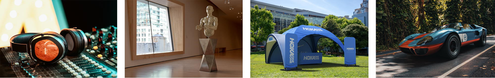

在擷取背景影像時，請務必牢記3D元素將會複合在背景影像中。 應該會有一個空白焦點區域，為這些物件留出空間。 3D內容通常是最終構圖的主要焦點，因此背景本身不要過於醒目，這一點很重要。

同樣重要的是影像內的光線狀況，因為這會大幅影響合成的3D內容。 光線應該從肩膀或側面射入鏡頭 — 這樣會產生最佳效果，因為當3D物件放置在場景中時，它會起到關鍵光源的作用。 如果沒有檢視的焦點元素，您可能忍不住會朝燈光拍攝，但請記住，這樣會使得內容永遠是背光的。 在場景中加入暫時的直立物件對於構成和評定光線可能很有用。

## 擷取HDR窗格

### 相機位置

將360°相機放在您要用來擷取背景的一般區域中心。 在背景顯示較寬場景的情況下，使用單腳架將相機抬離地面可能是比較理想的作法，否則可以直接在地面上設定相機。

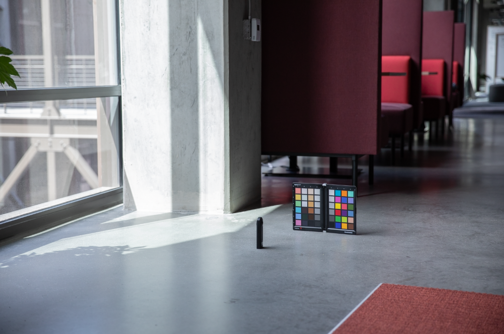擷取360度的全景影像

### 顏色

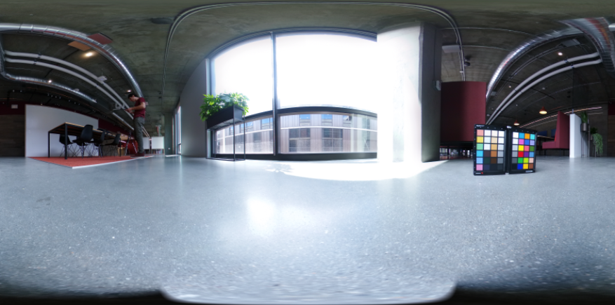

在用來拍攝環境的相機與用來拍攝背景的相機之間保持顏色非常重要，因為影像會一起使用。 這裡我們已將兩個相機的色溫設定為5000k，並拍攝了兩個相機的彩色圖表，以便在貼文時進一步對齊。

### 括弧內的曝光值

若要使用360度攝影機建立HDR環境，需要擷取數個EV，以便在貼文時合併成HDR影像。 EV的數量並未標準化，但一般而言，您會希望曝光範圍的高端會移至陰影中沒有更多資訊的位置，而曝光範圍的低端會移至亮部中沒有更多資訊的位置。

理想情況下，360°相機應該具備自動包圍功能，讓相機可以批次處理各種曝光度。 理想的設定是使用可用於避免雜訊的最低ISO值，以及銳利度的高光圈值。 然後可以使用快門速度來改變曝光值，並透過停止來分解；將曝光度減半或加倍。

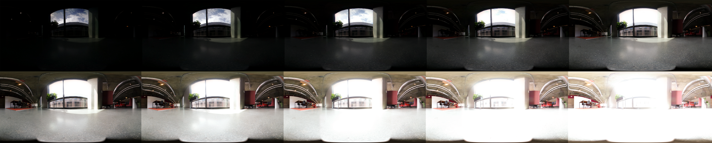

以下是用來在戶外射擊IBL的EV範例：

01 - F 5.6、ISO 80、快門速度1/25000、WB 5000 K

02 - F 5.6、ISO 80、快門速度1/12500、WB 5000 K

03 - F 5.6、ISO 80、快門速度1/6400、WB 5000 K

...

16 - F 5.6、ISO 80、快門速度1、WB 5000 K

如果使用的360度能夠輸出RAW影像，則EV可以以2-4秒為增量分割，因為它們比JPEG等8位元影像保留更多資訊。

![Adobe Photoshop中的[合併至HDR Pro]檔案選擇功能表](assets/Photorealistic_13.png)

對EV進行任何顏色調整後，可將其暫時匯出至個別檔案，然後合併至Photoshop。 檔案型別應根據來源而定，但在任何情況下都不要使用如JPEG的壓縮格式。 在Photoshop中，使用「檔案」>「自動」>「合併至HDR Pro...」，並選取所有匯出的EV。

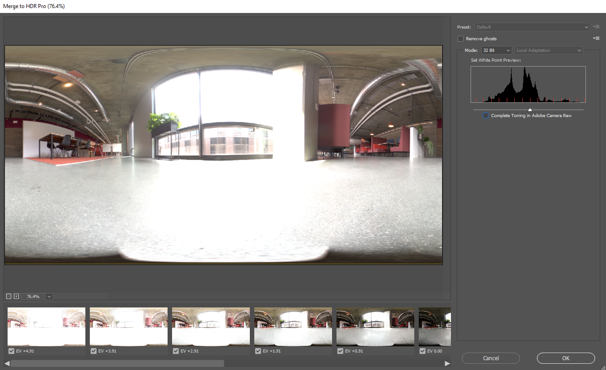

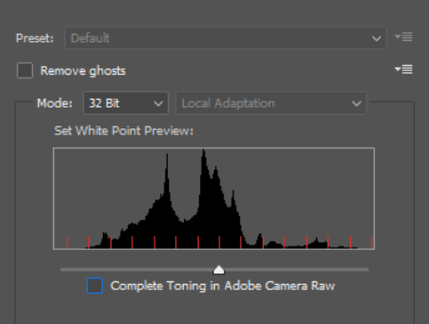

請確定&#39;Mode&#39;設為32位元。 使用「移除幽靈」有助於移除在電動車之間變更的詳細資料，但如果您不需要的話，就不要使用它。 長條圖下的滑桿只會影響預視曝光度，因此請忽略它。 取消勾選「在Adobe Camera Raw中完成色調」，然後按「確定」。

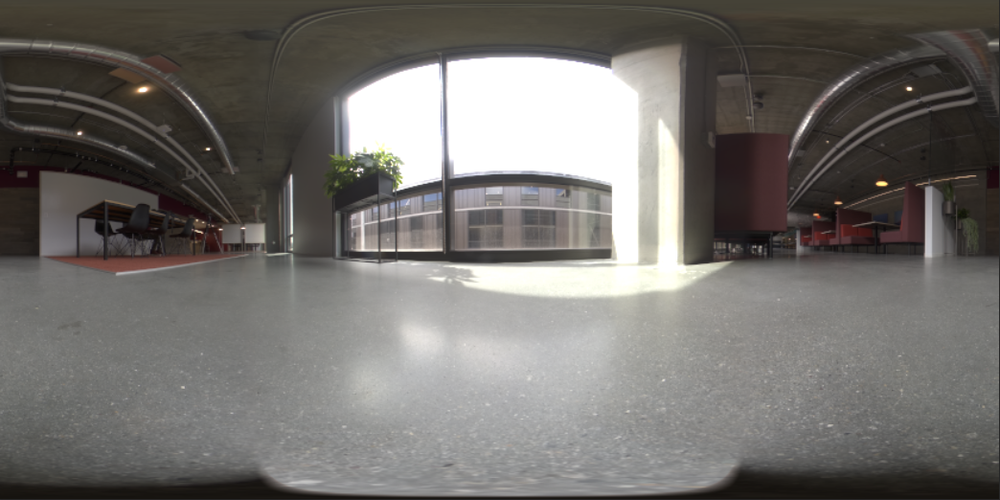

結果會產生HDR影像，可用來照明3D場景。

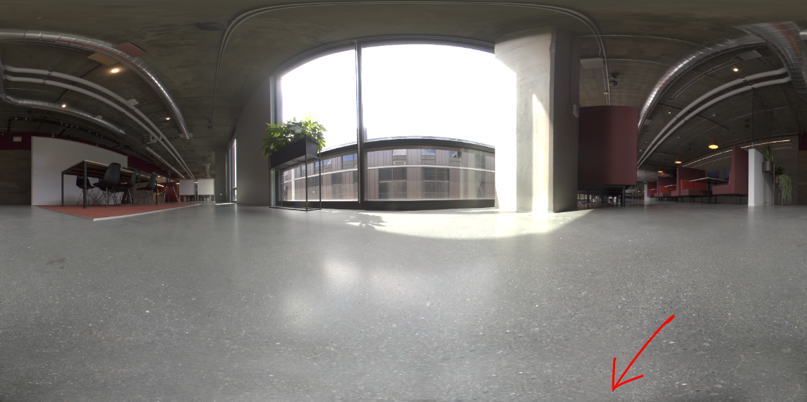

最後的步驟是移除影像底部可見的任何陰影和三腳架，並調整影像的預設曝光度以正確地照亮場景。 您可以使用Photoshop中的原地複製工具來移除詳細資訊。 調整曝光應與[!DNL Dimension]中的背景一起完成，因為HDR IBL的曝光值是3D物件的照明值。

### 擷取背景

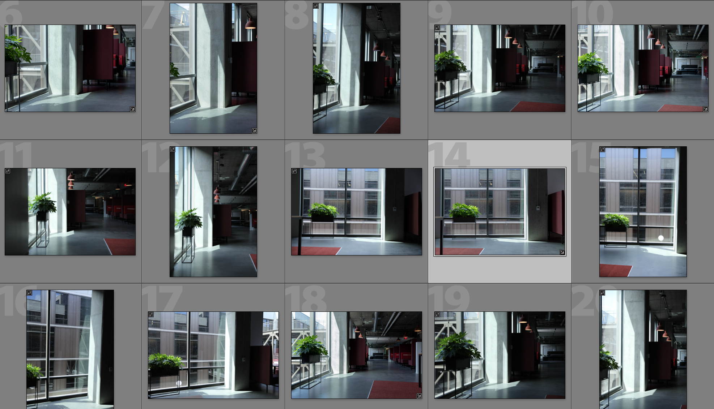

擷取環境後，您現在可以使用您選擇的相機來擷取背景。 品質越高、解析度越高越好。 這個過程的主要優點在於，它還有攝影者所擁有的構圖。 以上影像是使用Canon 5D MK IV擷取的。

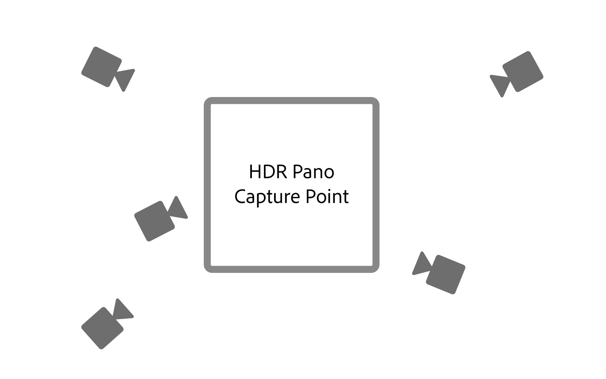

設定背景的框架及作文有很多迴旋餘地。 相機可以針對不同的景深有高或低的孔徑，使用長或短焦距，並且向上或向下傾斜。 主要需求是相機必須瞄準使用360相機擷取環境的中心點。

擷取完成後，影像應進行後續處理，以儘可能符合環境的顏色。 色彩和曝光度應儘可能保持中性且自然。 使用Adobe [!DNL Dimension]將3D元素組合到影像中後，應該套用任何風格化的外觀。

## 在[!DNL Dimension]中組合您的複合影像

收集並完成這些元素後，即可在Adobe [!DNL Dimension]的場景中組合這些元素。 這就像將背景拖曳到場景中一樣簡單，然後會將背景套用至背景；接著將HDR窗格加入環境淺色影像插槽。

將背景影像拖放至畫布的空白區域，或選取場景面板中的「環境」，然後將影像新增至背景輸入。

![可以從Adobe的[內容]功能表選取虛擬像片的背景影像[!DNL Dimension]](assets/Photorealistic_20.png)

選取「環境光」並將其新增至「影像」輸入，以新增「HDR」窗格。

![您可以從Adobe [!DNL Dimension]](assets/Photorealistic_21.png)的「場景」功能表，將環境光源新增至虛擬像片的背景影像

接著，您可以在背景上使用「符合影像」，以符合解析度和外觀以及相機透視。 系統不會從背景影像產生環境，而是使用擷取的HDR全景影像來點亮場景，因此「建立光線」選項可以保留為未核取狀態。

![使用Adobe [!DNL Dimension]中的「符合影像」功能，以HDR全景影像中的環境光線來轉譯3D金屬球影像](assets/Photorealistic_22.png)

現在，加入場景的物件會以逼真的方式合成到背景中，因為它們是由拍攝影像的環境所照亮的。

若要快速評估HDR面板相對於背景的方向和曝光度，可以將從[!DNL Dimension]中的自由資產面板中取得的具有金屬材料的球形基本物件置於場景中。 然後可以定位環境光的旋轉，使反射看起來正確。 如果HDR面板的光線暴露在球體上方或下方，HDR面板的暴露應增加或減少以補償。

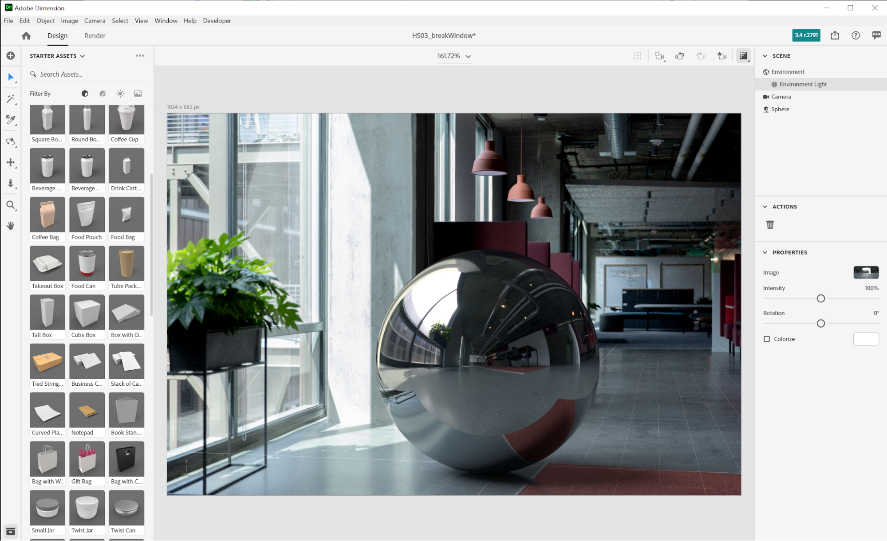

若要快速評估HDR面板相對於背景的方向和曝光度，可以將從[!DNL Dimension]中的自由資產面板中取得的具有金屬材料的球形基本物件置於場景中。 然後可以定位環境光的旋轉，使反射看起來正確。 如果HDR面板的光線暴露在球體上方或下方，HDR面板的暴露應增加或減少以補償。

## 最終結果：如像片般逼真的合成影像

![在Adobe [!DNL Dimension]](assets/Photorealistic_24.gif)中，虛擬產品像片的3D合成與演算的時間間隔

場景完成後，使用者的工作流程將變得簡單明瞭。 只要將您自己的模型或任何[Adobe [!DNL Stock] 3D](https://stock.adobe.com/3d-assets)內容直接拖放至影像中，將其呈現為拍攝影片時的狀態。 這開啟了新的途徑，可建立高度逼真的廣告內容，或是在許多不同內容中重複設計的能力。

最終的結果是逼真的將現實與3D相結合，協助使用者以最省力的方式建立如像片般逼真的影像。 嘗試使用我們為示範工作流程所建立的[免費 [!DNL Dimension] 場景](https://assets.adobe.com/public/3926726a-2a17-43d4-4937-6d84a4d29338)。

[請立即下載最新版本](https://creativecloud.adobe.com/apps/download/dimension) （共[!DNL Dimension]版），並開始建立如像片般逼真的影像。
