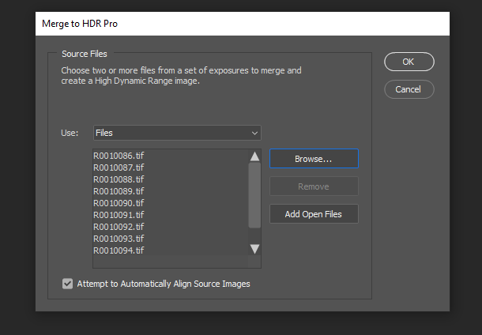

# 利用3D渲染和合成建立照片真實感虛擬攝影

![使用Adobe[!DNL Dimension]](assets/Photorealistic_1.png)設計的照片真實虛擬照片的示例拼貼圖

看著上面的圖片，你會原諒自己認為你看到的一切都是真實的。 然而，隨著在繪製真實感照片的3D影像方面的技術進步，確定真實和虛擬是比以往任何時候都更加困難。 在這個例子中，這些影像是真實、攝影和渲染的3D內容的組合 — 這正是公司投資的3D設計類型。

這種將3D模型分層或「合成」成影像或視頻的技術並不新鮮，其起源實際上可以追溯到VFX的早期（可追溯到20世紀80年代）。 最新而令人興奮的是，此技術已成為[Adobe [!DNL Dimension]](https://www.adobe.com/tw/products/dimension.html)用戶的強大工具，並成為攝影師的有趣新工作流。

## 在Adobe[!DNL Dimension]中建立複合映像的技術

![在Adobe[!DNL Dimension]複合](assets/Photorealistic_3.png)中編輯金屬球模型的平面

Adobe[!DNL Dimension]允許用戶使用AdobeAI直接將2D和3D元素無縫地組合在應用中。 通過這種方式合成元素的主要好處是，它通過用背景影像代替完全實現的3D場景，從而加快了建立真實感的外觀影像的過程，該背景影像可以從實際中捕獲。

![Adobe[!DNL Dimension]中的「匹配影像」功能分析背景影像並估計用於捕獲該影像的攝像機的焦距和位置](assets/Photorealistic_4.gif)

「匹配影像」特徵分析背景影像並估計用於捕獲該影像的攝像機的焦距和位置。 然後在[!DNL Dimension]場景中建立3D相機，該相機可用於在與背景影像相同的透視中渲染3D元素，以便它們將複合在一起。

但是鏡頭裡沒有捕捉到的一切呢？  影像在事情中被顯著捕獲的整個環境，因為它定義了其內部一切的外觀。 影像中的物體反射周圍世界的光，包括相機後面的所有東西。 因此，要使分層的3D元素真正融入到您的影像背景中，它們需要充分反映拍攝影像的環境中的光照。

「匹配影像」將嘗試對拍攝背景影像的照明環境「產生幻覺」。 它做得很出色，能在短時間內產生出優異的效果，但是捕捉環境和背景影像會產生更真實的結果。 這甚至是訓練Adobe人工智慧的方法。

進入360° HDR全景影像世界。 這些影像長期以來一直被用在3D圖形中，以加快全世界照明環境的照明效果。 過去捕獲這些資訊的過程相當複雜，因為需要大量知識和專門設備來製作這些資訊。 隨著360度相機的問世，建立這些影像的可能性比以往任何時候都大。

里科 — θ、戈普羅·MAX和Insta 360等相機可以拍攝360張全景照片。 Ricoh Theta具有自動曝光支架，該支架是捕獲過程的關鍵部分。 這減少了捕獲HDR的時間和精力，並使其更容易被攝影者接受。

## 一種建立圖形逼真複合影像的方法

### [!DNL Capture]

要開始捕獲環境以便進行合成，您需要兩個主要元素：高質量背景影像或影像以及拍攝環境的360° HDR全景圖。

有效捕獲此類內容最重要的方面之一是利用攝影師現有的技能和工具。 建立美麗的背景影像，需要注意合成和關注細節。 背景影像還需要一種特殊的思維模式，以便建立對於將3D元素合成為有用的東西。

### 選擇位置

查找對上下文和光照都感興趣的位置。 在考慮背景時，想像場景的潛在用途是有幫助的。 例如，空路視圖可用於添加3D汽車，而咖啡店的桌子視圖可用於[顯示食品包裝](https://www.adobe.com/tw/products/dimension/packaging-design-mockup.html)。

將虛擬照片的

在捕獲背景影像時，必須牢記3D元素將合成到背景影像中。 應該有一個空的焦點區域為這些對象留有空間。 3D內容通常是最終作品的主要焦點，因此，背景本身不應過於突出很重要。

同樣重要的是影像中的光照情況，因為這會極大地影響合成的3D內容。 光線應該從肩部或側面射入鏡頭 — 這將產生最佳效果，因為當3D對象放在場景中時，它將充當關鍵光線。 當沒有焦點時，向光線射擊可能很誘人，但請記住，這會導致總是背光的內容。 向場景添加臨時的待機對象可用於合成和評估照明。

## 捕獲HDR帕諾

### 攝像機放置

將360°相機放置在您將重點用於捕捉背景的區域的一般中心。 在背景顯示更寬的場景下，用單腳架將攝像機從地面抬起，否則攝像機可以直接放在地面上。

捕獲360度全景影像

### 顏色

保持用於拍攝環境的攝像機和用於拍攝背景的攝像機之間的顏色非常重要，因為影像將一起使用。 這裡我們把兩台相機的色溫都設定為5000k，然後用兩台相機拍了一張彩色圖表，以便在後面進行進一步的對準。

### 方括弧內的暴露值

要使用360°攝像頭建立HDR環境，需要捕獲多個EV，以便在發佈後將HDR影像合併。 EV的數量沒有標準化，但通常您希望曝光範圍的高端到達陰影中沒有更多資訊的位置，而曝光範圍的低端到達高光中沒有更多資訊的位置。

理想情況下，360°相機將具有自動支架功能，允許相機拍打各種曝光量。 理想的設定是使用可用的最低ISO值來避免噪音和高孔徑值來銳度。 然後，利用快門速度可以改變曝光值，並通過停止來分解；使曝光量減半或加倍。

下面是用於在戶外拍攝IBL的EV的示例：

01 - F 5.6、ISO 80、快門速度1/25000、WB 5000 K

02 - F 5.6、ISO 80、快門速度1/12500、WB 5000 K

03 - F 5.6、ISO 80、快門速度1/6400、WB 5000 K

...

16 - F 5.6、ISO 80、快門速度1、WB 5000 K

如果使用的360°能夠輸出RAW影像，則EV可以按2-4個停止增量分割，因為它們保留的資訊比像JPEG這樣的8位影像更多。

對EV進行任何顏色調整後，它們可以臨時導出到各個檔案，然後在Photoshop合併。 檔案類型應取決於源，但在兩種情況下均不使用壓縮格式，如JPEG。 在Photoshop，使用「檔案」>「自動」>「合併到HDR Pro...」，並選擇所有導出的EV。

確保「Mode」設定為32位。 使用「刪除鬼」可幫助刪除在EV之間更改的詳細資訊，但如果您不需要，請不要使用它。 直方圖下的滑塊僅影響預覽曝光度，因此忽略它。 取消選中「Complete Toning inAdobe Camera Raw」，然後按「OK（確定）」。

結果是HDR影像，該影像可用於在3D中照亮場景。

最後的步驟是去除在影像底部可見的任何陰影和三腳架，並調整影像的預設曝光量以正確照亮場景。 可以使用Photoshop的克隆工具刪除詳細資訊。 應結合[!DNL Dimension]中的背景來調整曝光，因為HDR IBL的曝光值是3D對象的光照值。

### 捕獲背景

捕獲環境後，您現在可以使用您選擇的攝像頭捕獲背景。 質量越高，解析度越高。 這，加上攝影者對作文的注意，是這個過程的主要好處。 以上影像是用佳能5D MK IV拍攝的。

在背景的框定和構成上，有很大的餘地。 所述照相機可具有用於不同景深的高或低孔徑，使用長或短焦距，並且成角度地向上或向下。 主要要求是，相機瞄準360相機捕捉環境的中心點。

捕獲完成後，應對影像進行後處理以盡可能接近環境的顏色。 顏色和曝光應盡可能中性和自然。 將3D元素合成到具有Adobe[!DNL Dimension]的影像後，應應用任何風格化外觀。

## 正在[!DNL Dimension]中組裝合成影像

通過收集並完成這些元素，現在可以在Adobe[!DNL Dimension]中的場景中組裝這些元素。 這就像將背景拖入場景一樣簡單，然後將其應用到背景；然後，將HDR面板添加到環境光影像插槽中。

將背景影像拖放到畫布的空區域，或在場景面板中選擇「環境」，然後將影像添加到背景輸入。

![可以從Adobe[!DNL Dimension]](assets/Photorealistic_20.png)中的「屬性」菜單中選擇虛擬照片的背景影像

通過選擇「Environment Light（環境指示燈）」並將其添加到「Image（影像）」輸入，添加HDR面板。

![可以從Adobe[!DNL Dimension]](assets/Photorealistic_21.png)中的「場景」菜單將環境光源添加到虛擬照片的背景影像中

然後，可以在背景上使用「匹配影像」來匹配解析度和長寬以及相機透視。 捕獲的HDR pano影像不是從背景影像生成環境，而是用於照亮場景，因此「建立燈光」選項可以保持未選中狀態。

![使用Adobe[!DNL Dimension]中的「匹配影像」功能，使用HDR全景中的環境光來呈現3D金屬球影像](assets/Photorealistic_22.png)

現在，添加到場景中的對象將真實地合成到背景中，因為它們被拍攝影像的環境點亮。

為快速評估HDR面板相對於背景的方向和曝光度，可將一個帶有金屬材料的原始球體放置在場景中，該球體取自[!DNL Dimension]中的自由資產面板。 然後，環境光的旋轉可以被定位，使反射看起來正確。 如果HDR pano的照明在球體上或在球體下露出，則HDR pano的暴露應增加或減少以補償。

為快速評估HDR面板相對於背景的方向和曝光度，可將一個帶有金屬材料的原始球體放置在場景中，該球體取自[!DNL Dimension]中的自由資產面板。 然後，環境光的旋轉可以被定位，使反射看起來正確。 如果HDR pano的照明在球體上或在球體下露出，則HDR pano的暴露應增加或減少以補償。

## 最終結果：一張真實感的複合影像

![Adobe[!DNL Dimension]](assets/Photorealistic_24.gif)中虛擬產品照片的3D合成和呈現的延時

場景完成後，最終用戶的工作流將變得簡單明瞭。 只需將您自己的模型或任何[Adobe [!DNL Stock] 3D](https://stock.adobe.com/3d-assets)內容直接拖放到影像中，以將其呈現為在拍攝照片時就已存在。 這為建立高度現實的廣告內容或在許多不同上下文中迭代設計提供了新的途徑。

最終結果是真實與3D的令人信服的結合，幫助最終用戶以最少的努力實現建立照片真實影像的目標。 請親自嘗試一下我們為演示工作流而建立的[免費 [!DNL Dimension] 場景](https://assets.adobe.com/public/3926726a-2a17-43d4-4937-6d84a4d29338)。

[立即下載](https://creativecloud.adobe.com/apps/download/dimension)的最新版本[!DNL Dimension]，然後開始生成您的照片真實感影像。
