# 適用於企業的Creative Cloud教學課程

作為企業創意人員，您必須與分散的團隊共同作業、建立可擴充的流程，並遵守公司系統和准則。 這些教學課程可協助您從企業角度瞭解Creative Cloud的新功能。

## 選取要檢視的產品（依字母順序列出）教學課程

### Adobe Acrobat

<table style="table-layout:fixed">
<tr>
 <td>
   
    

   內容建立者的<a href="acrobat-content-creators.md"><strong>Acrobat</strong></a>
    

    <em>瞭解有助於簡化創意工作流程的Acrobat工具</em>
     
  </td>
  <td>
    
    

     
  </td>
  <td>
    
    

     
  </td>
  <td>
    
    

     
  </td>
</tr>
</table>

### Adobe Portfolio

<table  style="table-layout:fixed">
<tr>
   <td>
   <a href="assets/GettingStartedWithAdobePortfolio.pdf">
      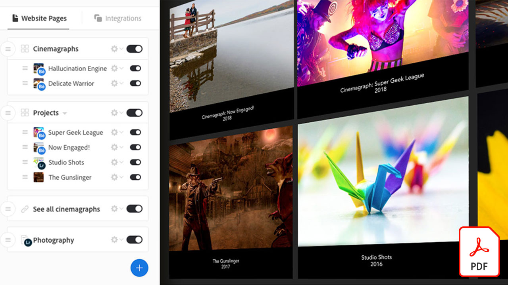
   </a>
    

   <a href="assets/GettingStartedWithAdobePortfolio.pdf"><strong>開始使用Adobe Portfolio (PDF)</strong></a>
    

    <em>與Adobe Portfolio分享您的最佳工作成果，是分享您的成功並吸引新創意人才的有效方式</em>
     
  </td>
  <td>
   <a href="assets/ConnectingLightroomandBehancetoYourAdobePortfolio.pdf">
      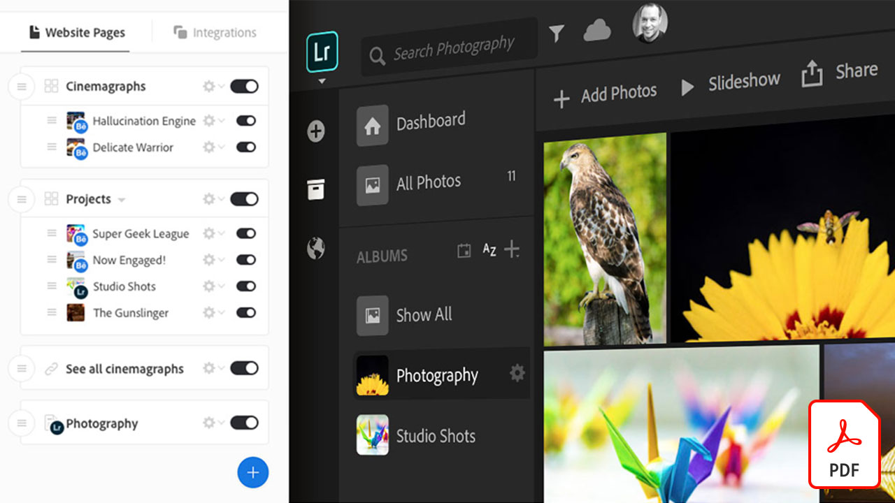
   </a>
    

   <a href="assets/ConnectingLightroomandBehancetoYourAdobePortfolio.pdf"><strong>將Lightroom和Behance連線至您的Adobe Portfolio (PDF)</strong></a>
    

    <em>使用Behance專案作為您投資組合中的頁面</em>
     
  </td>
  <td>
   
    

   <a href="assets/ShowYourBestWorkwithAdobePortfolio.pdf"><strong>使用Adobe Portfolio (PDF)顯示您的最佳工作</strong></a>
    

    <em>Adobe Portfolio可讓您上傳、組織您的工作，並與全球各地的潛在員工和客戶分享</em>
     
  </td>
  <td>
    
    

     
  </td>
 </tr>
 </table>

### CC Libraries

<table  style="table-layout:fixed">
<tr>
  <td>
   <a href="cc-workflows-cc-libraries.md">
      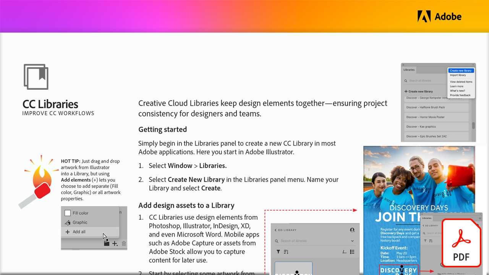
   </a>
   

   <a href="cc-workflows-cc-libraries.md"><strong>使用CC Libraries改善CC工作流程</strong></a>
    

    <em>瞭解Creative Cloud Libraries如何將設計元素保持在一起 — 確保設計師和團隊的專案一致性</em>
     
  </td>
  <td>
   
   

   <a href="ccteamlibraries.md"><strong>建立團隊的Creative Cloud Libraries</strong></a>
    

    <em>瞭解如何使用適用於團隊的Creative Cloud Libraries在群組或團隊內共用資產</em>
     
  </td>
  <td>
   <a href="sharecclibraries.md">
      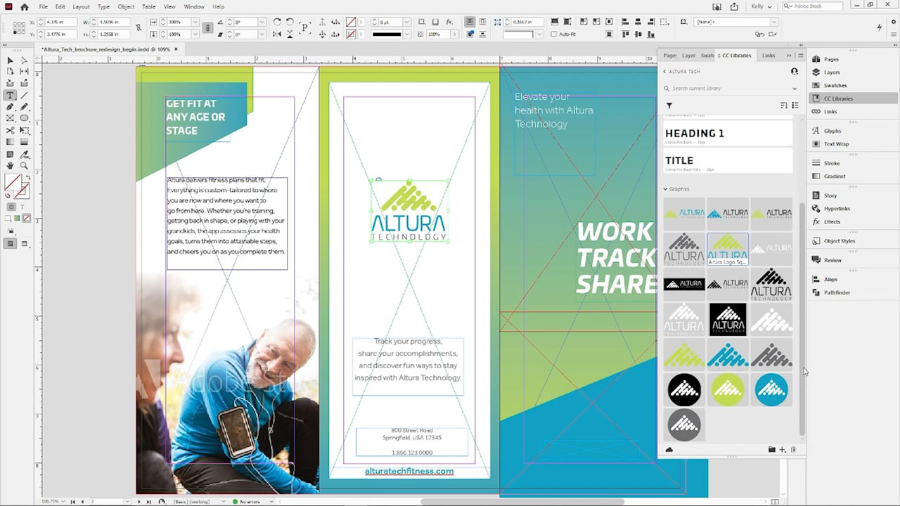
   </a>
   

   <a href="sharecclibraries.md"><strong>與團隊的Creative Cloud Libraries共用品牌化資產</strong></a>
    

    <em>瞭解如何使用適用於團隊的Creative Cloud Libraries為您的群組或團隊建立、使用和共用品牌化資產</em>
     
  </td>
  <td>
   <a href="assets/CreateAddandShareYourBrandAssetswithCreativeCloudLibraries.pdf">
      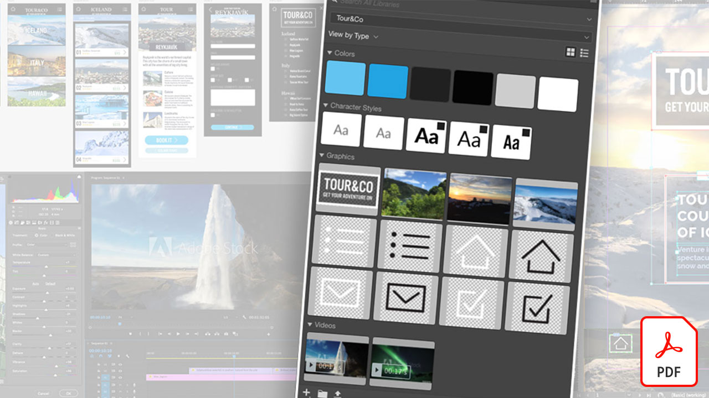
   </a>
    

   <a href="assets/CreateAddandShareYourBrandAssetswithCreativeCloudLibraries.pdf"><strong>與Creative Cloud Libraries (PDF)建立、新增及共用您的品牌資產</strong></a>
    

    <em>Creative Cloud Libraries提供內建品牌系統，讓設計人員得以跨創意團隊共用品牌資產</em>
     
  </td>
  </tr>
  <tr>
  <td>
   <a href="assets/ShareTextStylesFromIllustratorwithCreativeCloudLibraries.pdf">
      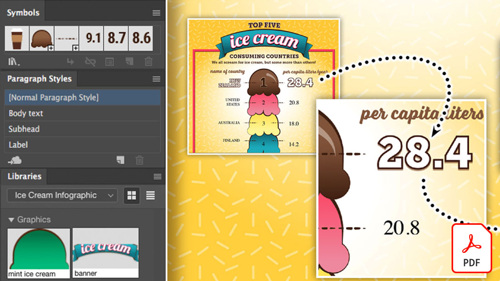
   </a>
    

   <a href="assets/ShareTextStylesFromIllustratorwithCreativeCloudLibraries.pdf"><strong>與Creative Cloud Libraries (PDF)共用Illustrator的文字樣式</strong></a>
    

    <em>在Illustrator中更聰明地工作，而不是更努力</em>
     
  </td>
  <td>
    
    

     
  </td>
  <td>
    
    

     
  </td>
  <td>
    
    

     
  </td>
</tr>
</table>

### 適用於企業的 Creative Cloud

<table style="table-layout:fixed">
<tr>
 <td>
   <a href="collaboration-the-future-of-creativity.md">
      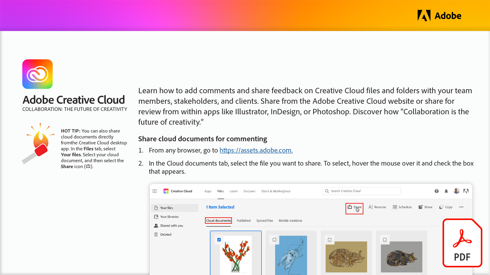
   </a>
    

   <a href="collaboration-the-future-of-creativity.md"><strong>Collaboration：創造力的未來</strong></a>
    

    <em>在Adobe Creative Cloud訂閱的眾多優惠中，有20,000多種專業設計和精選的字型可免費存取Adobe Fonts</em>
     
  </td>
  <td>
   <a href="assets/FromHandLetteringtoIllustratorviaCreativeCloud.pdf">
      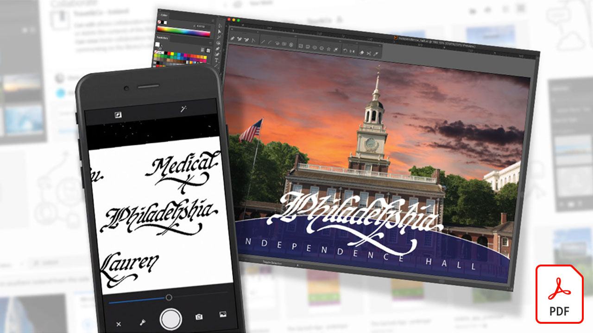
   </a>
    

   <a href="assets/FromHandLetteringtoIllustratorviaCreativeCloud.pdf"><strong>透過Creative Cloud (PDF)將手寫字母移至Illustrator</strong></a>
    

    <em>使用適用於企業的Creative Cloud、Adobe行動與案頭應用程式的強大功能，讓您能夠隨時隨地透過任何裝置擷取、轉換及建立</em>
     
  </td>
  <td>
   <a href="assets/FromLightroomWebtoInDesignviaCreativeCloud.pdf">
      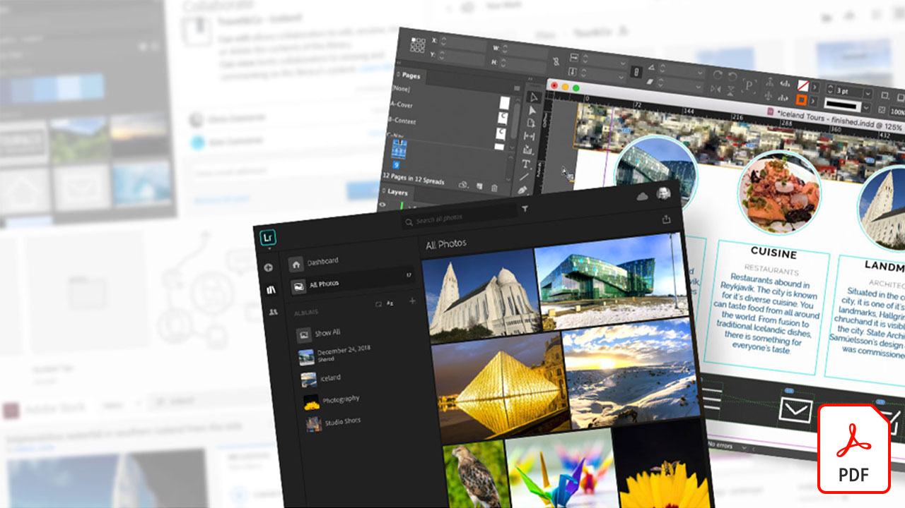
   </a>
    

   <a href="assets/FromLightroomWebtoInDesignviaCreativeCloud.pdf"><strong>透過Lightroom (PDF)從Creative Cloud Web移至InDesign</strong></a>
    

    <em>利用Creative Cloud檔案和程式庫，將您的創意從相機帶入最終設計</em>
     
  </td>
  <td>
    
    

     
  </td>
</tr>
</table>

### [!DNL Dimension]

<table  style="table-layout:fixed">
<tr>
   <td>
   
    

   <a href="assets/VisualizeyourProductinaRealisticEnvironment.pdf"><strong>在逼真的環境中視覺化您的產品(PDF)</strong></a>
    

    <em>當您想要瞭解產品在真實世界中的外觀時，Adobe [!DNL Dimension]是您的首選應用程式</em>
     
  </td>
  <td>
    
    

     
  </td>
  <td>
    
    

     
  </td>
  <td>
    
    

     
  </td>
</tr>
</table>

### Fresco

<table>
<tr>
 <td>
   <a href="frescoworkshop.md">
      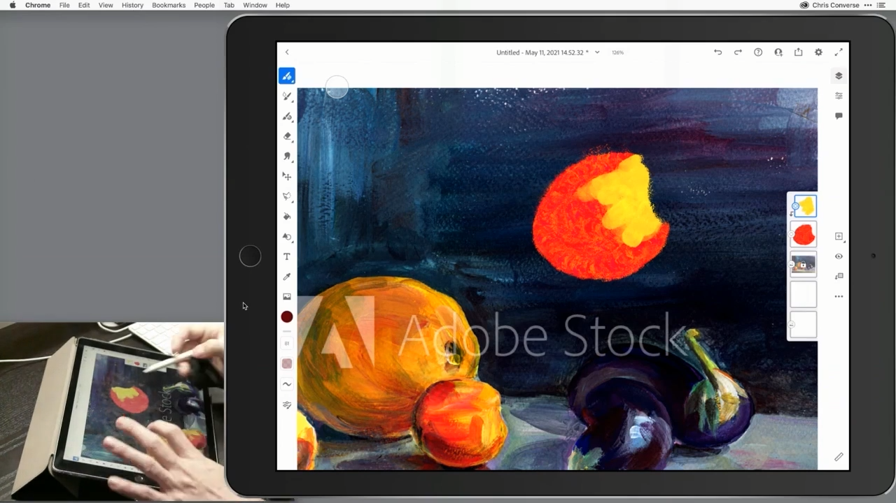
   </a>
    

   <a href="frescoworkshop.md"><strong>在iPad （和iPhone）上試用Fresco </strong></a>
    

    <em>在這個15分鐘的實作講座上，與Adobe Fresco一起探索全新的數位繪圖世界</em>
     
  </td>
  <td>
    
    

     
  </td>
  <td>
    
    

     
  </td>
  <td>
    
    

     
  </td>
</tr>
</table>

### 字體

<table  style="table-layout:fixed">
<tr>
<td>
   
    

   <a href="taming-type-anxiety.md"><strong>正在處理型別焦慮</strong></a>
    

    <em>瞭解如何在Creative Cloud中存取及使用超過20,000種專業設計的字型</em>
     
  </td>
  <td>
   <a href="assets/CreatingBeautifulTypographywithCreativeCloud.pdf">
      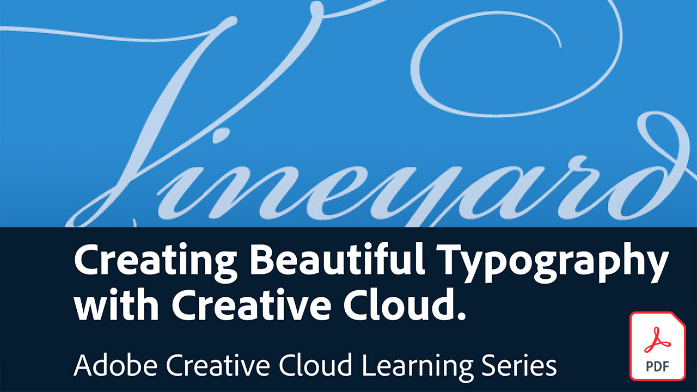
   </a>
    

   <a href="assets/CreatingBeautifulTypographywithCreativeCloud.pdf"><strong>使用Creative Cloud (PDF)建立精美的印刷樣式</strong></a>
    

    <em>瞭解如何運用最先進的設計工具中的排版控制項</em>
     
  </td>
   <td>
   
    

   <a href="assets/DiscoveringFontswithCreativeCloud.pdf"><strong>使用Creative Cloud (PDF)探索字型</strong></a>
    

    <em>有時為專案尋找正確的字型會讓人覺得不知所措。 使用各種Creative Cloud應用程式和服務，尋找正確的字型現在很有趣且令人振奮</em>
     
  </td>
  <td>
   <a href="assets/UnleashHiddenGemsinOpenTypefonts.pdf">
      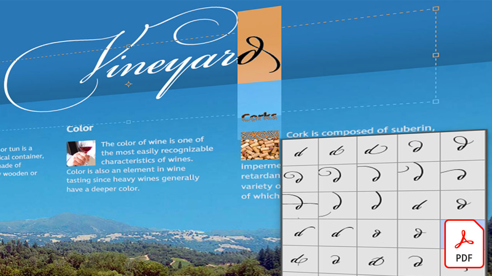
   </a>
    

   <a href="assets/UnleashHiddenGemsinOpenTypefonts.pdf"><strong>在OpenType字型中釋放隱藏的Gems (PDF)</strong></a>
    

    <em>OpenType格式允許字型最多包含65,536個字元</em>
     
  </td>
</table>

### Illustrator

<table  style="table-layout:fixed">
<tr>
   <td>
   <a href="assets/GettoKnowGraphicStylesinIllustrator.pdf">
      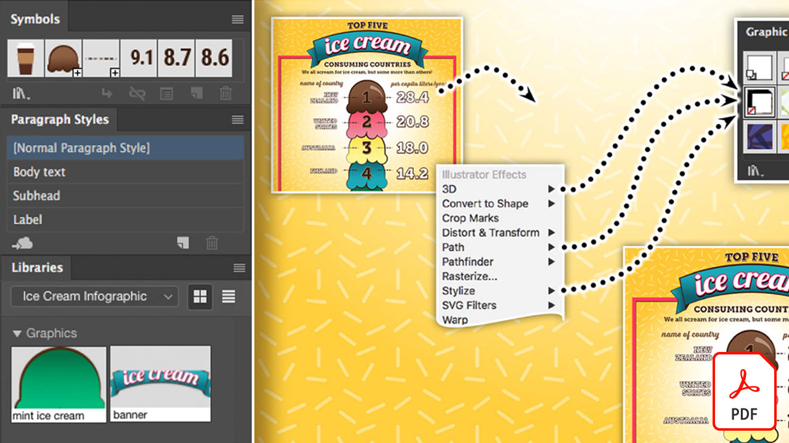
   </a>
    

   <a href="assets/GettoKnowGraphicStylesinIllustrator.pdf"><strong>瞭解Illustrator (PDF)中的繪圖樣式</strong></a>
    

    <em>Illustrator可讓您以類似文字樣式的方式來設定圖稿樣式</em>
     
  </td>
   <td>
   <a href="assets/WorkSmarterNotHarderwithIllustrator.pdf">
      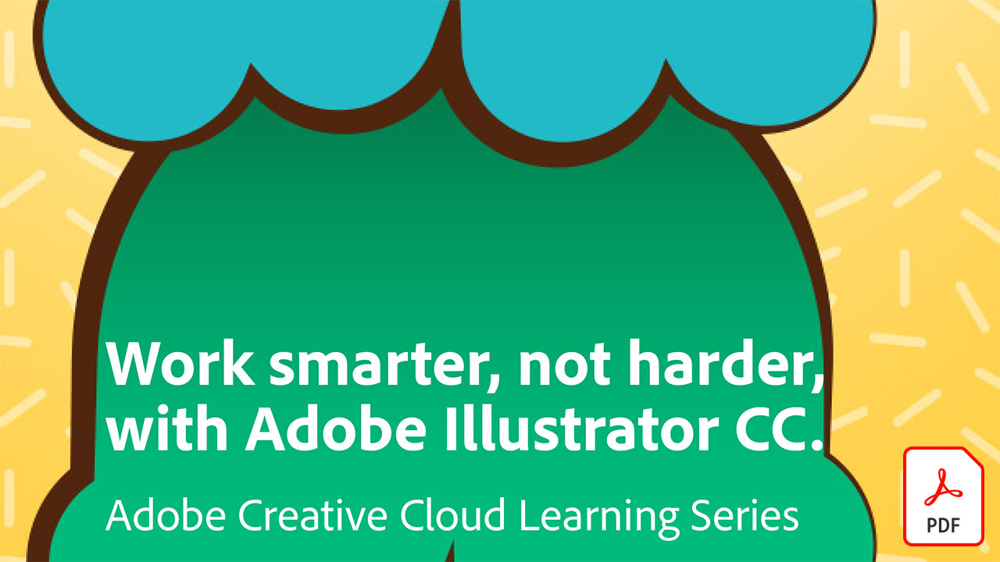
   </a>
    

   <a href="assets/WorkSmarterNotHarderwithIllustrator.pdf"><strong>使用Adobe Illustrator CC (PDF)更聰明地工作</strong></a>
    

    <em>在Illustrator中加速向量圖繪製</em>
     
  </td>
  <td>
   <a href="assets/IllustratorSymbolsandLayersequalsPerfectStructureforResponsiveSVG.pdf">
      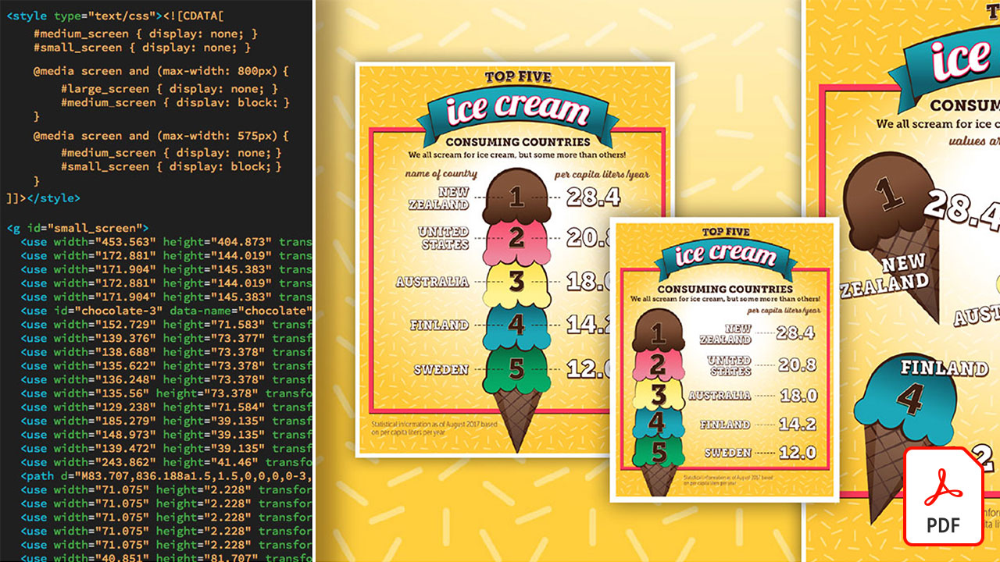
   </a>
    

   <a href="assets/IllustratorSymbolsandLayersequalsPerfectStructureforResponsiveSVG.pdf"><strong>Illustrator符號+圖層=回應式SVG的完美結構！ (PDF)</strong></a>
    

    <em>Illustrator為SVG格式提供無與倫比的支援，包括建立圖稿的符號、群組、識別碼和精確向量定義的能力</em>
     
  </td>
  <td>
    
    

     
  </td>
</tr>
</table>

### InDesign

<table  style="table-layout:fixed">
<tr>
  <td>
   <a href="assets/CreatingInteractivePDFsfromInDesign.pdf">
      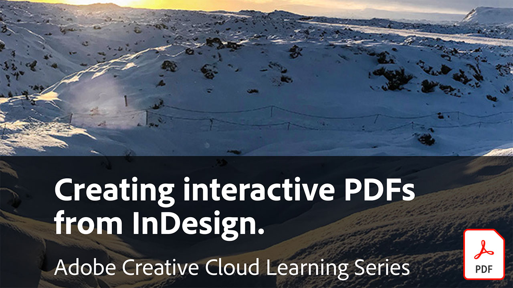
   </a>
    

   <a href="assets/CreatingInteractivePDFsfromInDesign.pdf"><strong>從InDesign (PDF)建立互動式PDF</strong></a>
    

    <em>InDesign包含許多協助您格式化、樣式化、管理及追蹤檔案內容的功能</em>
     
  </td>
   <td>
   <a href="assets/EasilyGatherandIncorporateDesignFeedbackwithAdobeAcrobatandInDesign.pdf">
      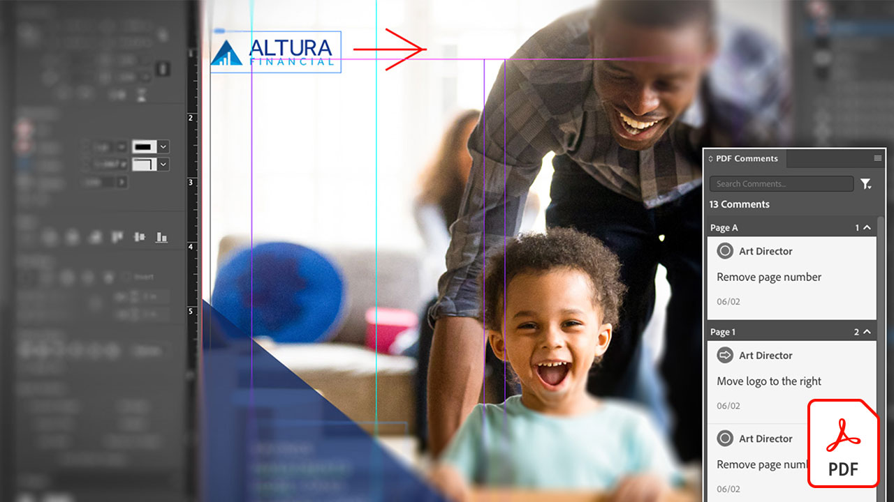
   </a>
    

   <a href="assets/EasilyGatherandIncorporateDesignFeedbackwithAdobeAcrobatandInDesign.pdf"><strong>透過Adobe Acrobat和InDesign (PDF)輕鬆收集與合併設計意見回饋</strong></a>
    

    <em>利害關係人可以使用Acrobat新增詳細的評論和註解，然後您可以快速將這些標籤帶回Adobe InDesign，以便在您的版面環境中檢視它們</em>
     
  </td>
  <td>
   
    

   使用Adobe InDesign CC (PDF)建立<a href="assets/StyleWebContentwithInDesign.pdf"><strong>樣式網頁內容</strong></a>
    

    <em>您知道您可以利用InDesign的強大功能來輸出HTML和Web圖形嗎？</em>
     
  </td>
  <td>
   <a href="assets/InteractivePDFBookmarksandLinkedTOCsfromInDesign.pdf">
      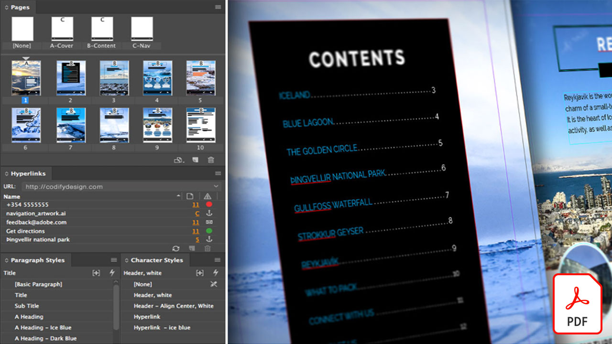
   </a>
    

   <a href="assets/InteractivePDFBookmarksandLinkedTOCsfromInDesign.pdf"><strong>互動式PDF：來自InDesign (PDF)的書籤和連結的目錄</strong></a>
    

    <em>瞭解如何使用InDesign中的目錄功能來產生書籤和超連結，協助您的讀者快速在您的PDF檔案中找到資訊</em>
     
  </td>
</tr>
<tr>
  <td>
   <a href="assets/InteractivePDFGraphicalHyperlinksandNestedMasterPagesinInDesign.pdf">
      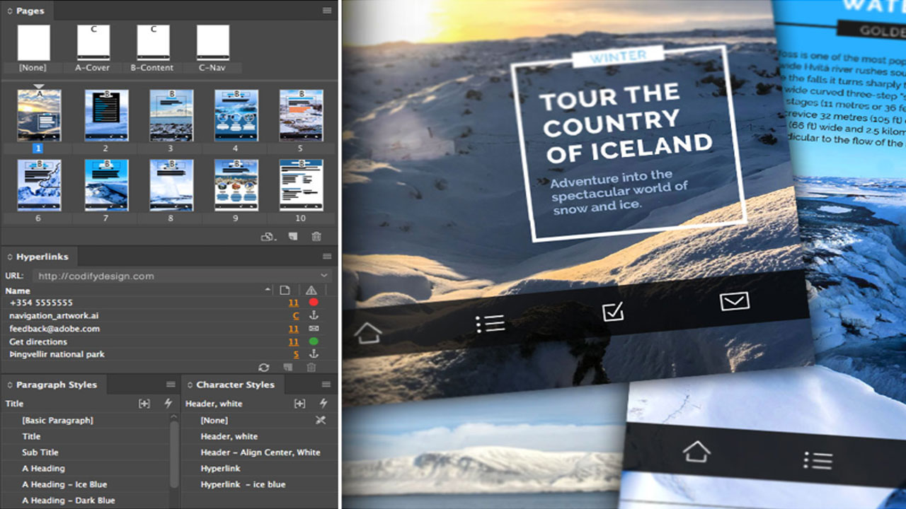
   </a>
    

   <a href="assets/InteractivePDFGraphicalHyperlinksandNestedMasterPagesinInDesign.pdf"><strong>互動式PDF： InDesign (PDF)中的圖形超連結與巢狀主版頁面</strong></a>
    

    <em>套用主版頁面的超連結可讓您快速管理所有頁面的導覽系統</em>
     
  </td>
  <td>
    
    

     
  </td>
  <td>
    
    

     
  </td>
  <td>
    
    

     
  </td>
</tr>
</table>

### Photoshop

<table style="table-layout:fixed">
<tr>
  <td>
    <a href="alphabetsoup.md">
      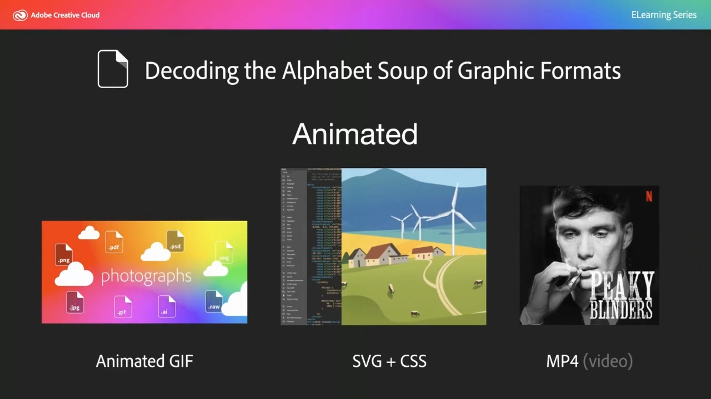
    </a>
    

    <a href="alphabetsoup.md"><strong>解碼圖形格式的字母湯</strong></a>
    

    <em>JPG、PNG、SVG、GIF和EPS檔案都常用於設計，有些用於網頁，有些用於簡報、出版物和創意專案。 但它們是什麼意思？您應該選擇哪一個？</em>
     
  </td>
  <td>
    <a href="compositepsipad.md">
      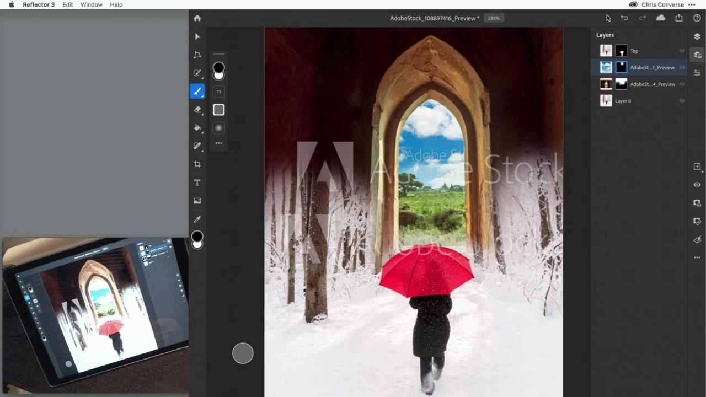
    </a>
    

    <a href="compositepsipad.md"><strong>使用iPad的Adobe [!DNL Stock]和Photoshop建立獨特的複合專案</strong></a>
    

    <em>讓Photoshop的強大功能觸手可及。 瞭解如何以全新方式使用您最愛的Creative Cloud應用程式之一，並搭配重新設計的觸控式介面</em>
     
  </td>
  <td>
    
    

    <a href="cinemagraphps.md"><strong>使用Photoshop建立動態靜圖</strong></a>
    

    <em>在此逐步研討會影片教學課程中，您將Adobe [!DNL Stock]的影片與Photoshop中巧妙的遮色片技巧相結合，以建立栩栩如生的像片</em>
     
  </td>
  <td>
    
    

    <a href="assets/AddRemarkableLightingtoaPhotowithPhotoshopandAfterEffects.pdf"><strong>透過Photoshop和After Effects (PDF)為像片加入非凡的光線</strong></a>
    

    <em>瞭解如何在Adobe After Effects中使用光突發效應，以大幅增強像片</em>
     
  </td>
</tr>
<tr>
  <td>
    
    

    <a href="assets/CreateCinemagraphsinaSnapwithPhotoshopandAdobeStock.pdf"><strong>使用Photoshop和Adobe [!DNL Stock] (PDF)快速建立動態靜圖</strong></a>
    

    <em>在Adobe [!DNL Stock]上搜尋順暢循環的視訊，以便在Photoshop中快速組合吸引目光的電影底片</em>
     
  </td>
  <td>
    
    

    <a href="assets/CreatingaLivingPhotographwithPhotoshopPart1.pdf"><strong>使用Photoshop建立動態像片 — 第1部分(PDF)</strong></a>
    

    <em>Adobe Photoshop可讓您快速將短片轉換為生動像片，讓您的對象在任何社交平台上都著迷</em>
     
  </td>
  <td>
    <a href="assets/CreatingaLivingPhotographwithPhotoshopPart2.pdf">
      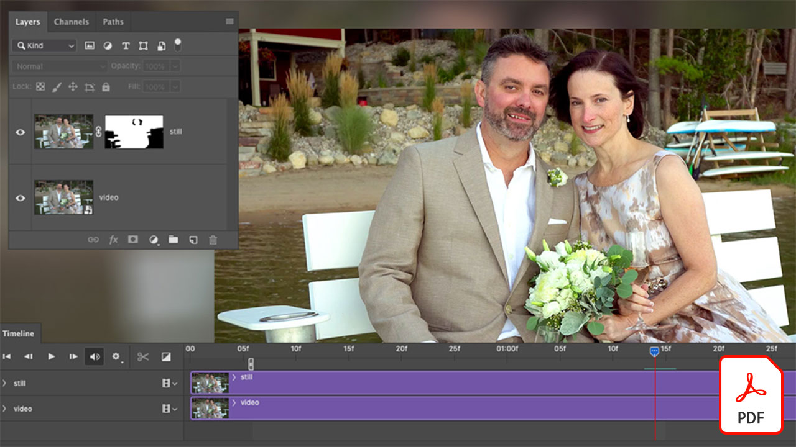
    </a>
    

    <a href="assets/CreatingaLivingPhotographwithPhotoshopPart2.pdf"><strong>使用Photoshop建立動態像片 — 第2部分(PDF)</strong></a>
    

    <em>將像片與視訊結合是增加像片吸引人的品質的強大方法，而且不會犧牲原始影像的訊息或色調</em>
     
  </td>
  <td>
    
    

    <a href="assets/PhotoshopAfterEffectsAwesomenessAdobeMAX2018LabRecap.pdf"><strong>Photoshop + After Effects =非同凡響： Adobe MAX 2018年實驗室回顧(PDF)</strong></a>
    

    <em>在這個實作且逐步的實驗室中，結合Photoshop與After Effects，建立適合在任何媒體中使用的下巴影像和效果</em>
     
  </td>
</tr>
<tr>
  <td>
    
    

    <a href="assets/QuicklyBrandYourInstagramPhotoswithAdobePhotoshopActions.pdf"><strong>使用Adobe Photoshop動作(PDF)快速為您的Instagram像片加上品牌</strong></a>
    

    <em>使用Photoshop中的動作，消除單調乏味並節省大量時間</em>
     
  </td>
  <td>
    <a href="assets/WorkSmarterNotHarderwithPhotoshop.pdf">
      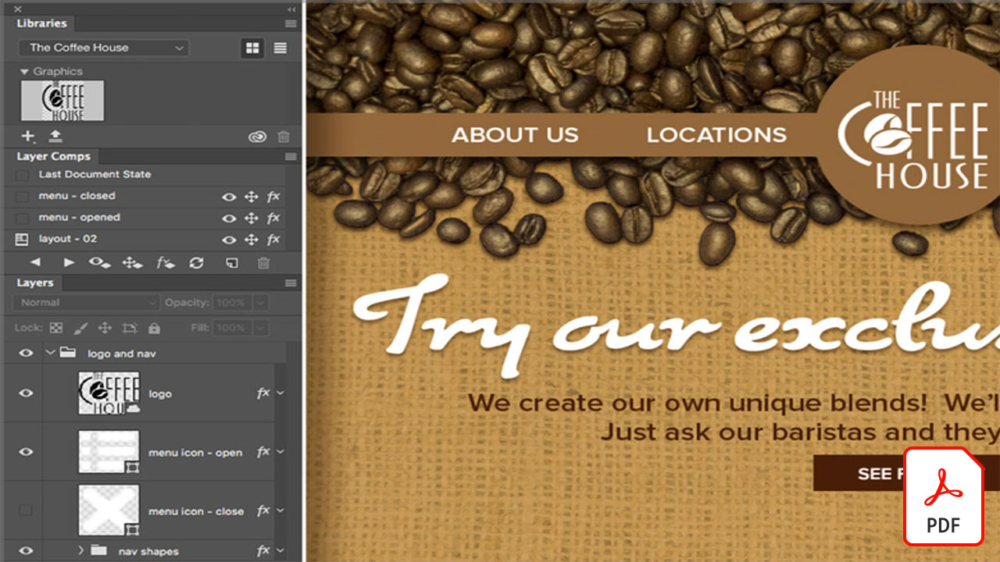
    </a>
    

    <a href="assets/WorkSmarterNotHarderwithPhotoshop.pdf"><strong>使用Photoshop (PDF)，更聰明地工作，而不是更努力</strong></a>
    

    <em>在Photoshop中的變更可能很耗時，但並不一定需要</em>
     
  </td>
  <td>
    <a href="assets/AnyoneCanBeCreativewithAdobeCreativeCloud.pdf">
      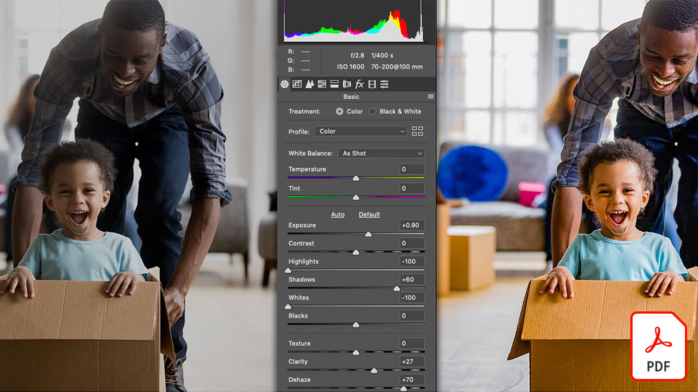
    </a>
    

    <a href="assets/AnyoneCanBeCreativewithAdobeCreativeCloud.pdf"><strong>新增一些Adobe Photoshop至您的創意技能組(PDF)</strong></a>
    

    <em>新增一些Adobe Photoshop至您的創意技能組</em>
     
  </td>
  <td>
    
    

    <a href="assets/GreenScreenisNotJustforVideo.pdf"><strong>綠色熒幕不只適用於視訊(PDF)</strong></a>
    

    <em>您可以在像片工作室中使用綠色熒幕，並使用After Effects準備在Photoshop中使用的像片</em>
     
  </td>
</tr>  
</table>
