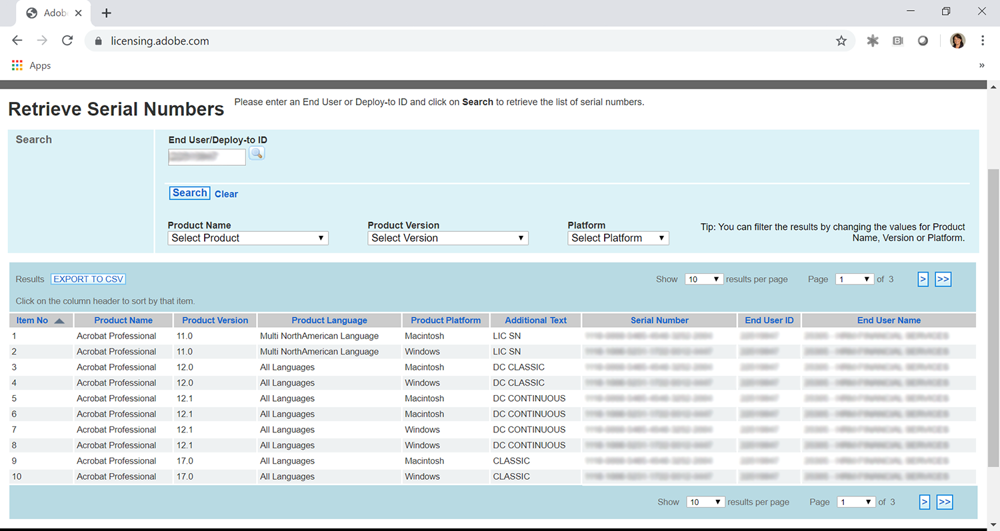
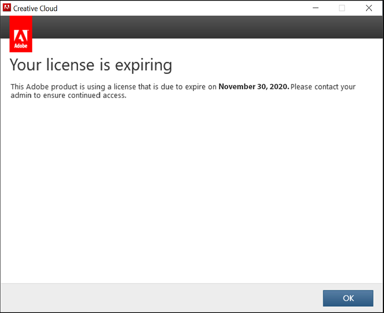
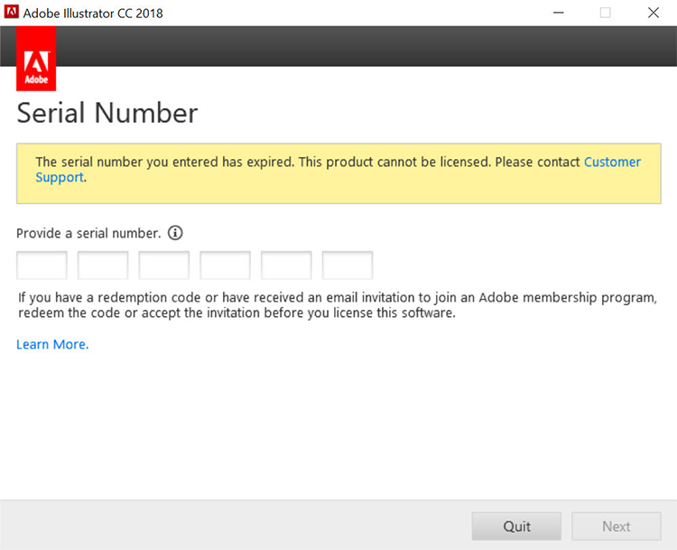
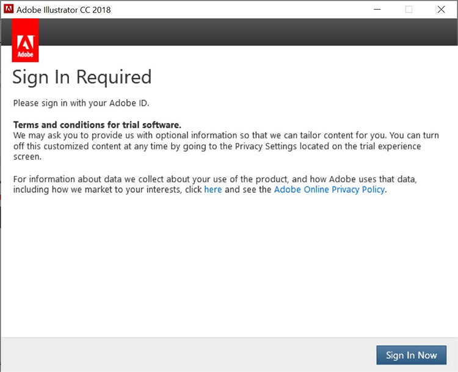
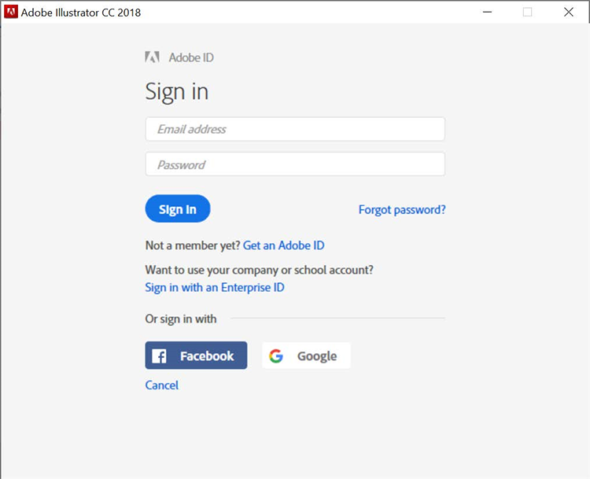
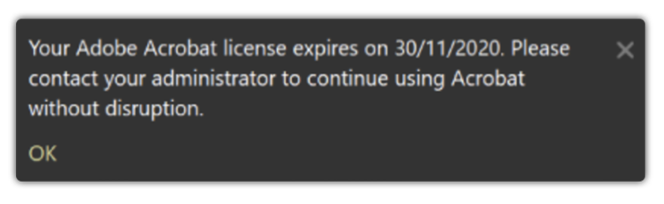
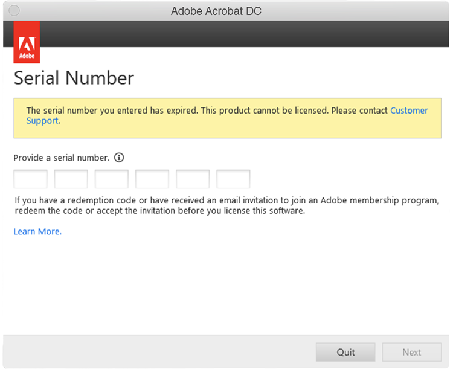
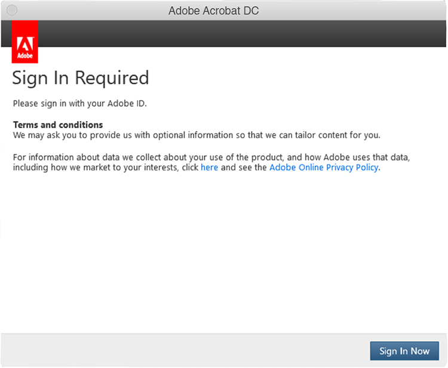
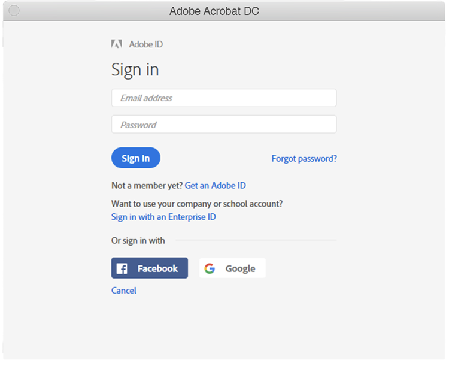

# 瞭解適用於企業的Creative Cloud和Acrobat序號有效期

過去，Adobe會使用我們的應用程式（即Creative Suite、Creative Cloud for enterprise、Acrobat XI、Acrobat DC）將序號核發給簽訂企業授權合約(ETLA)的客戶。 這些序號確實有到期日。 到期日過後，產品將不再有效，因此務必要在序號到期前規劃您的移轉。 本頁面概述確保一般使用者可持續存取其Adobe應用程式和服務所需的步驟。

## 檢查您的序號到期日

### 尋找您的序號

與您的ETLA合約相關聯的序號授權可透過[Adobe授權網站](https://licensing.adobe.com/) (LWS)取得。 請依照下列指示顯示和下載：

1. 使用您的Adobe ID和密碼登入[Adobe授權網站](https://licensing.adobe.com/) (LWS)。
1. 選擇&#x200B;**授權>擷取序號**。
1. 輸入您的&#x200B;**一般使用者ID**&#x200B;或&#x200B;**部署至ID**。
1. （選擇性）選取&#x200B;**產品名稱**、**產品版本**&#x200B;或&#x200B;**平台**&#x200B;以篩選結果。
1. 按一下「搜尋」。
1. 產品名稱和序號便會顯示。
1. （選用）選取「匯出至CSV」以下載序號清單。

### 檢查到期日期

[AdobeExpiryCheck](https://helpx.adobe.com/tw/enterprise/kb/volume-license-expiration-check.html)是命令列公用程式，可供IT管理員檢查電腦上的Adobe產品是否使用已過期或即將過期的序號。 此工具會顯示產品授權識別碼(LEID)、加密序號和到期日等資訊。 此[頁面](https://helpx.adobe.com/tw/enterprise/kb/volume-license-expiration-check.html)包含在Mac或Windows電腦上下載及使用此工具的指示。

## 瞭解序號過期之前和之後的一般使用者體驗

適用於企業應用程式的Acrobat和Creative Cloud都會在到期前60天開始顯示訊息（在應用程式中）。 一旦序號過期，產品就會停止運作，並提示使用者採取動作。

### 適用於企業的Creative Cloud體驗

下列資訊概述一般使用者體驗。 以下是簡短影片，隨後是使用者體驗的檢閱。

>[!VIDEO](https://video.tv.adobe.com/v/3441290?captions=chi_hant&hidetitle=true)

**到期之前**

從序號過期前60天開始，所有適用於企業應用程式的Creative Cloud都會向一般使用者顯示「在產品中」對話方塊。 此訊息會每週顯示，直到到期前30天為止，然後每天顯示，直到到期日顯示&#x200B;*您的授權到期為止。 此Adobe產品使用將於2020年11月29日到期的授權。 請連絡您的管理員以確保繼續存取*。

過期訊息之前的

**過期之後**

一旦序號過期，使用者將無法再存取適用於企業應用程式的Creative Cloud。 到期後第一次啟動時，系統會提示使用者，並出現對話方塊，指出&#x200B;*您輸入的序號已過期。 無法授權此產品。 請聯絡客戶支援*。

過期訊息之後的

對於所有後續嘗試啟動應用程式，系統將提示使用者&#x200B;**立即登入**，之後再選擇建立自己的Adobe ID並進入試用模式。 不過，一般使用者建立的任何新Adobe ID都不會與您組織的授權建立關聯，而且會對您的使用者造成額外的混淆。 為避免業務中斷和/或不必要的混淆，請在您的序號到期之前，將您的使用者移轉至指定的使用者授權。

### Acrobat體驗

下列資訊概述一般使用者體驗。 以下是簡短影片，隨後是使用者體驗的檢閱。

>[!VIDEO](https://video.tv.adobe.com/v/331749?hidetitle=true)

**到期之前**

從序號到期前60天開始，Acrobat會向一般使用者顯示產品快顯訊息。 這將會每週顯示一次，直到到期前7天為止。 然後它會開始每日顯示，指出&#x200B;*您的Adobe Acrobat授權於2020年30月11日到期。 請聯絡您的管理員以繼續使用Acrobat而不會中斷。*

**過期之後**

一旦序號到期，使用者將無法再存取Acrobat。 到期後第一次啟動時，系統會提示使用者，並出現對話方塊，指出&#x200B;*您輸入的序號已過期。 無法授權此產品。 請聯絡客戶支援。*

過期訊息之後的

對於所有後續啟動Acrobat的嘗試，系統將提示使用者&#x200B;**立即登入**，之後再選擇建立自己的Adobe ID並進入試用模式。 不過，一般使用者建立的任何新Adobe ID都不會與您組織的授權建立關聯，而且會對您的使用者造成額外的混淆。

對話方塊1中的Acrobat Sign

對話方塊2中的Acrobat Sign

## 如果您需要協助，請聯絡我們

如果您對使用[AdobeExpiryCheck](https://helpx.adobe.com/tw/enterprise/kb/volume-license-expiration-check.html)工具有任何疑問，或需要協助從序號部署移轉至具名使用者，您有幾個選擇：
* 傳送電子郵件給Adobe Enterprise入門團隊 — **entonb@adobe.com**
* 在[Admin Console](https://adminconsole.adobe.com/support/?locale=zh-Hant)中開啟支援票證
* 聯絡您的Adobe客戶團隊
