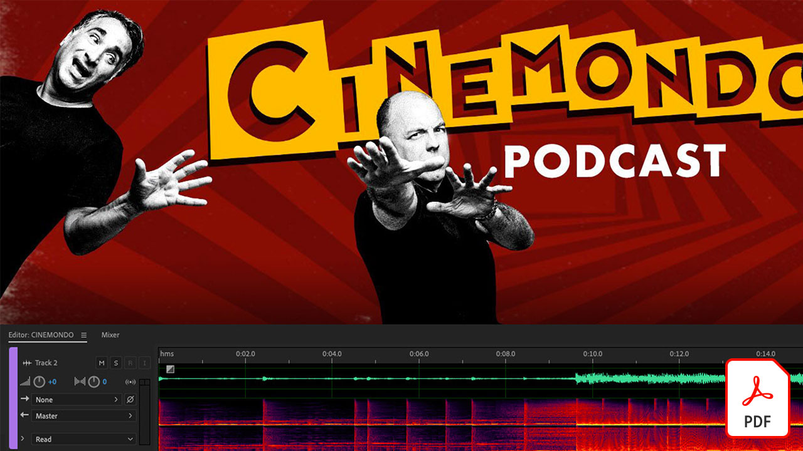
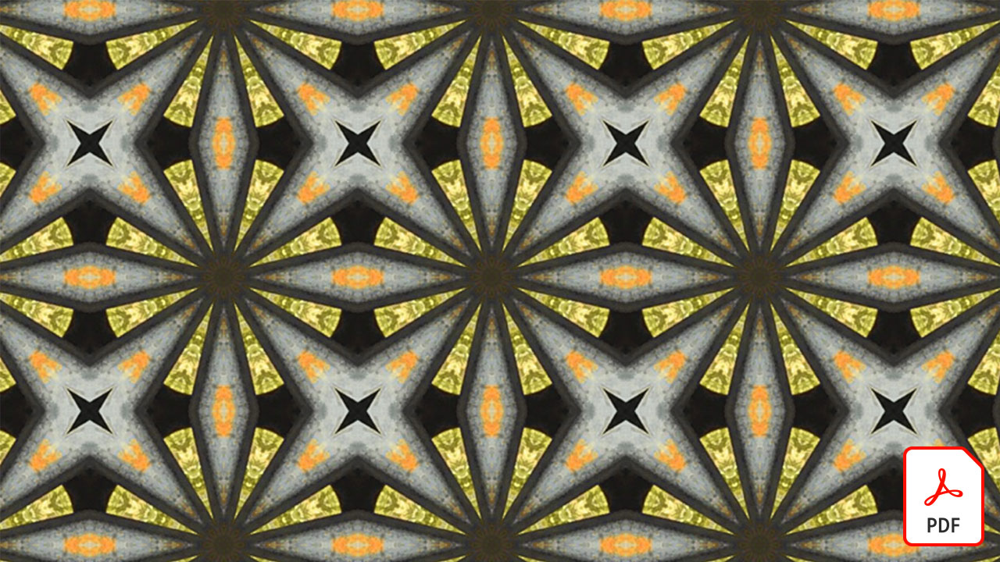
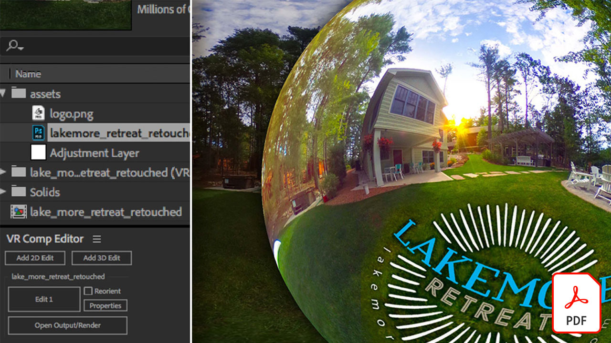

# 影片快速參考指南

透過Adobe軟體與應用程式，讓您的想法栩栩如生，包括視訊編輯、動態圖形、視覺效果、動畫等。 選取要下載或檢視快速參考指南的PDF的影像。

## Adobe Audition

<table>
<tr>
   <td>
      
      

      <a href="assets/QuicklyRemoveUnwantedAudioContentwiththeSpotHealingBrushinAdobeAudition.pdf" target="_blank"><strong>使用Adobe Audition (PDF)中的汙點修復筆刷，快速移除不要的音訊內容</strong></a>
      

      <em>您知道Adobe Photoshop汙點修復筆刷可讓您移除Adobe Audition音訊檔案中分散注意力的聲音嗎？</em>
       
  </td>
  <td>
    
    

     
  </td>
  <td>
    
    

     
  </td>
  <td>
    
    

     
  </td>
</tr>
</table>

## Adobe Express （前身為Adobe Spark）

<table>
<tr>
<td>
   
    

   <a href="assets/ShowcaseyourSparkVideoinyourSparkPage.pdf" target="_blank"><strong>在您的Spark Page (PDF)中展示您的Spark Video</strong></a>
    

    <em>Adobe Spark Page可讓您從多種來源載入視訊，包括您使用Spark Video建立的視訊！</em>
     
  </td>
  <td>
    
    

     
  </td>
  <td>
    
    

     
  </td>
  <td>
    
    

     
  </td>
</tr>
</table>

## After Effects

<table>
<tr>
 <td>
   
    

   <a href="assets/AfterEffectsforPhotography.pdf" target="_blank"><strong>適用於攝影的After Effects (PDF)</strong></a>
    

    <em>瞭解如何在After Effects中使用令人驚豔的效果來增強您的像片</em>
     
  </td>
  <td>
   
    

   <a href="assets/CinemagraphsTheMesmerizingPlaceBetweenaPhotoandaVideo.pdf" target="_blank"><strong>動態靜圖：像片與影片之間的迷人位置(PDF)</strong></a>
    

    <em>進一步瞭解動態靜圖，也就是存在於像片與影片之間的搶眼混合影像</em>
     
  </td>
  <td>
   
    

   <a href="assets/CreateanIllustrationfromanAdobeStockPhotowithAfterEffects.pdf" target="_blank"><strong>使用After Effects (PDF)從Adobe [!DNL Stock]像片中建立插圖</strong></a>
    

    <em>在After Effects中結合色相/飽和度和色階與卡通效果，從Adobe [!DNL Stock]像片中建立獨特的風格化插圖</em>
     
  </td>
   <td>
   
    

   <a href="assets/CreateBeautifulKaleidoscopePatternswithAfterEffects.pdf" target="_blank"><strong>使用After Effects PDF建立精美的萬花筒圖樣)</strong></a>
    

    <em>使用Adobe After Effects中的CC Kaleida效果，從任何影像建立無限數量的圖樣和紋理</em>
     
  </td>
</tr>
<tr>
<td>
   
    

   <a href="assets/CreateIntricateTransparencyinyourPhotographswithKeyinginAfterEffects.pdf" target="_blank"><strong>使用After Effects (PDF)中的Keying在像片中建立複雜的透明度</strong></a>
    

    <em>Keying經常用於視訊，當您的像片需要用於設計專案時，它也會很有幫助</em>
     
  </td>
 <td>
   
    

   <a href="assets/CreateAnimatedTitlesUsingMotionGraphicsTemplatesinAdobePremiereRush.pdf" target="_blank"><strong>在Adobe Premiere [!DNL Rush] (PDF)中使用動態圖形範本建立動畫標題</strong></a>
    

    <em>新增符合您故事或個人品牌且專業設計的動態圖形範本，讓您的影片看起來更令人驚歎</em>
     
  </td>
  <td>
      
      

      <a href="assets/DazzlingLightEffectsforPhotographywithAfterEffects.pdf" target="_blank"><strong>使用After Effects (PDF)進行攝影的炫光效果</strong></a>
      

      <em>Adobe After Effects中的燈光效果可能會大幅改變像片的外觀</em>
       
  </td>
  <td>
      
      

      <a href="assets/EditingVRPhotography360photoswithAfterEffects.pdf" target="_blank"><strong>使用After Effects (PDF)編輯VR Photography （360度像片）</strong></a>
      

      <em>雖然更沈浸式的互動遊戲和體驗並不常見，但360度攝影已經在這裡了</em>
       
  </td>
</tr>
</table>

## Premiere Rush

<table>
<tr>
   <td>
      
      

      <a href="assets/SmoothlyCombineMusicandDialogueorNarrationwithAutoduckinginAdobePremiereRush.pdf" target="_blank"><strong>在[!DNL Adobe Premiere Rush] (PDF)</strong></a>中順暢地結合音樂與對話或旁白與自動迴避功能
      

      <em>Adobe Premiere [!DNL Rush]可在簡單易用的應用程式中提供進階的視訊編輯功能，任何人都能在幾分鐘內建立高品質的視訊</em>
       
  </td>
  <td>
    
    

     
  </td>
  <td>
    
    

     
  </td>
  <td>
    
    

     
  </td>
</tr>
</table>
