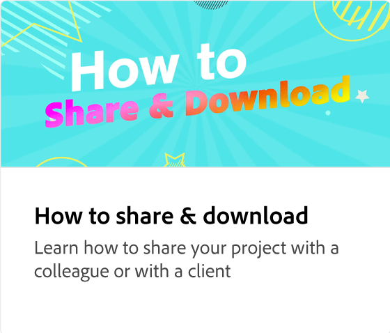

# 設定品牌手冊

瞭解如何建立品牌資產集合，為您的企業或個人專案建立一致且專業的設計。 品牌手冊是品牌資產的集合，例如標誌、顏色、字型、圖形和範本。 這些檔案可以從頭或從現有的資料庫建立，並與擁有編輯或檢視許可權的同事共用。

>[!VIDEO](https://video.tv.adobe.com/v/3420218?quality=12&learn=on&hidetitle=true)

## 本系列的其他影片

<table style="table-layout:fixed">
<tr>
  <td>
      
  </td>
   <td>
      
  </td>
  <td>
      
  </td>
 <td>
      
  </td>
</tr>
<tr>
   <td>
      
  </td>
   <td>
      
  </td>
   <td>
         
   </td>
   <td>
         
   </td>
</tr>
<tr>
    <td>
   
   </td>
   <td>
   
   </td>
   <td>
   
   </td>
   <td>
      
      

       
   </td>
</tr>
</table>
