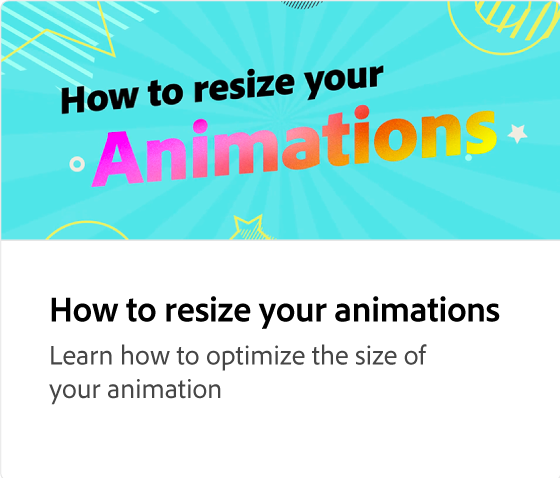

# 動畫簡介

瞭解如何在社交媒體貼文中加入動畫以增加參與度。 選取頁面上的任何元素 （例如影像） 並套用各種類型的動畫，即可存取動畫面板。

>[!VIDEO](https://video.tv.adobe.com/v/3426975?quality=12&learn=on&hidetitle=true)

## 本系列的其他影片

<table style="table-layout:fixed">
<tr>
   <td>
         
   </td>
   <td>
         
   </td>
   <td>
         
   </td>
   <td>
         
   </td>
</tr>
<tr>
   <td>
         
   </td>
   <td>
         
   </td>
   <td>
         
   </td>
   <td>
         
   </td>
</tr>
</table>

