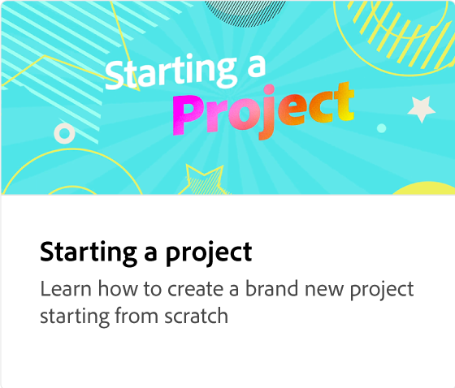

# 使用層次和工作區域

瞭解如何在設計專案中使用工作區域和圖層。 針對不同的社交管道新增、刪除、複製、重新排序和調整工作區域大小。 您也可以變更層次堆疊中元素的順序。

>[!VIDEO](https://video.tv.adobe.com/v/3447076?quality=12&learn=on&hidetitle=true&captions=chi_hant)

## 本系列的其他影片

<table style="table-layout:fixed">
<tr>
 <td>
      
  </td>
   <td>
      
  </td>
   <td>
      
  </td>
  <td>
      
  </td>
</tr>
<tr>
   <td>
      
  </td>
   <td>
      
  </td>
   <td>
      
  </td>
   <td>
         
   </td>
</tr>
<tr>
   <td>
   
   </td>
   <td>
   
   </td>
   <td>
   
   </td>
   <td>
      
      

       
   </td>
</tr>
</table>
