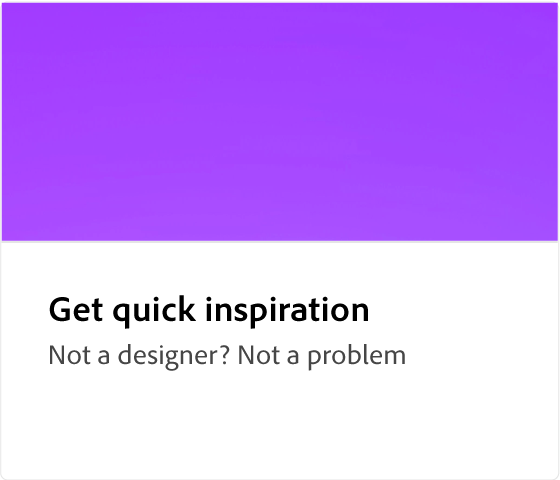
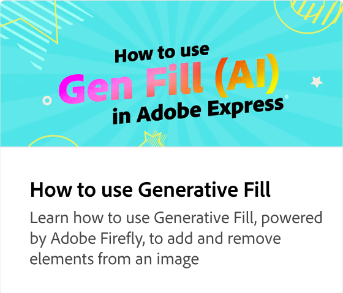
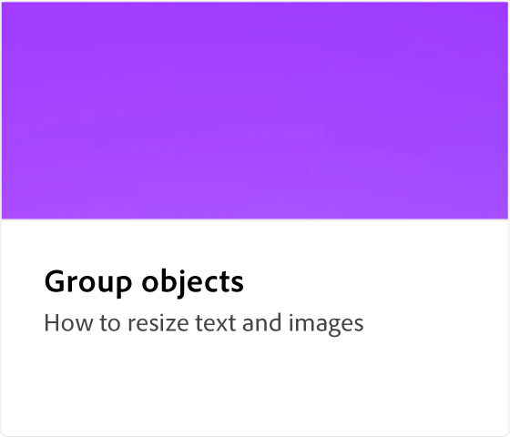
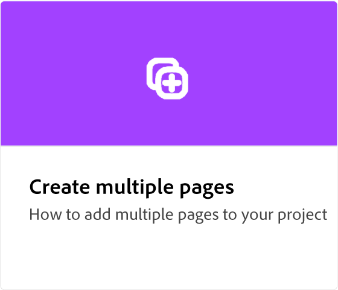
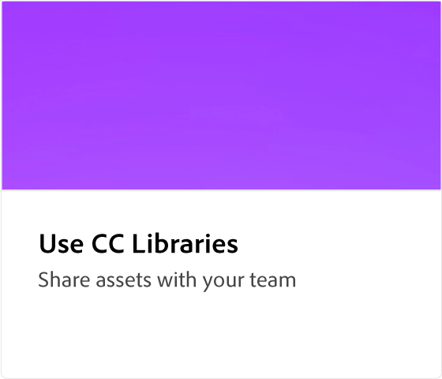
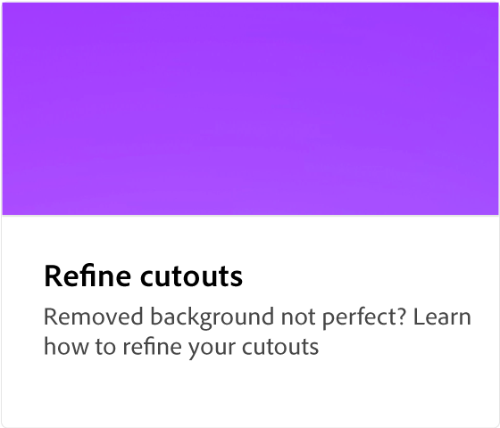
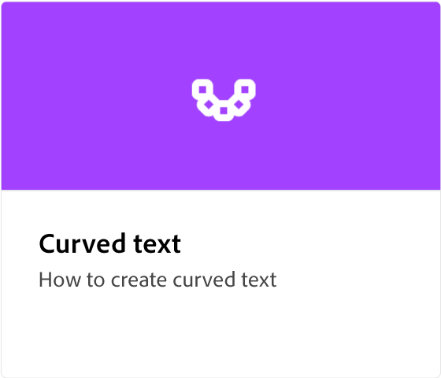
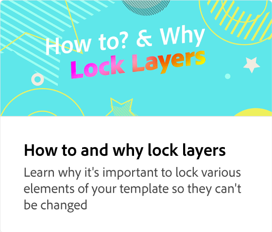
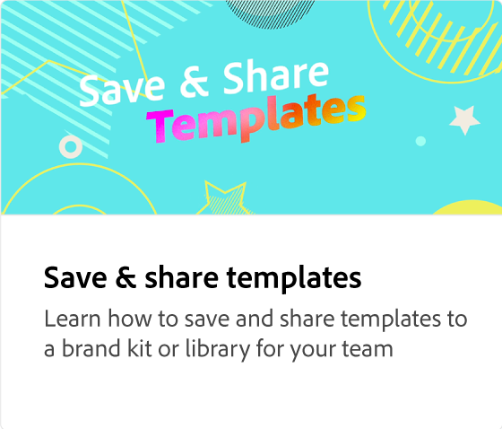
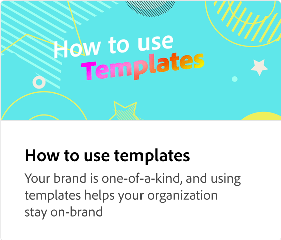

# Adobe [!DNL Express]操作教學課程

開始建立令人驚歎的工作，並透過Adobe Firefly支援的創作AI脫穎而出。 使用Adobe Express設計傳單、TikToks、履歷和卷軸。

## 快速入門

<table style="table-layout:fixed">
<tr>
 <td>
      
 </td>
 <td>
      
 </td>
 <td>
      
 </td>
 <td>
      
      

       
   </td>
</tr>
</table>

## 基本任務

<table style="table-layout:fixed">
<tr>
 <td>
      
  </td>
   <td>
      
  </td>
   <td>
      
  </td>
  <td>
      
  </td>
</tr>
<tr>
   <td>
      
  </td>
   <td>
      
  </td>
   <td>
      
  </td>
   <td>
         
   </td>
</tr>
<tr>
   <td>
         
   </td>
   <td>
   
   </td>
   <td>
   
   </td>
   <td>
   
   </td>
</tr>
<tr>
   <td>
      
   </td>
   <td>
      
  </td>
  <td>
      
      

       
   </td>
   <td>
      
      

       
   </td>
</tr>
</table>

## 動畫

<table style="table-layout:fixed">
<tr>
   <td>
         
   </td>
  <td>
         
   </td>
   <td>
         
   </td>
   <td>
         
   </td>
</tr>
<tr>
   <td>
         
   </td>
   <td>
         
   </td>
   <td>
         
   </td>
   <td>
         
   </td>
</tr>
<tr>
   <td>
         
   </td>
   <td>
      
      

       
   </td>
    <td>
      
      

       
   </td>
    <td>
      
      

       
   </td>
</tr>
</table>

## 進階工作

<table style="table-layout:fixed">
<tr>
   <td>
         
   </td>
   <td>
         
   </td>
   <td>
         
   </td>
   <td>
         
   </td>      
</tr>
<tr>
   <td>
      
   </td>
   <td>
      
   </td>
   <td>
      
   </td>
   <td>
      
   </td>
</tr>
<tr>
   <td>
      
   </td>
   <td>
         
   </td>
   <td>
      
  </td>
  <td>
      
  </td>
</tr>
<tr>
   <td>
      
  </td>
  <td>
         
   </td>
   <td>
         
   </td>
   <td>
    
    

     
   </td>
</tr>
</table>

## 影片

<table style="table-layout:fixed">
<tr>
   <td>
         
   </td>
  <td>
         
   </td>
   <td>
         
   </td>
   <td>
         
   </td>
</tr>
<tr>
  <td>
         
   </td>
    <td>
         
   </td>
   <td>
    
    

     
   </td>
   <td>
    
    

     
   </td>
</tr>
</table>

## 範本

<table style="table-layout:fixed">
<tr>
   <td>
        
        

            <a href="lock-layers.md"><strong>鎖定圖層的方式及原因</strong></a>
            

            <em>瞭解為何鎖定範本的各種元素很重要</em>
             
    </td>
    <td>
         
         

         <a href="create-templates.md"><strong>最大化效率：建立可重複使用的範本</strong></a>
         

         <em>瞭解如何使用範本為您的組織帶來品牌一致性、效率和成本節省</em>
          
   </td>
   <td>
         
         

         <a href="share-templates.md"><strong>儲存並共用範本</strong></a>
         

         <em>瞭解如何儲存範本並分享至您團隊的品牌套件或媒體櫃</em>
          
   </td>
   <td>
         
         

         <a href="use-templates.md"><strong>輕鬆維持與範本的品牌一致性</strong></a>
         

         <em>瞭解如何在整個組織中快速有效地建立品牌內內容</em>
          
   </td>
</tr>
</table>