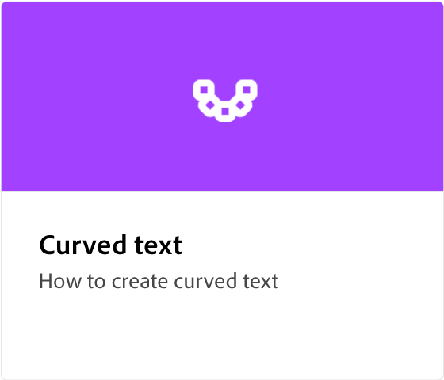

# [!DNL Express] Adobe操作教學課程

開始使用由 Adobe Firefly 支援的生成 AI，創作出出色的出色作品。 使用 Adobe Express 設計傳單、TikToks、履歷表和標籤。

## 快速入門

<table style="table-layout:fixed">
<tr>
 <td>
      
 </td>
 <td>
      
 </td>
 <td>
      
 </td>
 <td>
      
      

       
   </td>
</tr>
</table>

## 基本工作

<table style="table-layout:fixed">
<tr>
 <td>
      
  </td>
   <td>
      
  </td>
   <td>
      
  </td>
  <td>
      
  </td>
</tr>
<tr>
   <td>
      
  </td>
   <td>
      
  </td>
   <td>
      
  </td>
   <td>
         
   </td>
</tr>
<tr>
   <td>
         
   </td>
   <td>
   
   </td>
   <td>
   
   </td>
   <td>
   
   </td>
</tr>
<tr>
   <td>
      
   </td>
   <td>
      
  </td>
  <td>
      
      

       
   </td>
   <td>
      
      

       
   </td>
</tr>
</table>

## 動畫

<table style="table-layout:fixed">
<tr>
   <td>
         
   </td>
  <td>
         
   </td>
   <td>
         
   </td>
   <td>
         
   </td>
</tr>
<tr>
   <td>
         
   </td>
   <td>
         
   </td>
   <td>
         
   </td>
   <td>
         
   </td>
</tr>
<tr>
   <td>
         
   </td>
   <td>
      
      

       
   </td>
    <td>
      
      

       
   </td>
    <td>
      
      

       
   </td>
</tr>
</table>

## 進階工作

<table style="table-layout:fixed">
<tr>
   <td>
         
   </td>
   <td>
         
   </td>
   <td>
         
   </td>
   <td>
         
   </td>      
</tr>
<tr>
   <td>
      
   </td>
   <td>
      
   </td>
   <td>
      
   </td>
   <td>
      
   </td>
</tr>
<tr>
   <td>
      
   </td>
   <td>
   
   </td>
   <td>
         
   </td>
   <td>
      
  </td>
</tr>
<tr>
  <td>
      
  </td>
   <td>
      
  </td>
  <td>
         
   </td>
   <td>
         
   </td>
</tr>
</table>

## 影片

<table style="table-layout:fixed">
<tr>
   <td>
         
   </td>
  <td>
         
   </td>
   <td>
         
   </td>
   <td>
         
   </td>
</tr>
<tr>
   <td>
         
   </td>
   <td>
    
    

     
   </td>
   <td>
    
    

     
   </td>
   <td>
    
    

     
   </td>
</tr>
</table>
