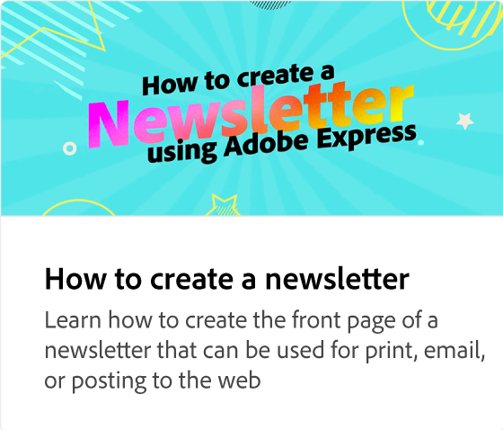
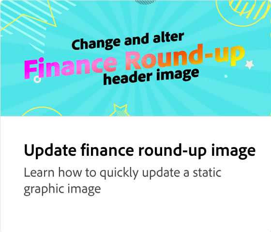
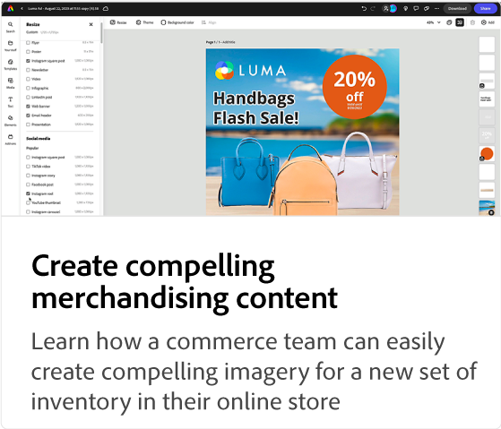

# Adobe [!DNL Express]使用案例教學課程

探索組織內不同的團隊如何受益於Adobe Express。

## 新增功能

>[!BEGINTABS]

>[!TAB 為事件建立多管道人力資源內容]

瞭解如何快速[建立事件的多管道HR內容](create-hr-content.md)。

>[!TAB 建立線上學習課程的促銷視覺效果]

瞭解如何為[線上學習課程](promo-visual.md)建立吸引人的視覺效果。

>[!TAB 建立年終影片]

瞭解如何建立鼓舞人心的年終影片。

>[!ENDTABS]

<table style="table-layout:fixed">
<tr>
   <td>
      
      

      <a href="create-hr-content.md">為事件建立多管道人力資源內容</a>
      

      瞭解如何快速建立事件的多管道人力資源內容
       
   </td>
   <td>
      
      

      <a href="promo-visual.md">建立線上學習課程的促銷視覺效果</a>
      

      瞭解如何為線上學習課程建立吸引人的視覺效果
       
   </td>
   <td>
      
      

      <a href="end-of-year-video.md">建立年終影片</a>
      

      瞭解如何建立鼓舞人心的年終影片
       
   </td>
   <td>
      
      

      <a href="newsletter.md">如何建立電子報</a>
      

      瞭解如何建立電子報的動態首頁
       
   </td>
</tr>
<tr>
   <td>
      
      

      <a href="create-digital-screens.md">建立Office的數位熒幕宣告</a>
      

      瞭解如何為辦公室建立吸引人的數位熒幕公告
       
   </td>
    <td>
      
      

      <a href="create-backgrounds.md">正在建立簡報的背景</a>
      

      瞭解如何為PowerPoint簡報建立吸引人的背景
       
   </td>
   <td>
      
      

      <a href="update-image.md">更新財務彙總影像</a>
      

      瞭解如何快速更新靜態圖形影像
       
   </td>
   <td>
      
      

      <a href="compelling-merchandise.md">建立吸引人的銷售內容</a>
      

      瞭解如何為一組新詳細目錄建立吸引人的影像
       
   </td>
</tr>
<tr>
   <td>
      
      

      <a href="multi-channel-marketing-content.md">讓行銷團隊建立多管道內容</a>
      

      瞭解如何建立獨特的內容以吸引線上活動的觀看者
       
   </td>
   <td>
      
      

      <a href="localized-marketing-content.md">讓分散的團隊將內容當地語系化</a>
      

      瞭解如何將地區行銷活動的內容本地化
       
   </td>
   <td>
      
      

      <a href="jumpstart-ideation.md">Jumpstart創意創意</a>
      

      瞭解如何搶先開發創意內容
       
   </td>
   <td>
      
      

      <a href="create-local-marketing.md">使用Firefly為行銷活動建立傳單內容</a>
      

      瞭解如何將全球行銷活動的內容本地化
       
   </td>
</tr>
<tr>
   <td>
      
      

      <a href="create-on-boarding.md">使用Firefly建立招募和上線內容</a>
      

      瞭解如何為員工招募和入門內容建立獨特的圖形
       
   </td>
   <td>
      
      

      <a href="create-social-posters.md">使用Firefly建立社交海報</a>
      

      瞭解如何輕鬆建立社群媒體的促銷活動
       
   </td>
   <td>
      
      

      <a href="create-blog-graphics.md">使用Firefly建立部落格的圖形內容</a>
      

      瞭解如何為網頁、部落格及社交行銷活動建立獨特的圖形內容
       
   </td>
   <td>
      
      

      <a href="create-webinar-poster.md">使用Firefly建立網路研討會海報</a>
      

      瞭解如何為虛擬實境活動創作引人入勝的網路研討會海報
       
   </td>
</tr>
</table>
