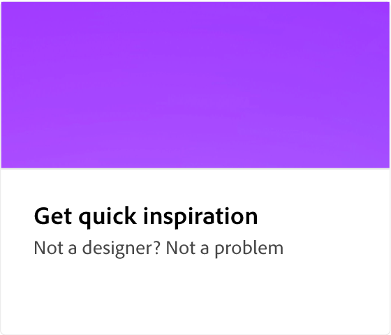
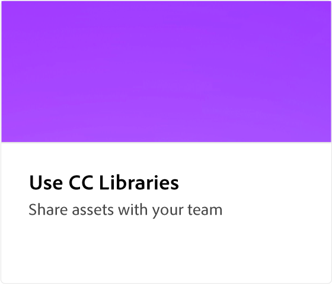

# [!DNL Express]Adobe概觀

Adobe Express 是簡單易用的創意工具，無需具備任何體驗。

  

## 使用 Adobe Express 建立您的第一個設計

  

>[!VIDEO](https://video.tv.adobe.com/v/3420225?quality=12&learn=on&hidetitle=true)

## Adobe Express 教學課程

<table style="table-layout:fixed">
<tr>
   <td>
      
  </td>
  <td>
      
   </td>     
   <td>
      
   </td>    
   <td>
      
   </td>
</tr>
<tr>
   <td>
      
   </td>
   <td>
      
   </td>
   <td>
      
   </td>
   <td>
      
   </td>
</tr>
<tr>
  <td>
   
  </td>
    <td>
      
  </td>
   <td>
   
  </td>
   <td>
         
   </td>
</tr>
<tr>
  <td>
         
   </td>
  <td>
         
   </td>
  <td>
      
  </td>
  <td>
      
   </td>
</tr>
<tr>
 <td>
      
  </td>
   <td>
      
  </td>
   <td>
      
  </td>
  <td>
      
  </td>
</tr>
<tr>
 <td>
      
  </td>
  <td>
      
  </td>
  <td>
      
  </td>
   <td>
      
   </td>
</tr>
</table>
