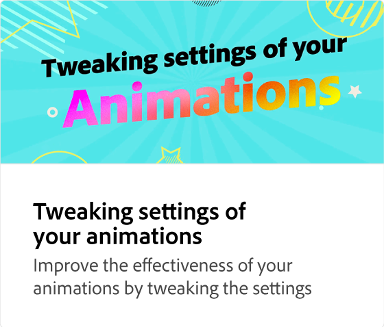

# 如何調整動畫大小

瞭解如何使用適用於 Instagram 等社交媒體貼文的內建預設集，優化動畫大小。 無論您如何調整動畫大小，都會保留這些設定，這樣您就不需要重建這些設定。

>[!VIDEO](https://video.tv.adobe.com/v/3437737?quality=12&learn=on&hidetitle=true&captions=chi_hant)

## 本系列的其他影片

<table style="table-layout:fixed">
<tr>
   <td>
         
   </td>
  <td>
         
   </td>
   <td>
         
   </td>
   <td>
         
   </td>
</tr>
<tr>
    <td>
         
   </td>
   <td>
         
   </td>
   <td>
         
   </td>
   <td>
         
   </td>
</tr>
</table>
