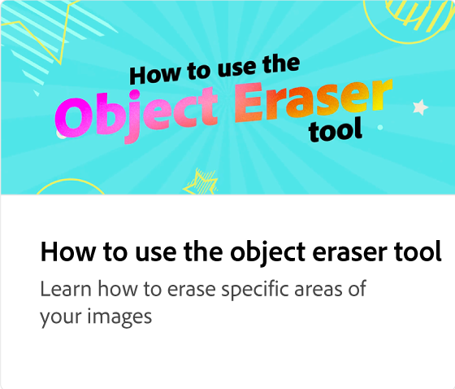

# 如何使用排程器張貼

安排 Instagram、Facebook、Twitter、Pinterest 和 LinkedIn 的社交貼文。 您可以為每個平台選擇特定屬性。 例如，您可以在 Instagram 上選擇您的內容是要貼文、故事還是轉臻。

>[!VIDEO](https://video.tv.adobe.com/v/3420242?quality=12&learn=on&hidetitle=true)

## 本系列的其他影片

<table style="table-layout:fixed">
<tr>
   <td>
         
   </td>
   <td>
         
   </td>
   <td>
         
   </td>
   <td>
         
   </td>      
</tr>
<tr>
   <td>
      
   </td>
   <td>
      
   </td>
   <td>
      
   </td>
   <td>
      
   </td>
</tr>
</table>
