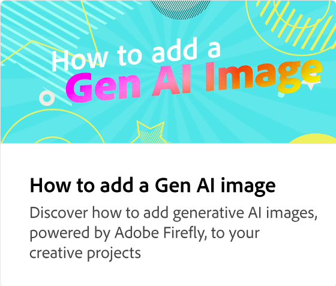

# 如何分享和下載

瞭解以 PNG、JPEG 或 PDF 等不同檔案格式下載及共用項目的選項。 將專案發佈到網路併產生連結以方便存取，或安排媒體並直接分享到社交媒體平臺，並提供為每個平臺自定義貼文的選項。

>[!VIDEO](https://video.tv.adobe.com/v/3426936?quality=12&learn=on&hidetitle=true)

## 本系列的其他影片

<table style="table-layout:fixed">
<tr>
   <td>
      
  </td>
   <td>
      
  </td>
   <td>
      
   </td>
   <td>
      
   </td>
</tr>
<tr>
   <td>
      
  </td>
   <td>
      
  </td>
   <td>
      
  </td>
   <td>
         
   </td>
</tr>
<tr>
   <td>
         
   </td>
   <td>
   
   </td>
   <td>
   
   </td>
   <td>
      
      

       
   </td>
</tr>
</table>
