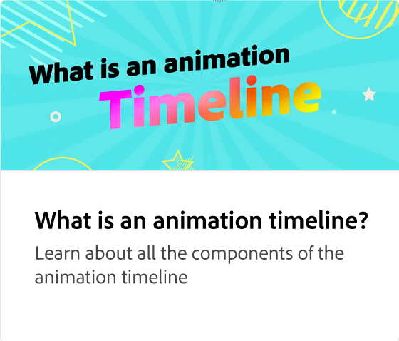
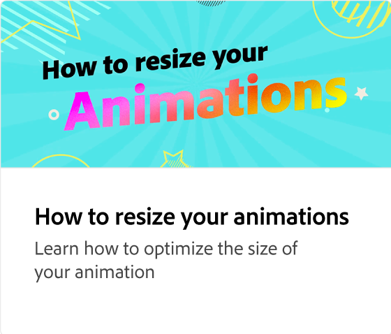

# 調整動畫的設定

瞭解如何調整動畫的設定以提升效果。 您可以編輯動畫的持續時間、個性、速度和強度，以建立特定效果。

>[!VIDEO](https://video.tv.adobe.com/v/3426977?quality=12&learn=on&hidetitle=true)

## 本系列的其他影片

<table style="table-layout:fixed">
<tr>
   <td>
         
   </td>
   <td>
         
   </td>
   <td>
         
   </td>
   <td>
         
   </td>
</tr>
<tr>
   <td>
         
   </td>
   <td>
         
   </td>
   <td>
         
   </td>
   <td>
         
   </td>
</tr>
</table>
