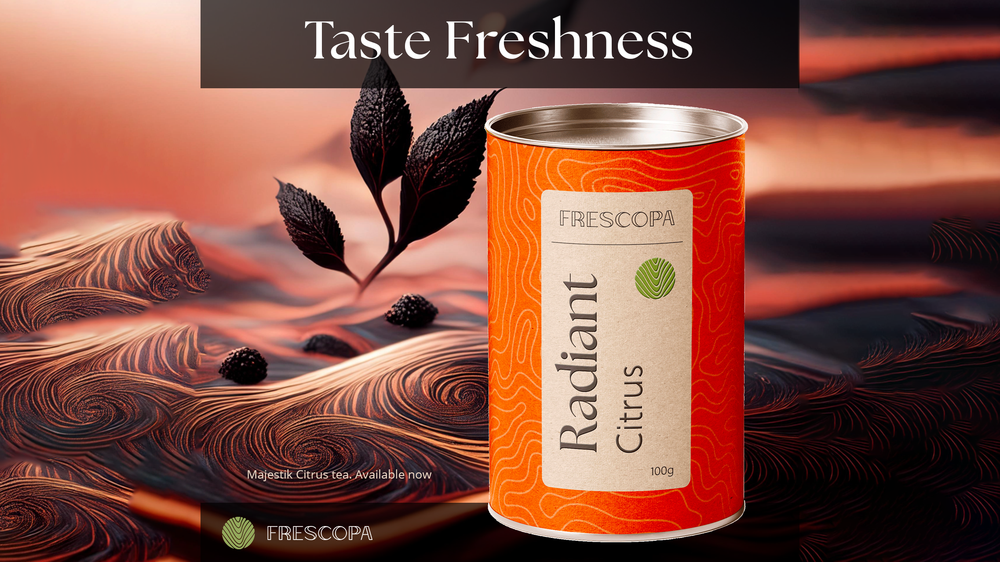

# 使用範本輕鬆保持品牌一致性

瞭解如何在整個組織中快速有效率地建立品牌內容。 此教學課程逐步瞭解如何建立全新的品牌特效內容，以便立即分享和當地語系化。

>[!VIDEO](https://video.tv.adobe.com/v/3427099?quality=12&learn=on&hidetitle=true)

## 本系列的其他影片

<table style="table-layout:fixed">
<tr>
    <td>
        
        

            <a href="lock-layers.md"><strong>如何和為何鎖定圖層</strong></a>
            

            <em>了解為何鎖定範本的各種元素如此重要</em>
             
    </td>
    <td>
         
         

         <a href="create-templates.md"><strong>提高效率：建立可重複使用的範本</strong></a>
         

         <em>瞭解如何使用範本為您的組織帶來品牌一致性、效率、專業性和成本節約</em>
          
   </td>
   <td>
         
         

         <a href="share-templates.md"><strong>儲存和共用範本</strong></a>
         

         <em>瞭解如何為您的團隊儲存及分享範本至品牌手冊或資料庫</em>
          
   </td>
    <td>
      
      

       
    </td>
</tr>
</table>
