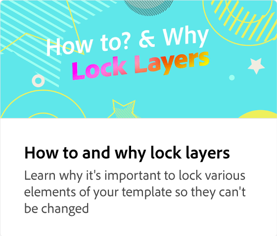
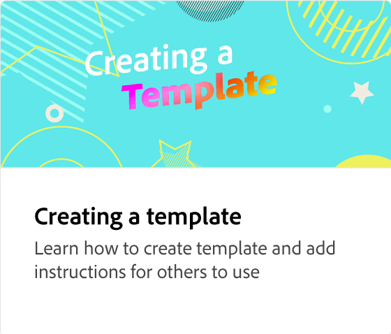
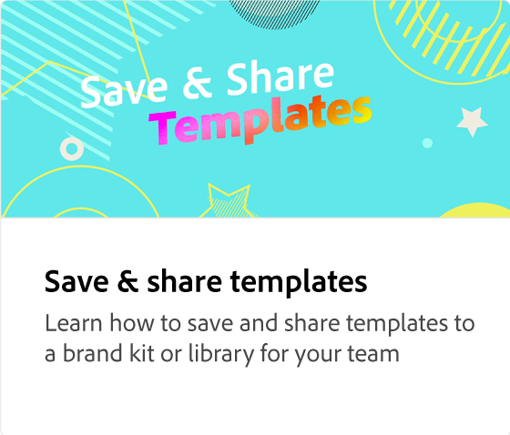

# 輕鬆維持與範本的品牌一致性

瞭解如何在整個組織中快速有效地建立品牌內內容。 本教學課程將逐步說明如何建立全新的品牌上內容，並立即進行共用和本地化。

>[!VIDEO](https://video.tv.adobe.com/v/3436141?captions=chi_hant&quality=12&learn=on&hidetitle=true)

## 此系列的其他影片

<table style="table-layout:fixed">
<tr>
    <td>
        
        

            <a href="lock-layers.md"><strong>鎖定圖層的方式及原因</strong></a>
            

            <em>瞭解為何鎖定範本的各種元素很重要</em>
             
    </td>
    <td>
         
         

         <a href="create-templates.md"><strong>最大化效率：建立可重複使用的範本</strong></a>
         

         <em>瞭解如何使用範本為您的組織帶來品牌一致性、效率和成本節省</em>
          
   </td>
   <td>
         
         

         <a href="share-templates.md"><strong>儲存並共用範本</strong></a>
         

         <em>瞭解如何儲存範本並分享至您團隊的品牌套件或媒體櫃</em>
          
   </td>
    <td>
      
      

       
    </td>
</tr>
</table>
