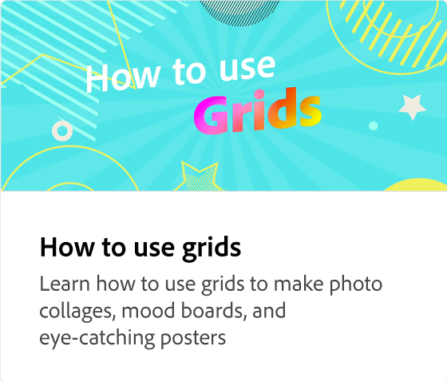

# 專案的UX

瞭解如何在Adobe Express中導覽工作區。 工作區包含強大的搜尋功能，可尋找背景、音訊範本和像片。 您可以存取自己的品牌和範本，並搜尋特定主題。 媒體可從裝置上傳，或從Adobe Stock集合中選擇。 設計資產、背景、形狀和圖示都可在專案中使用。 此外，您可以邀請同事共同進行專案設計。

>[!VIDEO](https://video.tv.adobe.com/v/3426932?quality=12&learn=on&hidetitle=true)

## 此系列的其他影片

<table style="table-layout:fixed">
<tr>
 <td>
      
  </td>
   <td>
      
  </td>
   <td>
      
  </td>
   <td>
      
  </td>
</tr>
<tr>
   <td>
      
  </td>
   <td>
      
  </td>
   <td>
         
   </td>
    <td>
         
   </td>
</tr>
<tr>
    <td>
   
   </td>
   <td>
   
   </td>
   <td>
   
   </td>
    <td>
      
      

       
   </td>
</tr>
</table>
