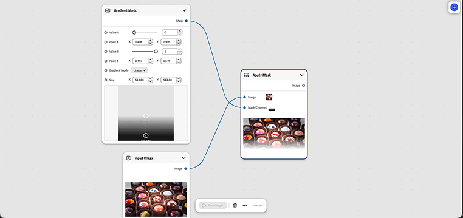

# &#x200B;3. 建立您的第一個圖表

一旦您知道節點、連線和範本是什麼，您就可以準備建立第一個工作流程。

1. 開啟Firefly並從左側功能表選取&#x200B;**圖形**。
1. 選取&#x200B;**建立新圖形**。
1. 在空白畫布上按一下滑鼠右鍵，然後選取&#x200B;**+新節點**。
1. 在左側功能表中選取&#x200B;**輸入**，然後選取&#x200B;**輸入影像**。
   
此節點可讓您匯入圖形。
1. 將影像拖放至節點。
   
1. 在空白畫布上按一下滑鼠右鍵，選取&#x200B;**+新節點**，然後在對話方塊中選取&#x200B;**漸層遮色片**。
1. 在空白畫布上按一下滑鼠右鍵，選取&#x200B;**+新節點**，然後在對話方塊中選取&#x200B;**套用遮色片**。
1. 將&#x200B;**輸入影像**&#x200B;節點輸出插入&#x200B;**套用遮色片**&#x200B;影像節點輸入。
1. 將&#x200B;**漸層遮色片**&#x200B;輸出插入&#x200B;**套用遮色片**遮色片/色版輸入。
   

## 下一步

從範本開始？ 前往[4。 自訂範本](https://experienceleague.adobe.com/en/docs/creative-cloud-enterprise-learn/cce-learning-hub/fireflyoverview/firefly-graph/customize-template)，使其反映您自己的簡報。
