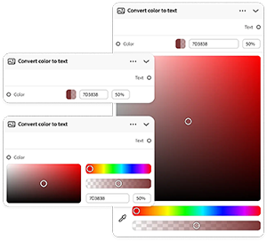

# &#x200B;2. Firefly Graph重要概念

瞭解重要概念，協助您開始使用Firefly Graph。

## 節點

節點會在工作流程中執行一個步驟 — 一個節點，一個工作。 節點可以產生影像、套用遮色片、移動顏色，或執行任何其他單一創意動作。

{align="center"}

## 連線埠

節點上的連線點。 輸出連線埠會從節點傳送資料；輸入連線埠會接收傳入的資料。 連線埠是資料流經工作流程的方式。

{align="center"}

## Widget

節點上的互動式控制項，例如文字欄位、下拉式清單和滑桿，可讓您直接在編輯器中設定其設定。

{align="center"}

## 連線

連線會在兩個節點之間傳輸輸入或輸出。 圖形會從左到右讀出，從來源輸入到最終輸出。

{align="center"}

## 圖表

您在編輯器中建立的完整工作流程。 圖表是由安排在畫布上以產生最終輸出的節點和連線所組成。

{align="center"}

## 下一步

準備好建置一些東西了嗎？ 移至[3。 建立您的第一個圖形](https://experienceleague.adobe.com/en/docs/creative-cloud-enterprise-learn/cce-learning-hub/fireflyoverview/firefly-graph/create-your-first-graph)以進行逐步解說。

返回[開始使用Firefly圖形](https://experienceleague.adobe.com/en/docs/creative-cloud-enterprise-learn/cce-learning-hub/fireflyoverview/firefly-graph/overview-firefly-graph)。
