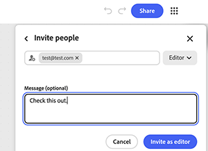

# &#x200B;5. 共用圖表

瞭解如何與其他人共用圖表。 共用圖表會共用即時工作流程，而不只是輸出。 任何擁有編輯存取許可權的人都可以重新執行、變更它，並將其交給其他人。 使用連結層級存取權在組織內獲得廣泛的可見度，並為需要直接存取的任何人提供具有特定角色的已命名邀請。

1. 選取圖表右上角的&#x200B;**共用**。

   {align="center"}

   對話方塊隨即開啟，其中包含一個欄位，用於新增名稱或電子郵件，以及目前擁有存取權的使用者摘要。 依預設，只有受邀人員才能存取圖表。

1. 選取齒輪圖示以開啟&#x200B;**設定**。

   {align="center"}

   提供三種存取層級：僅限受邀人員、組織成員或擁有連結的人員。

1. 選取&#x200B;**在[組織]的所有人都可以檢視**，讓公司內的任何人透過連結開啟圖形。

   {align="center"}

1. 透過搜尋開啟「可探索」，讓成員可以找到圖表，完全不需要連結。

   {align="center"}

   確認橫幅會明確指出誰可以使用連結檢檢視形。 將連結傳送至任何地方前請先勾選此方塊。 它適用於該連結的每個未來收件者，而不只是下一個受邀人員。

1. 在「邀請」欄位中直接輸入電子郵件地址，與一般連結設定分開，給予一個名為存取權的人存取權。 從欄位下方顯示的建議中選取其專案。

   {align="center"}

1. 選取其名稱旁的角色下拉式清單，以選擇「編輯者」或「檢視者」。

   {align="center"}

   編輯者可以編輯、下載和共用圖形。 檢視器只能檢視它。 選擇較窄的角色，除非人員需要變更圖表本身。

1. 在&#x200B;**訊息**&#x200B;欄位中新增選擇性附註，讓收件者知道他們為何取得存取權。 選取&#x200B;**邀請作為編輯者**，或選取&#x200B;**邀請作為檢視者** （如果已選取該角色），以傳送它。

   {align="center"}

## 下一步

要從範本開始嗎？ 前往[5。 自訂範本](https://experienceleague.adobe.com/zh-hant/docs/creative-cloud-enterprise-learn/cce-learning-hub/fireflyoverview/firefly-graph/customize-template)，使其反映您自己的簡報。

返回[開始使用Firefly圖形](https://experienceleague.adobe.com/zh-hant/docs/creative-cloud-enterprise-learn/cce-learning-hub/fireflyoverview/firefly-graph/overview-firefly-graph)。