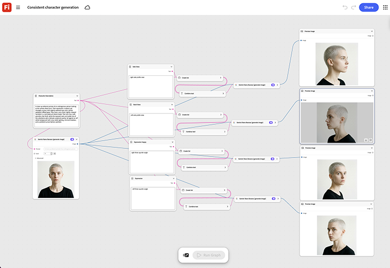

# 產生一致的字元

瞭解如何載入一個字元的參考影像，然後交換每個新快照的場景或姿勢提示。 [開啟一致的字元產生範本](https://firefly.adobe.com/graph/edit/id/urn:aaid:sc:US:6ab4c3c7-ead2-5fa5-9441-75b7a362ce11)。

[!BADGE 產業範例]{type=Informative tooltip="產業範例"}

* **旅遊** — 在多視訊目的地系列和社交內容中，保持循環的指南或吉祥物字元一致，而不需針對每個場景重新簡報插圖師。
* **零售** — 在數十個季節性產品插圖和社交貼文中維護一個品牌輻條字元。
* **教育** — 在課程的每個課程影片中，保持動畫講師字元一致。

>[!TIP]
>
>**開始之前** — 為獲得最佳結果，請根據您自己的品牌、產品和工作流程自訂此範本。 在使用任何輸出之前，交換參考影像、提示和複製。

{align="center"}

返回[開始使用Firefly Graph](https://experienceleague.adobe.com/en/docs/creative-cloud-enterprise-learn/cce-learning-hub/fireflyoverview/firefly-graph/overview-firefly-graph)。
