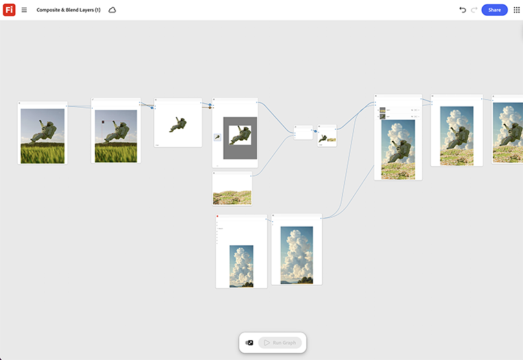

# 複合與混合圖層

瞭解如何將產品切除和背景場景棧疊為單獨的圖層輸入。 調整混合模式和光源節點，直到複合讀取為單次拍攝為止。 [開啟複合與混合圖層範本](https://firefly.adobe.com/graph/edit/id/urn:aaid:sc:US:6ab4c3c7-ead2-5fa5-9441-75b7a362ce11)。

[!BADGE 產業範例]{type=Informative tooltip="產業範例"}

* **飲品** — 將新的飲品組合成沙灘生活風格場景，以供夏季行銷活動使用，而不需飛翔
攝影團隊前往某個位置。
* **零售** — 將產品切割融入首頁橫幅的季節性生活方式背景。
* **旅遊** — 在聯合品牌促銷的產品快照後面合成目的地背景。

>[!TIP]
>
>**開始之前** — 為獲得最佳結果，請根據您自己的品牌、產品和工作流程自訂此範本。 在使用任何輸出之前，交換參考影像、提示和複製。

{align="center"}

返回[開始使用Firefly Graph](https://experienceleague.adobe.com/en/docs/creative-cloud-enterprise-learn/cce-learning-hub/fireflyoverview/firefly-graph/overview-firefly-graph)。
