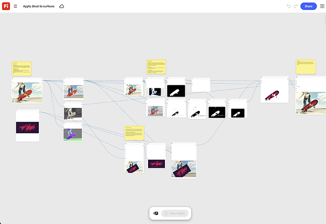

# 貼花至曲面

瞭解如何在產品模型上視覺化標籤或標誌。 範本會將貼花包裝在曲面幾何上，使其正確遵循輪廓。 [開啟[套用貼花至表面]範本](https://firefly.adobe.com/graph/edit/id/urn:aaid:sc:US:78443d67-3663-50df-868e-dd231469f868)。

[!BADGE 產業範例]{type=Informative tooltip="產業範例"}

* **戶外** — 在訂購生產工具之前，將重新整理的標誌貼花套用至全線齒輪模型，以預覽重新命名。
* **汽車** — 在包裝生產前，預覽車輛模型上的全新裝飾或貼花設計。
* **零售業** — 在列印核准之前，先測試整件服裝模型行上的新標誌位置。

>[!TIP]
>
>**開始之前** — 為獲得最佳結果，請根據您自己的品牌、產品和工作流程自訂此範本。 在使用任何輸出之前，交換參考影像、提示和複製。

{align="center"}

返回[開始使用Firefly Graph](https://experienceleague.adobe.com/zh-hant/docs/creative-cloud-enterprise-learn/cce-learning-hub/fireflyoverview/firefly-graph/overview-firefly-graph)。
