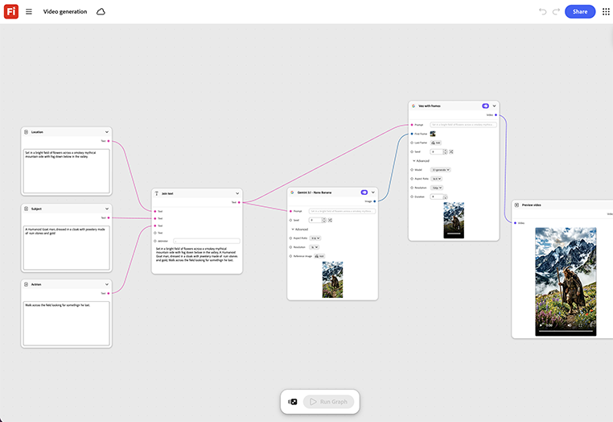

# 快速入門 — 視訊產生

瞭解如何加入核准的靜態關鍵藝術和簡短動作提示。 此範本會產生視訊剪下，該剪下是由相同的關鍵藝術作品所建置，而非新的拍攝。 [開啟快速入門 — 視訊產生](https://firefly.adobe.com/graph/edit/id/urn:aaid:sc:US:4729e537-95d5-56a6-b7c4-a1d4dadb76c9)。

[!BADGE 產業範例]{type=Informative tooltip="產業範例"}

* **財務** — 將核准的列印行銷活動的關鍵藝術轉換為付費社交的短片，而不需另外排程視訊拍攝。
* **飲料** — 在上市當天將主圖產品拍攝到簡短Teaser的動畫。
* **零售業** — 將單一行銷活動像片擴充為短格式視訊，以利社交。

>[!TIP]
>
>**開始之前** — 為獲得最佳結果，請根據您自己的品牌、產品和工作流程自訂此範本。 在使用任何輸出之前，交換參考影像、提示和複製。

{align="center"}

返回[開始使用Firefly Graph](https://experienceleague.adobe.com/en/docs/creative-cloud-enterprise-learn/cce-learning-hub/fireflyoverview/firefly-graph/overview-firefly-graph)。
