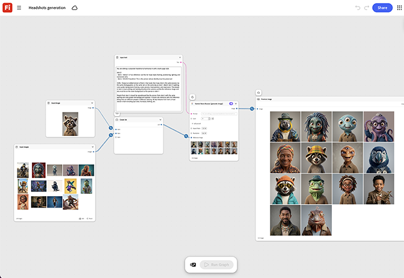

# 產生快照

瞭解如何協調批次的企業頭像。 圖表會標準化光線、背景、
並在一次回合中裁切整個集合。 [開啟的快照產生範本](https://firefly.adobe.com/graph/edit/id/urn:aaid:sc:US:5da3f95f-63e5-5335-9e10-58cfadd7ad3f)。

[!BADGE 產業範例]{type=Informative tooltip="產業範例"}

* **技術** — 在全體員工之前，為更新的員工目錄產生一致的頭像集，而不需要為每位新員工安排攝影師。
* **財務** — 將顧問團隊中的標題擷取標準化，以取得團隊會議頁面。
* **健康情況** — 將多個診所地點的員工頭像標準化，以統一網站外觀。

>[!TIP]
>
>**開始之前** — 為獲得最佳結果，請根據您自己的品牌、產品和工作流程自訂此範本。 在使用任何輸出之前，交換參考影像、提示和複製。

{align="center"}

返回[開始使用Firefly Graph](https://experienceleague.adobe.com/en/docs/creative-cloud-enterprise-learn/cce-learning-hub/fireflyoverview/firefly-graph/overview-firefly-graph)。
