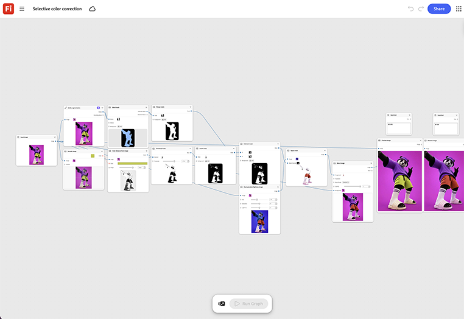

# 選擇性色彩校正

瞭解如何遮罩需要更正的特定區域，並僅在該節點上設定目標顏色。 影像的其餘部分則未觸及圖形。 [開啟選擇性色彩校正範本](https://firefly.adobe.com/graph/edit/id/urn:aaid:sc:US:92c1c93e-4a12-5c99-a2d7-a06ad1662125)。

[!BADGE 產業範例]{type=Informative tooltip="產業範例"}

* **通訊與電信** — 整批零售商店攝影的品牌色彩正確無誤，因此每個位置都符合品牌的標誌色彩，不論是否完全符合。
* **零售** — 在不一致的照明下標準化像片組中的產品顏色。
* **財務** — 在發佈之前，修正整批行銷攝影中的雜散品牌顏色。

>[!TIP]
>
>**開始之前** — 為獲得最佳結果，請根據您自己的品牌、產品和工作流程自訂此範本。 在使用任何輸出之前，交換參考影像、提示和複製。

{align="center"}

返回[開始使用Firefly Graph](https://experienceleague.adobe.com/zh-hant/docs/creative-cloud-enterprise-learn/cce-learning-hub/fireflyoverview/firefly-graph/overview-firefly-graph)。
