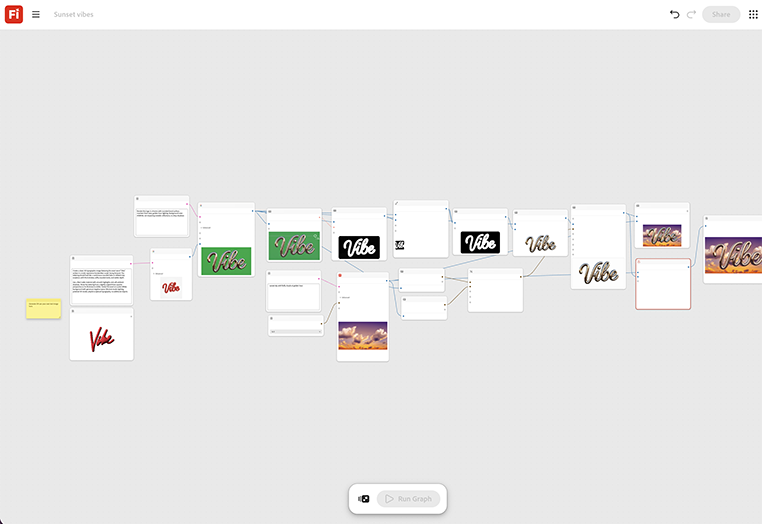

# 日落氣氛

瞭解如何從文字提示建立以「Vibe」一詞為主的3D印刷影像。 [開啟Sunset Vibes範本](https://firefly.adobe.com/graph/edit/id/urn:aaid:sc:US:364c621e-ca81-5a5b-a550-dabed63fb7bc)。

>[!TIP]
>
>**開始之前** — 為獲得最佳結果，請根據您自己的品牌、產品和工作流程自訂此範本。 在使用任何輸出之前，交換參考影像、提示和複製。

{align="center"}

[!BADGE 使用案例]{type=Informative tooltip="使用案例"}

* **旅遊** — 在時尚的日落背景上覆蓋新的目的地標語，以供社交輪播貼文使用，並於當天下午建立及測試。
* **飲料** — 搭配季節性標語與溫暖的生活風格背景，進行夏季促銷活動。
* **零售業** — 產生快速樣式文字和背景資產，以利快閃銷售公告。

返回[開始使用Firefly圖形](https://experienceleague.adobe.com/en/docs/creative-cloud-enterprise-learn/cce-learning-hub/fireflyoverview/firefly-graph/overview-firefly-graph)。
