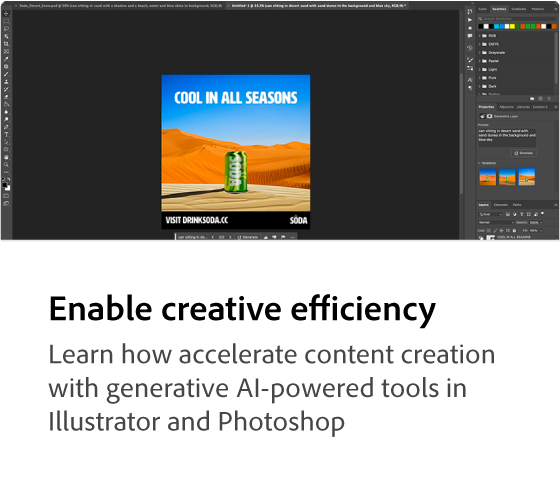

# [!DNL Firefly] Adobe概觀

Firefly 是一系列新系列的創意生成 AI 模型即將推出Adobe產品，主要著重於影像和文字效果的產生。 Firefly 提供新的方式來構想、創作和溝通，同時顯著改善創意工作流程。

## Look您可以使用 Adobe Firefly 做些什麼

  

>[!VIDEO](https://video.tv.adobe.com/v/3416970t1?quality=12&learn=on&hidetitle=true)

## 進一步瞭解 Adobe Firefly

<table style="table-layout:fixed">
<tr>
   <td>
      
  </td>
  <td>
      
  </td>
  <td>
      
  </td>
  <td>
    
    

     
  </td>
</tr>
</table>

## Firefly 教學課程

<table style="table-layout:fixed">
<tr>
   <td>
      
   </td>
   <td>
      
   </td>
   <td>
      
   </td>
   <td>
      
   </td>
</tr>
<tr>
  <td>
      
   </td>
   <td>
      
   </td>
   <td>
      
   </td>
    <td>
      
   </td>
</tr>
<tr>
 <td>
      
   </td>
   <td>
      
   </td>
   <td>
      
   </td>
   <td>
      
   </td>
</tr>
<tr>
  <td>
      
   </td>
  <td>
      
   </td>
  <td>
      
  </td>
  <td>
      
   </td>
</table>
