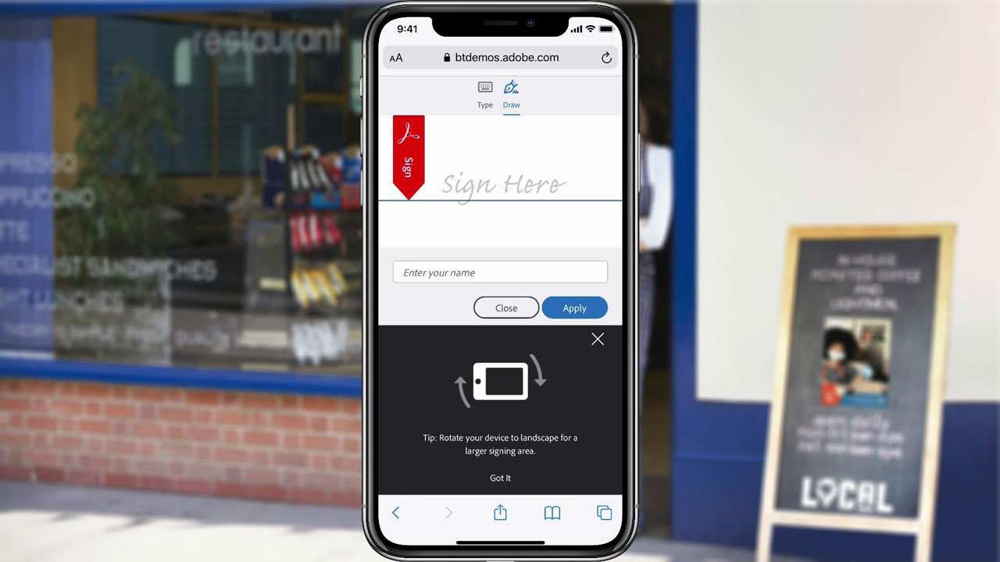
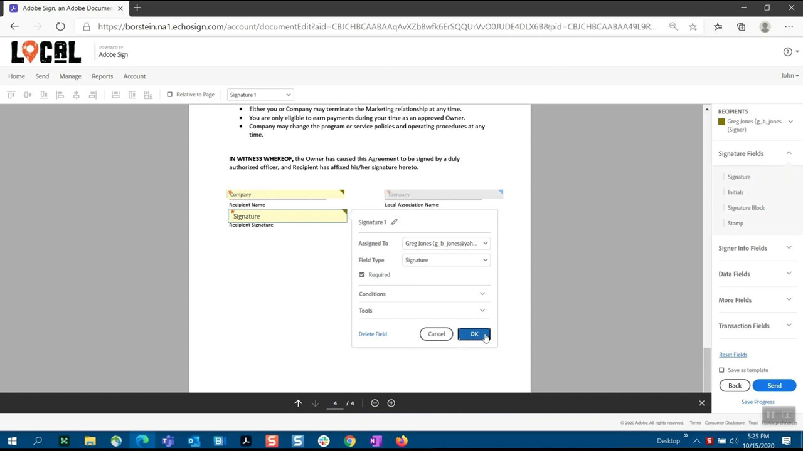

# Acrobat &amp; Sign

Adobe Document Cloud包含全球領先的PDF及電子簽章解決方案，讓您將手動檔案流程轉換為高效的數位流程。 現在，您的團隊可以在多個畫面和裝置間，隨時隨地於您最愛的Microsoft和企業應用程式內，對檔案、工作流程和工作採取快速動作。

## 瀏覽產品教學課程

<table style="table-layout:fixed">
<tr>
 <td>
   
    

   <a href="acrobat-sign.md#tutorial1"><strong>正在起始Acrobat共用稽核</strong></a>
    

    <em>邀請檢閱者將其註解新增至PDF檔案</em>
     
  </td>
  <td>
    
    

    <a href="acrobat-sign.md#tutorial2"><strong>使用Adobe Sign建立線上劐免Forms</strong></a>
    

    <em>快速將檔案轉換為線上表單，並線上上張貼，任何有需要的人都可以填寫並簽署</em>
     
  </td>
  <td>
   
    

    <a href="acrobat-sign.md#tutorial3"><strong>要求使用Adobe Sign的簽章</strong></a>
    

    <em>從Word移至PDF並使用Adobe Sign傳送以索取簽名</em>
     
  </td>
</tr>
<tr>
 <td>
   
    

   <a href="acrobat-sign.md#tutorial4"><strong>使用液態模式檢視行動裝置上的功能表</strong></a>
    

    <em>使用Liquid Mode來增強行動裝置上PDF的讀者體驗</em>
     
  </td>
  <td>
    
    

    <a href="acrobat-sign.md#tutorial5"><strong>從行動電話掃描檔案至PDF</strong></a>
    

    <em>透過Adobe Scan，輕鬆擷取檔案、表單、名片及白板並將其轉換為高品質的Adobe PDF</em>
     
  </td>
  <td>
    
    

     
  </td>
</tr>
</table>

## 正在起始Acrobat共用稽核(3:49) {#tutorial1}

>[!VIDEO](https://video.tv.adobe.com/v/326777?hidetitle=true)

**描述**
邀請稽核者將其註解新增至PDF檔案。

在本教學課程中，您將學習如何：
* 在Document Cloud中託管PDF評論
* 在一個位置收集註解
* 同時發表評論可鼓勵共同作業

**Adobe檢閱和註解選項比較PDF**

**展示者：**
解決方案顧問Dan Armstrong （數位媒體）
解決方案諮詢資深經理Rick Borstein （數位媒體）

## 使用Adobe Sign (5:19)建立線上劐免Forms {#tutorial2}

>[!VIDEO](https://video.tv.adobe.com/v/326776?hidetitle=true)

**描述**
快速將檔案轉換為線上表單，並線上上張貼，任何有需要的人都可以填寫並簽署。

在本教學課程中，您將學習如何：
* 將紙本表單轉換為數位檔案，以數位化
* 將數位表單發佈到您的網站，客戶可以從自己的裝置存取這些表單
* 已完成的表單會自動封存以供記錄使用

**展示者：**
解決方案顧問Taylor Kobey （數位媒體）
解決方案顧問Emily Palmer （數位媒體）

## 使用Adobe Sign (3:21)要求簽名 {#tutorial3}

>[!VIDEO](https://video.tv.adobe.com/v/326801?hidetitle=true)

**描述**
從Word移至PDF，並使用Adobe Sign傳送以索取簽名。

在本教學課程中，您將學習如何：
* 善用您每天使用的工具，傳送數位檔案以索取簽名

**展示者：**
解決方案諮詢資深經理Rick Borstein （數位媒體）

## 使用液態模式(2:57)在行動裝置上檢視功能表 {#tutorial4}

>[!VIDEO](https://video.tv.adobe.com/v/327093?hidetitle=true)

**描述**
使用Liquid Mode來增強行動裝置上PDF的讀者體驗。

在本教學課程中，您將學習如何：
* 讓行動裝置的PDF檔案回應式
* 增強PDF版面配置
* 即時新增功能，協助您在手機和平板電腦上輕鬆閱讀檔案

**展示者：**
Emilie Enke，助理解決方案顧問（數位媒體）

## 從行動電話(5:53)掃描檔案至PDF {#tutorial5}

>[!VIDEO](https://video.tv.adobe.com/v/327094?hidetitle=true)

**描述**
透過Adobe Scan，輕鬆擷取檔案、表單、名片和白板，並將其轉換為高品質的Adobe PDF。

在本教學課程中，您將學習如何：
* 使用行動電話擷取檔案、表單、名片和白板，並將其轉換為高品質的Adobe PDF
* 自動識別並銳利化手寫或列印的文字，同時移除您不想要的元素，例如炫光和陰影
* 在Acrobat Reader中開啟掃描的PDF ，即可提出備註和意見，並與團隊共同檢閱

**展示者：**
Emilie Enke，助理解決方案顧問（數位媒體）

**Acrobat與Adobe Sign資源**

[學習與支援](https://helpx.adobe.com/tw/support/document-cloud.html)是您其他教學課程、[新增功能](https://helpx.adobe.com/tw/acrobat/using/whats-new.html)和社群論壇連結的中樞。

**2020年10月發行版本**

開始使用這些功能（以及更多功能！） 從您的Creative Cloud案頭應用程式下載最新更新。
