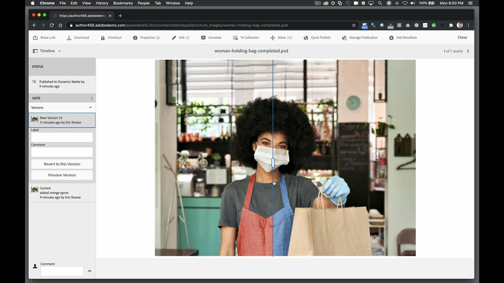

# AEM Assets與Asset Link

Adobe Experience Manager是領先業界的企業與中型組織數位體驗管理解決方案。 它提供現代、可擴充的基礎，以提供引人入勝的體驗，提升品牌參與度、推動需求並提高客戶忠誠度。 Experience Manager包含一整套工具，可跨所有管道建立、管理和提供數位體驗。

## 瀏覽產品教學課程

<table style="table-layout:fixed">
<tr>
 <td>
   
    

   <a href="aem.md#tutorial1"><strong>AEM和資產連結</strong></a>
    

    <em>使用Asset Link即時更新儲存在AEM中的資產</em>
     
  </td>
   <td>
   
    

   <a href="aem.md#tutorial2"><strong>在AEM中託管的InDesign檔案</strong></a>
    

    <em>將您的InDesign檔案託管在AEM中，讓多位使用者能同時建立內容變化</em>
     
  </td>
  <td>
    
    

     
  </td>
</tr>
</table>

## AEM和Asset Link (5:45) {#tutorial1}

>[!VIDEO](https://video.tv.adobe.com/v/326828?hidetitle=true)

**描述**
使用Asset Link即時更新儲存在AEM中的資產。

在本教學課程中，您將學習如何：
* 透過專用面板搜尋和瀏覽設計程式內的資產，隨時隨地尋找您需要的內容
* 直接從您的設計程式輕鬆上傳資產
* 從DAM取出資產，並將資產簽入您的設計程式，以進行即時更新

**展示者：**
Eric Rowse，資深解決方案顧問（數位媒體）

## 在AEM (3:16)中託管的InDesign檔案 {#tutorial2}

>[!VIDEO](https://video.tv.adobe.com/v/326829?hidetitle=true)

**描述**
將您的InDesign檔案託管在AEM中，讓多位使用者可以同時建立內容變體。

在本教學課程中，您將學習如何：
* 將InDesign檔案上傳至AEM以進行一般儲存存取
* 安全地建立變數，而不用擔心破壞來源檔案
* 檔案欄位會預先格式化，以便快速編輯或變更內容

**展示者：**
Eric Rowse，資深解決方案顧問（數位媒體）

<table style="table-layout:fixed">
<tr>
 <td>
   
    

   <a href="https://www.adobe.com/marketing/experience-manager.html"><strong>Adobe Experience Manager</strong></a>
    

    <em>滿足您的內容與數位資產管理需求的Powerhouse組合套件</em>
     
  </td>
  <td>
   
    

   <a href="https://www.adobe.com/marketing/experience-manager-assets.html"><strong>AEM Assets</strong></a>
    

    <em>新一代數位資產管理</em>
     
  </td>
  <td>
   
    

   <a href="https://www.adobe.com/marketing/experience-manager-assets/benefits.html"><strong>AEM Assets：優點</strong></a>
    

    <em>讓您的數位資產為您運作</em>
     
  </td>
</tr>
</table>

**資產連結與AEM資源**

[學習與支援](https://helpx.adobe.com/support/experience-manager.html)是您其他教學課程、新增功能及社群論壇連結的中樞。

**2020年10月發行版本**

開始使用這些功能（以及更多功能！） 從您的Creative Cloud案頭應用程式下載最新更新。
