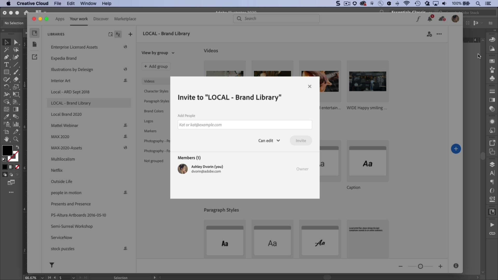

# CC Libraries

讓您的資產保持在手邊，讓您的專案保持在品牌上。

## 瀏覽產品教學課程

<table style="table-layout:fixed">
<tr>
 <td>
   
    

   <a href="cclibraries.md#tutorial1"><strong>建立CC Libraries</strong></a>
    

    <em>透過Adobe Creative Cloud Libraries，您可以在最愛的Creative Cloud應用程式中管理、整理及存取您的標誌、色彩等</em>
     
  </td>
   <td>
   
    

   <a href="cclibraries.md#tutorial2"><strong>共用CC Libraries</strong></a>
    

    <em>更有效率地工作，確保創意的一致性，並輕鬆與團隊保持同步</em>
     
  </td>
  <td>
    
    

     
  </td>
</tr>
</table>

## 建立CC Libraries (4:38) {#tutorial1}

>[!VIDEO](https://video.tv.adobe.com/v/326802?hidetitle=true)

**描述**
有了Adobe Creative Cloud Libraries，您就可以在最愛的Creative Cloud應用程式中，管理、組織及存取您的標誌、顏色等。

在本教學課程中，您將學習如何：
* 讓您的資產保持在手邊，讓您的專案保持在品牌上
* 最新！ 與Adobe XD完全整合

**展示者：**
資深解決方案顧問Ashley Dvorin （數位媒體）

## 共用CC Libraries (4:14) {#tutorial2}

>[!VIDEO](https://video.tv.adobe.com/v/326803?hidetitle=true)

**描述**
提高工作效率、確保創意一致性，並輕鬆與團隊保持同步。

在本教學課程中，您將學習如何：
* 讓您的資產保持在手邊，讓您的專案保持在品牌上
* 直接從您最愛的應用程式輕鬆共同作業專案

**展示者：**
資深解決方案顧問Ashley Dvorin （數位媒體）

**CC Libraries資源**

[學習與支援](https://helpx.adobe.com/tw/creative-cloud/help/libraries.html)是您其他教學課程、新增功能及社群論壇連結的中樞。

**2020年10月發行版本**

開始使用這些功能（以及更多功能！） 從您的Creative Cloud案頭應用程式下載最新更新。
