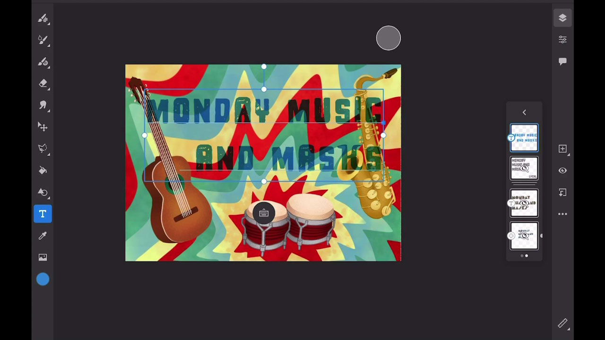

# Fresco

Adobe Fresco是一款跨平台應用程式，可結合向量和點陣工作流程與雲端檔案，使用筆刷式方法來建立繪圖與油畫。

## 瀏覽產品教學課程

<table style="table-layout:fixed">
<tr>
 <td>
   
    

   <a href="fresco.md#tutorial1"><strong>使用Adobe Fresco繪圖簡介</strong></a>
    

    <em>使用Adobe Fresco中強大的選取和色彩編輯工具，大幅變更影像以符合您的公司品牌需求</em>
     
  </td>
  <td>
   
    

   <a href="fresco.md#tutorial2"><strong>建立紋理圖稿 — Fresco到Illustrator</strong></a>
    

    <em>在Adobe Fresco中繪圖和繪製紋理，並瞭解如何在Illustrator中使用它們</em>
     
  </td>
  <td>
    
    

     
  </td>
</tr>
</table>

## 使用Adobe Fresco (19:07)繪圖簡介 {#tutorial1}

>[!VIDEO](https://video.tv.adobe.com/v/326946?hidetitle=true)

**描述**
探索使用結合向量和點陣工作流程與雲端檔案的筆刷式方法來建立繪圖與繪畫的Adobe Fresco。

在本教學課程中，您將學習如何：
* 使用獨特的即時筆刷，模擬水彩和油漆，以及您最愛的畫素和向量筆刷
* 藉由分層不同的筆刷並使用遮色片來建立紋理效果
* 使用適用於iPhone的全新Fresco應用程式在任一處建立
* 將您的工作匯出為各種格式，以用於其他行動與案頭應用程式

**展示者：**
解決方案顧問Liz Tanonis （數位媒體）

## 建立紋理圖稿 — Fresco到Illustrator (4:10) {#tutorial2}

>[!VIDEO](https://video.tv.adobe.com/v/326947?hidetitle=true)

**描述**
在Adobe Fresco中繪製和繪製紋理，並瞭解如何在Illustrator中使用它們。

在本教學課程中，您將學習如何：
* 在適用於iPhone的Adobe Fresco應用程式中建立圖稿，並將其匯出以用於其他Creative Cloud應用程式
* 使用Illustrator中的「影像描圖」工具，將圖稿轉換為向量
* 在Illustrator中套用手繪紋理至向量圖稿

**展示者：**
解決方案顧問Liz Tanonis （數位媒體）

**Fresco資源**

[學習與支援](https://helpx.adobe.com/support/adobe-fresco.html)是您其他教學課程、[新增功能](https://helpx.adobe.com/fresco/using/whats-new.html)和社群論壇連結的中樞。

**2020年10月發行版本**

開始使用這些功能（以及更多功能！） 從您的Creative Cloud案頭應用程式下載最新更新。
