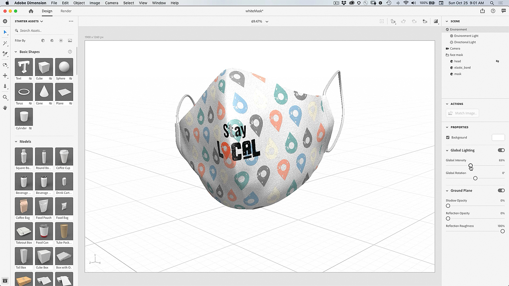

# 設計列印外掛程式 — 自訂遮色片

如果您可以用自己的圖稿自訂面具，不是很酷嗎？ 有了Adobe Design to Print外掛程式，您就可以將數百種Zazzle產品的設計加以視覺化，並直接發佈至其線上市集。

## 瀏覽Facemask專案教學課程

<table style="table-layout:fixed">
<tr>
 <td>
   
    

   <a href="handsonproject.md#tutorial1"><strong>安裝Photoshop Design以列印外掛程式</strong></a>
    

    <em>使用Adobe Photoshop中強大的選取和色彩編輯工具，大幅變更影像以符合您的公司品牌需求</em>
     
  </td>
  <td>
    
    

    <a href="handsonproject.md#tutorial2"><strong>使用列印設計自訂面罩</strong></a>
    

    <em>自訂Zazzle面罩</em>
     
  </td>
  <td>
    
    

   <a href="handsonproject.md#tutorial3"><strong>建立面罩的3D視覺效果</strong></a>
    

    <em>為活動相簿建立面罩的3D視覺效果</em>
     
  </td>
</tr>
</table>

## 安裝Photoshop Design以列印外掛程式(1:50) {#tutorial1}

>[!VIDEO](https://video.tv.adobe.com/v/327096?hidetitle=true)

**描述**
瞭解如何安裝Photoshop的Design to Print外掛程式。

在本教學課程中，您將學習如何：
* 將您在服裝、配件、文具和牆壁藝術等產品上的設計即時視覺化！
* 發佈至Dazzle線上市集

**展示者：**
Patti Sokol，首席解決方案顧問（數位媒體）

## 使用要列印的設計自訂面罩(7:54) {#tutorial2}

>[!VIDEO](https://video.tv.adobe.com/v/327097?hidetitle=true)

**描述**
自訂Zazzle面罩

在本教學課程中，您將學習如何：
* 將您在服裝、配件、文具和牆壁藝術等產品上的設計即時視覺化！
* 發佈至Dazzle線上市集

**按一下影像以下載學習設計以列印PDF**

**展示者：**
Patti Sokol，首席解決方案顧問（數位媒體）

## 建立面罩的3D視覺效果(7:54) {#tutorial3}

>[!VIDEO](https://video.tv.adobe.com/v/327098?hidetitle=true)

**描述**
為事件相簿建立面罩的3D視覺效果

在本教學課程中，您將學習如何：
* 輕鬆建立如像片般逼真的3D視覺效果
* 增加材質並控制燈光，以提供專業外觀
* 匯入資產以套用您的品牌或其他設計

**按一下影像即可下載包含白色遮色片3D模型的[!DNL Dimension]檔案**

**展示者：**
Patti Sokol，首席解決方案顧問（數位媒體）
