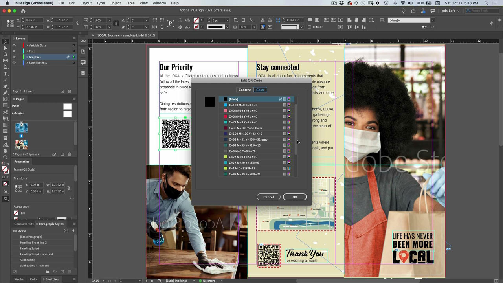
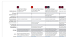

# InDesign

符合產業標準的應用程式，可建立美觀的列印與數位出版檔案。 創造豐富的數位和印刷體驗，從eBooks和電子雜誌，到書籍、報表和白皮書。

## 瀏覽產品教學課程

<table style="table-layout:fixed">
<tr>
 <td>
    
    

    <a href="indesign.md#tutorial1"><strong>產生QR碼</strong></a>
    

    <em>產生連結至網站的QR碼</em>
     
  </td>
  <td>
   
    

   從InDesign共用<a href="indesign.md#tutorial2"><strong>以檢閱</strong></a>
    

    <em>為設計師及其團隊成員提供順暢的創意評論體驗</em>
     
  </td>
  <td>
    
    

    從檔案<a href="indesign.md#tutorial3"><strong>匯入PDF註解 
雲端檢閱</strong></a>
    

    <em>從PDF直接將評論匯入InDesign，並快速套用要求的變更</em>
     
  </td>
</tr>
<tr>
<td>
   
    

   <a href="indesign.md#tutorial4"><strong>新增視訊檔案至InDesign檔案</strong></a>
    

    <em>新增視訊至InDesign。 輸出至PDF並線上上發佈</em>
     
  </td>
 <td>
    
    

     
 </td>
 <td>
    
    

     
 </td>
</tr>
</table>

## 產生QR碼(2:34) {#tutorial1}

>[!VIDEO](https://video.tv.adobe.com/v/326818?hidetitle=true)

**描述**
產生連結至網站的QR碼。

在本教學課程中，您將學習如何：
* 透過行動裝置提供對網頁內容的擴音存取
* 讓您的客戶感到安全
* 數位化表示內容隨時保持最新狀態

**展示者：**
Patti Sokol，首席解決方案顧問（數位媒體）

## 從InDesign (4:04)共用以進行檢閱 {#tutorial2}

>[!VIDEO](https://video.tv.adobe.com/v/326824?hidetitle=true)

**描述**
「InDesign分享稽核」為設計師及其團隊成員提供更加流暢的創意稽核體驗。

在本教學課程中，您將學習如何：
* 直接從InDesign啟動稽核，無需建立PDF
* 從網頁瀏覽器檢閱和評論
* 在一個地方收集多個利害關係人的意見反應
* 管理可立即進行變更的應用程式內意見反應。

**Adobe檢閱和註解選項比較PDF**

**展示者：**
解決方案顧問Emily Palmer （數位媒體）

## 從PDF評論匯入Document Cloud評論(4:52) {#tutorial3}

>[!VIDEO](https://video.tv.adobe.com/v/326959?hidetitle=true)

**描述**
將評論從PDF直接匯入InDesign並快速套用請求的變更。

在本教學課程中，您將學習如何：
* 支援現有的PDF註解工作流程
* 適用於從多個來源合併的PDF

**Adobe檢閱和註解選項比較PDF**

**展示者：**
資深解決方案顧問Michael Murphy (Digital Media)

## 新增視訊檔案至InDesign檔案(5:58) {#tutorial4}

>[!VIDEO](https://video.tv.adobe.com/v/326757?hidetitle=true)

**描述**
新增視訊至InDesign。 輸出至PDF並線上發佈。

在本教學課程中，您將學習如何：
* 新增視訊至InDesign
* 輸出至PDF並線上發佈

**展示者：**
Patti Sokol，首席解決方案顧問（數位媒體）

**InDesign資源**

[學習與支援](https://helpx.adobe.com/support/indesign.html)是您其他教學課程、[新增功能](https://helpx.adobe.com/indesign/user-guide.html/indesign/using/whats-new.ug.html)和社群論壇連結的中樞。

**2020年10月發行版本**

開始使用這些功能（以及更多功能！） 從您的Creative Cloud案頭應用程式下載最新更新。
