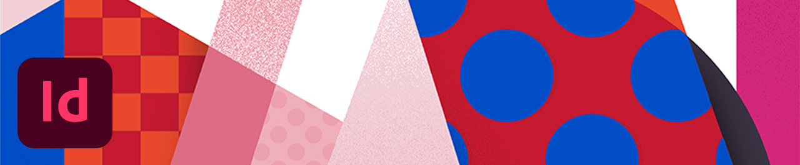
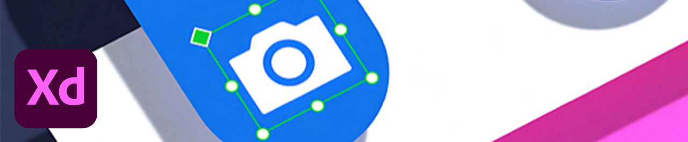
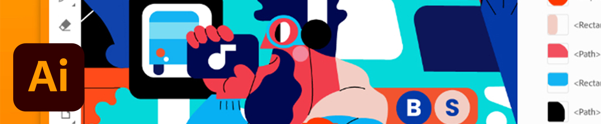

# 教學課程

作為企業創意人員，您需要與分散的團隊共同作業、建立可擴充的流程，並遵守公司系統和准則。 這些教學課程將協助您從企業角度瞭解2021年Creative Cloud版本中的新功能。

## 教學課程（依桌上型電腦產品）

<table style="table-layout:fixed">
<tr>
 <td>
    
    

    <a href="acrobat-sign.md"><strong>Acrobat與Adobe Sign</strong></a>
    

    <em>建立、編輯及簽署PDF檔案和表單</em>
     
  </td>
  <td>
    
    

    <a href="dimension.md"><strong>Dimension</strong></a>
    

    <em>為品牌、產品快照和封裝設計建立如像片般逼真的3D影像</em>
     
  </td>
  <td>
    
    

    <a href="illustrator.md"><strong>Illustrator</strong></a>
    

    <em>向量圖形與插圖</em>
     
  </td>
</tr>
<tr>
 <td>
    
    

    <a href="indesign.md"><strong>InDesign</strong></a>
    

    <em>列印與數位發行的頁面設計與版面配置</em>
     
  </td>
  <td>
    
    

    <a href="photoshop.md"><strong>Photoshop</strong></a>
    

    <em>在案頭上編輯、合成及建立精美的影像、圖形和藝術品</em>
     
  </td>
  <td>
    
    

    <a href="rush.md"><strong>Rush</strong></a>
    

    <em>隨處建立和分享線上視訊</em>
     
  </td>
</tr>
<tr>
 <td>
    
    

    <a href="xd.md"><strong>XD</strong></a>
    

    <em>設計、原型及共用使用者體驗</em>
     
  </td>
  <td>
    
    

     
  </td>
  <td>
    
    

     
  </td>
</tr>
</table>

### 教學課程（依行動應用程式）

<table style="table-layout:fixed">
<tr>
 <td>
    
    

    <a href="capture.md"><strong>Capture</strong></a>
    

    <em>將任何影像轉換為顏色主題、向量圖形、筆刷等等</em>
     
  </td>
  <td>
    
    

    <a href="fresco.md"><strong>Fresco</strong></a>
    

    <em>在任何地方重新探索繪圖和繪畫的樂趣</em>
     
  </td>
  <td>
    
    

    iPad上的<a href="illustratoripad.md"><strong>Illustrator</strong></a>
    

    <em>向量圖形與插圖</em>
     
  </td>
</tr>
<tr>
 <td>
    
    

    iPad上的<a href="photoshopipad.md"><strong>Photoshop</strong></a>
    

    <em>在案頭和iPad上編輯、合成及建立精美的影像、圖形和藝術品</em>
     
  </td>
  <td>
    
    

     
  </td>
  <td>
    
    

     
  </td>
</tr>
</table>

### 教學課程（依整合）

<table style="table-layout:fixed">
<tr>
 <td>
    
    

    <a href="aem.md"><strong>AEM Assets與資產連結</strong></a>
    

    <em>新一代數位資產管理</em>
     
  </td>
  <td>
    
    

    <a href="creativeclouddesktopapp.md"><strong>Creative Cloud案頭應用程式</strong></a>
    

    <em>Creative Cloud案頭應用程式是您管理CC應用程式、服務和共同作業等工作的中心！</em>
     
  </td>
  <td>
    
    

    <a href="cclibraries.md"><strong>CC Libraries</strong></a>
    

    <em>保留您的資產與品牌專案</em>
     
  </td>
</tr>
<tr>
<td>
    
    

    <a href="indesignserver.md"><strong>InDesign Server</strong></a>
    

    <em>InDesign的精密工具搭配自訂的自動化功能</em>
     
  </td>
 <td>
    
    

    <a href="stock.md"><strong>Adobe [!DNL Stock]</strong></a>
    

    <em>高品質的數位影像、插圖、影片、音訊、範本等</em>
     
  </td>
  <td>
    
    

     
  </td>
</tr>
</table>

### 實作專案：建立自己的面罩

<table style="table-layout:fixed">
<tr>
 <td>
    
    

    <a href="handsonproject.md"><strong>建立自己的面罩</strong></a>
    

    <em>透過Adobe Design to Print外掛程式，您可以視覺化數百種Zazzle產品的設計，並直接發佈至其線上市集</em>
     
  </td>
  <td>
    
    

     
  </td>
  <td>
    
    

     
  </td>
</tr>
</table>
