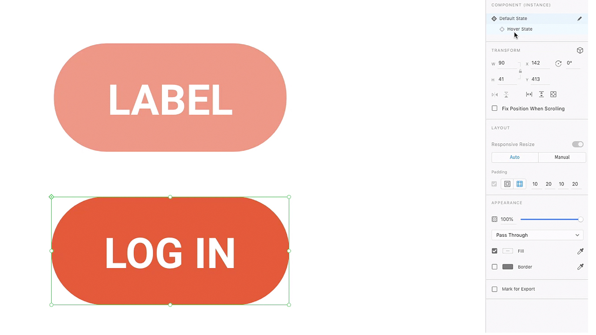
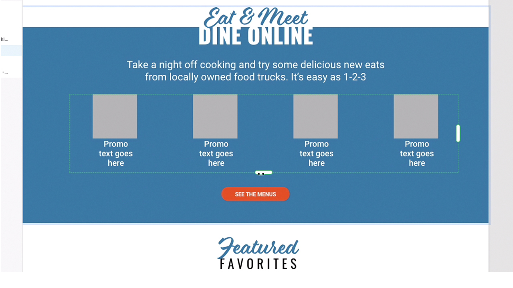
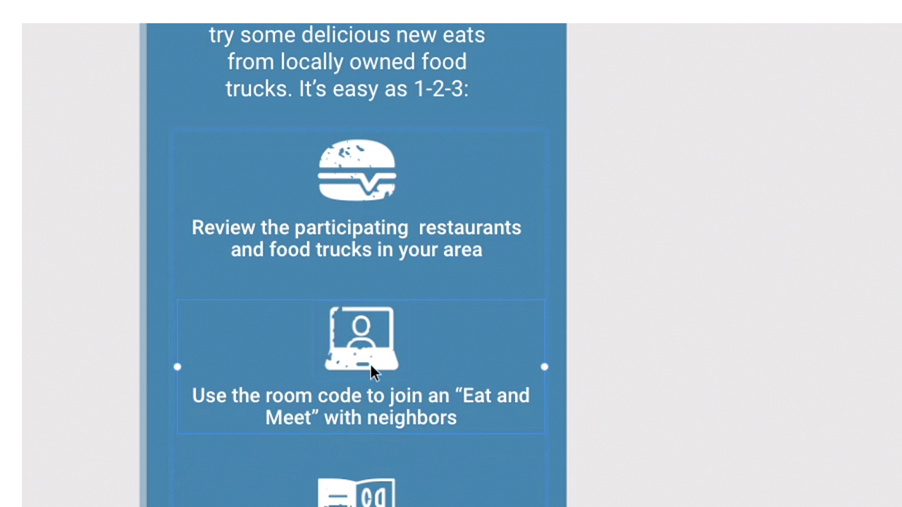
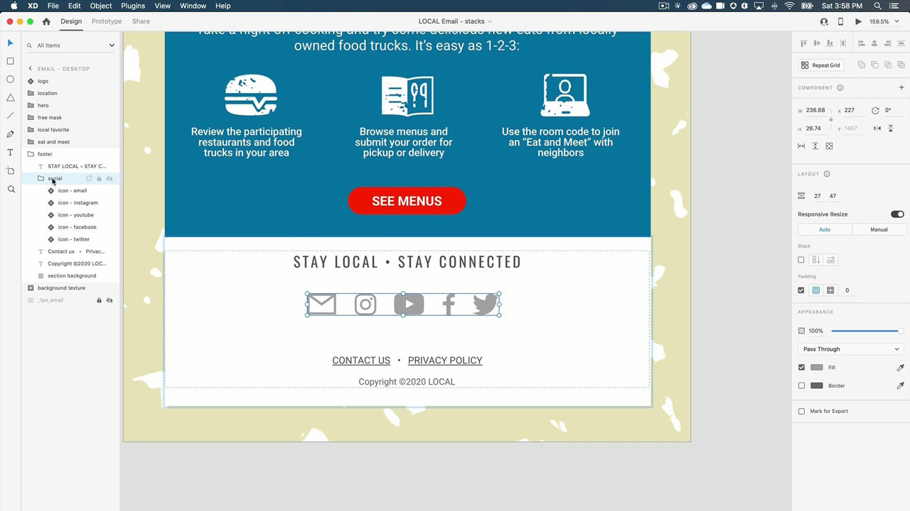

# XD

Adobe XD是使用者體驗設計和原型工具，用於設計網站、應用程式、語音介面、遊戲和其他型別的數位體驗。

## 瀏覽產品教學課程

<table style="table-layout:fixed">
<tr>
 <td>
   
    

   <a href="xd.md#tutorial1"><strong>建立具有暫留狀態的元件</strong></a>
    

    <em>為您的互動式設計建立可重複使用、可動態調整大小的按鈕</em>
     
  </td>
  <td>
    
    

    <a href="xd.md#tutorial2"><strong>建立並填入重複網格</strong></a>
    

    <em>只要按一下並拖曳</em>，即可將單一元素轉換為重複的格點
     
  </td>
  <td>
   
    

    <a href="xd.md#tutorial3"><strong>處理棧疊</strong></a>
    

    <em>使用棧疊屬性輕鬆重新排列元素</em>
     
  </td>
</tr>
<tr>
 <td>
    
    

    <a href="xd.md#tutorial4"><strong>建立原型 — 錨點連結和 
捲動群組</strong></a>
    

    <em>新增導覽及捲動至原型</em>
     
  </td>
  <td>
    
    

    <a href="xd.md#tutorial5"><strong>建立原型 — 互動式元件狀態</strong></a>
    

    <em>新增互動和覆蓋功能表至原型</em>
     
  </td>
  <td>
   
    

   <a href="xd.md#tutorial7"><strong>電子郵件 — 建立並填入重複網格</strong></a>
    

    <em>只要按一下並拖曳</em>，即可將單一元素轉換為重複的格點
     
  </td>
</tr>
<tr>
 <td>
    
    

    <a href="xd.md#tutorial7"><strong>電子郵件 — 處理棧疊</strong></a>
    

    <em>使用棧疊屬性輕鬆重新排列元素</em>
     
  </td>
  <td>
    
    

     
  </td>
  <td>
    
    

     
  </td>
</tr>
</table>

## 建立具有暫留狀態的[!UICONTROL 元件] (7:35) {#tutorial1}

>[!VIDEO](https://video.tv.adobe.com/v/326874?hidetitle=true)

**描述**
為您的互動式設計建立可重複使用、可動態調整大小的按鈕。

在本教學課程中，您將學習如何：
* 對來源主要元件進行變更，這些變更會自動推送至該元件的所有例項
* 使用元件以維持一致性、節省時間、減少點按次數

**展示者：**
資深解決方案顧問Michael Murphy (Digital Media)

## 建立並填入重複網格(2:57) {#tutorial2}

>[!VIDEO](https://video.tv.adobe.com/v/326955?hidetitle=true)

**描述**
只要按一下並拖曳，即可將單一元素轉換為重複格點。

在本教學課程中，您將學習如何：
* 立即提升工作流程，並拖曳出任何您需要的網格
* 引進真實的內容和資料，XD會以神奇的方式將所有影像和文字置入您的格線
* 變更一次，然後依您想要的方向套用變更

**展示者：**
資深解決方案顧問Ashley Dvorin （數位媒體）

## 處理棧疊(5:33) {#tutorial3}

>[!VIDEO](https://video.tv.adobe.com/v/326956?hidetitle=true)

**描述**
使用stack屬性可輕鬆重新排列元素。

在本教學課程中，您將學習如何：
* 即使您的設計有所變更，仍維持畫布上物件之間的對齊與間距
* 在棧疊中插入新物件或重新排序物件，所有內容都會自動調整

**展示者：**
資深解決方案顧問Michael Murphy (Digital Media)

## 建立原型 — 錨點連結和捲動群組(9:55) {#tutorial4}

>[!VIDEO](https://video.tv.adobe.com/v/326957?hidetitle=true)

**描述**
新增導覽和捲動至原型。

在本教學課程中，您將學習如何：
* 使用可讓使用者跳至相同工作區域上不同點的動作，將連結新增至您的原型
* 定義獨立於其他設計捲動的區域，以建立活動摘要、影像輪播、產品清單等
* 建立垂直捲動、水準捲動或兩者同時捲動的群組

**展示者：**
資深解決方案顧問Michael Murphy (Digital Media)

## 建立原型 — 互動式元件狀態(8:55) {#tutorial5}

>[!VIDEO](https://video.tv.adobe.com/v/326958?hidetitle=true)

**描述**
將互動性和覆蓋圖功能表新增至原型。

在本教學課程中，您將學習如何：
* 建立非線性互動和動畫使用者體驗，而不需要其他工作區域
* 在單一XD檔案中製作多個原型或互動流程，並為每個流程發佈唯一的可共用連結

**展示者：**
Emilie Enke，助理解決方案顧問（數位媒體）

## 電子郵件 — 建立並填入重複網格(4:45) {#tutorial6}

>[!VIDEO](https://video.tv.adobe.com/v/326775?hidetitle=true)

**描述**
只要按一下並拖曳，即可將單一元素轉換為重複格點。

在本教學課程中，您將學習如何：
* 立即提升工作流程，並拖曳出任何您需要的網格
* 引進真實的內容和資料，XD會以神奇的方式將所有影像和文字置入您的格線
* 變更一次，然後依您想要的方向套用變更

**展示者：**
解決方案顧問Victoria Torres （數位媒體）

## 電子郵件 — 處理棧疊(3:38) {#tutorial7}

>[!VIDEO](https://video.tv.adobe.com/v/326759?hidetitle=true)

**描述**
使用stack屬性可輕鬆重新排列元素。

在本教學課程中，您將學習如何：
* 即使您的設計有所變更，仍維持畫布上物件之間的對齊與間距
* 在棧疊中插入新物件或重新排序物件，所有內容都會自動調整

**展示者：**
解決方案顧問Victoria Torres （數位媒體）

**XD資源**

[學習與支援](https://helpx.adobe.com/tw/support/xd.html)是您其他教學課程、[新增功能](https://helpx.adobe.com/xd/user-guide.html/xd/help/whats-new.ug.html)和社群論壇連結的中樞。

**2020年10月發行版本**

開始使用這些功能（以及更多功能！） 從您的Creative Cloud案頭應用程式下載最新更新。
