# Adobe [!DNL Stock]教學課程

創意人員面臨快速提供引人入勝的視覺內容的壓力。 Adobe Stock讓創意團隊可在每天使用的Creative Cloud應用程式中，存取超過3億張免版稅影像、影片、音訊檔案、範本、插圖和3D資產。 透過Creative Cloud Pro Edition取得對Adobe Stock標準資產的無限制存取權。 請前往stock.adobe.com探索最新的集合。 選取影像以檢視教學課程。

<table>
<tr>
   <td>
      
      

      <a href="stunning-digital-assets.md"><strong>令人驚歎的數位資產(PDF)</strong></a>
      

      <em>透過此實作教學課程，瞭解如何將Adobe Stock與CC Libraries整合，以建立一致且專業的設計結果，讓平面和畫面都能顯示</em>
       
  </td>
  <td>
      
      

      <a href="searchstock.md"><strong>搜尋Adobe [!DNL Stock]授權記錄</strong></a>
      

      <em>瞭解如何在Creative Cloud企業版中快速搜尋您組織的Adobe [!DNL Stock]授權記錄</em>
       
  </td>
  <td>
      <a href="handdrawn.md">
         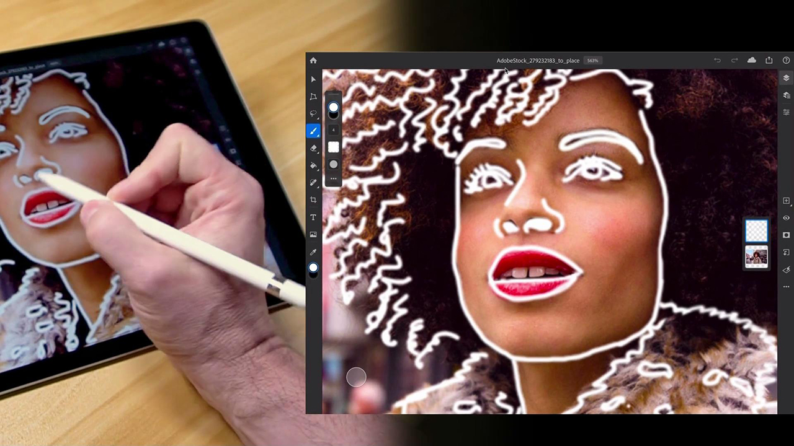
      </a>
      

      <a href="handdrawn.md"><strong>將手繪美學加入Adobe [!DNL Stock]影像</strong></a>
      

      <em>使用iPad適用的Photoshop，以獨特的技術為您的影像增加深度和維度，讓您的創意行銷更上一層樓</em>
       
  </td>
  <td>
   <a href="flairtypography.md">
      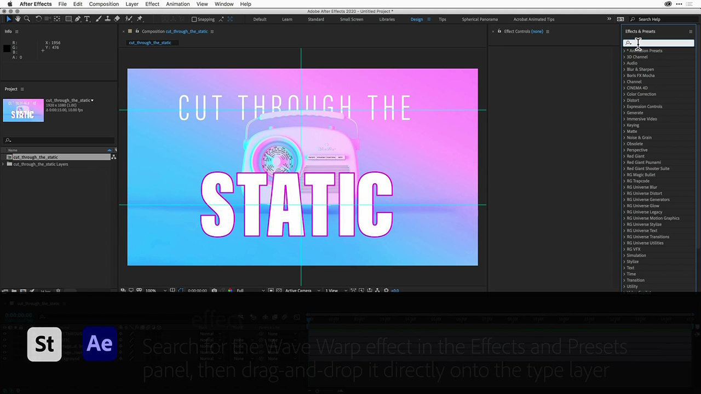
   </a>
    

   <a href="flairtypography.md"><strong>使用遮色片及動畫為印刷樣式增加風格</strong></a>
    

    <em>使用Adobe [!DNL Stock]中的元素和After Effects中的動畫樣式，讓您的文字生動起來</em>
     
  </td>
</tr>
<tr>
  <td>
      
      

      在Photoshop中<a href="animatevector.md"><strong>將Adobe [!DNL Stock]向量插圖製作成動畫</strong></a>
      

      <em>使用Adobe [!DNL Stock]</em>的可編輯向量，將動畫帶入您的電子報圖形中
       
  </td>
 <td>
      
      

      <a href="annualreport.md"><strong>以使用Adobe [!DNL Stock]和Spark Video建立的影片開始您的年度報告</strong></a>
      

      <em>透過Adobe [!DNL Stock]和Spark Video</em>將您的年度報告變成故事
       
  </td>
  <td>
      <a href="customanimations.md">
         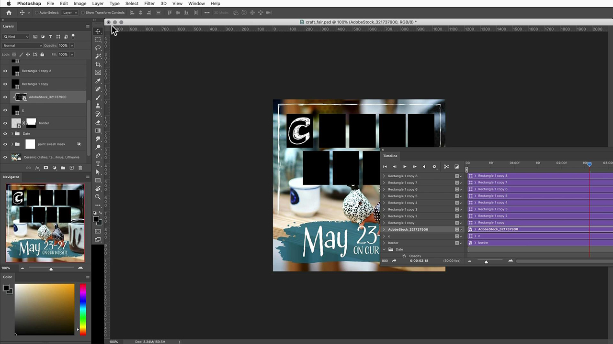
      </a>
      

      <a href="customanimations.md"><strong>透過Adobe [!DNL Stock]</strong></a>的自訂動畫讓創意栩栩如生
      

      <em>在Photoshop中使用Adobe [!DNL Stock]影像、紋理、圖案自訂動畫</em>
       
  </td>
  <td>
      
      

      <a href="changecolors.md"><strong>變更Adobe [!DNL Stock]影像的顏色以符合您的劇本</strong></a>
      

      <em>在Adobe [!DNL Stock]中尋找唯一的像片，然後調整Adobe Photoshop中的顏色以符合您的需求</em>
       
  </td>
</tr>
<tr>
 <td>
      <a href="collage.md">
         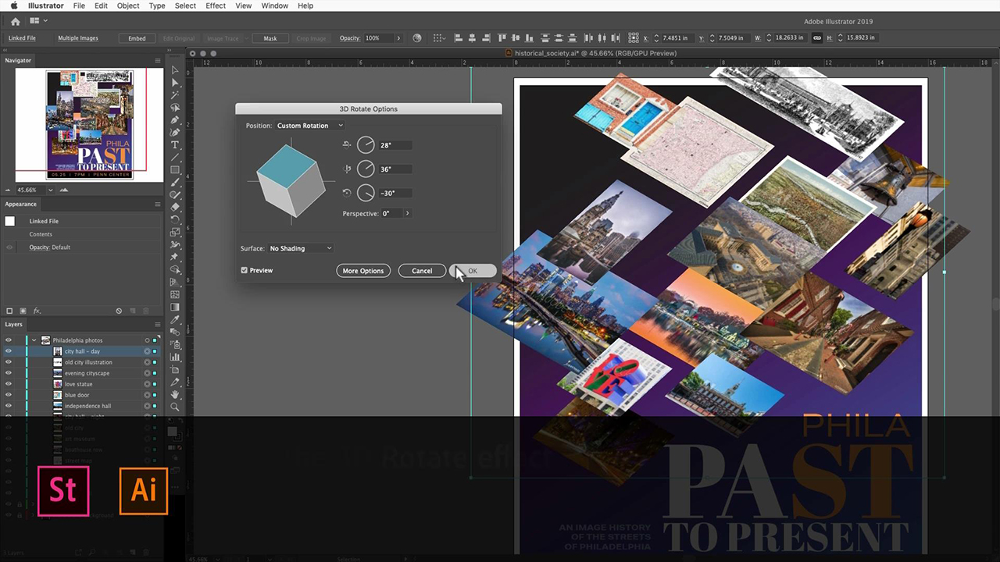
      </a>
      

      <a href="collage.md"><strong>使用Adobe [!DNL Stock]影像為海報建立3D拼貼</strong></a>
      

      <em>在Adobe Illustrator中設計拼貼，利用Adobe [!DNL Stock]</em>中的影像呈現令人驚豔的3D效果
       
  </td>
  <td>
      
      

      <a href="boldlabel.md"><strong>使用Adobe [!DNL Stock]範本和Photoshop智慧型物件建立粗體標籤</strong></a>
      

      <em>使用Adobe [!DNL Stock]</em>的真實封裝範本，設計並視覺化您的自訂設計
       
  </td>
  <td>
      
      

      <a href="infographic.md"><strong>使用Adobe建立公司指引資訊圖表[!DNL Stock]</strong></a>
      

      <em>結合來自Adobe [!DNL Stock]的各種資產，以視覺上吸引人的資訊圖形形式傳達指導方針</em>
       
  </td>
 <td>
      <a href="featurecomparison.md">
         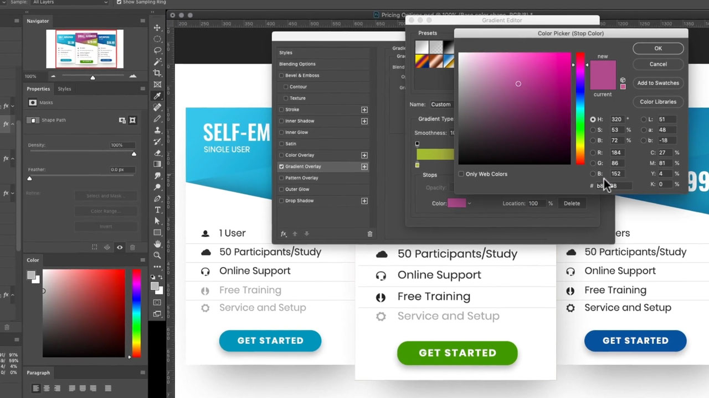
      </a>
      

      <a href="featurecomparison.md"><strong>使用Adobe [!DNL Stock]</strong></a>建立產品功能比較表
      

      <em>建立比較產品定價計畫的圖形，讓潛在客戶一目瞭然</em>
       
  </td>
</tr>
<tr>
   <td>
      <a href="surrealcomposite.md">
         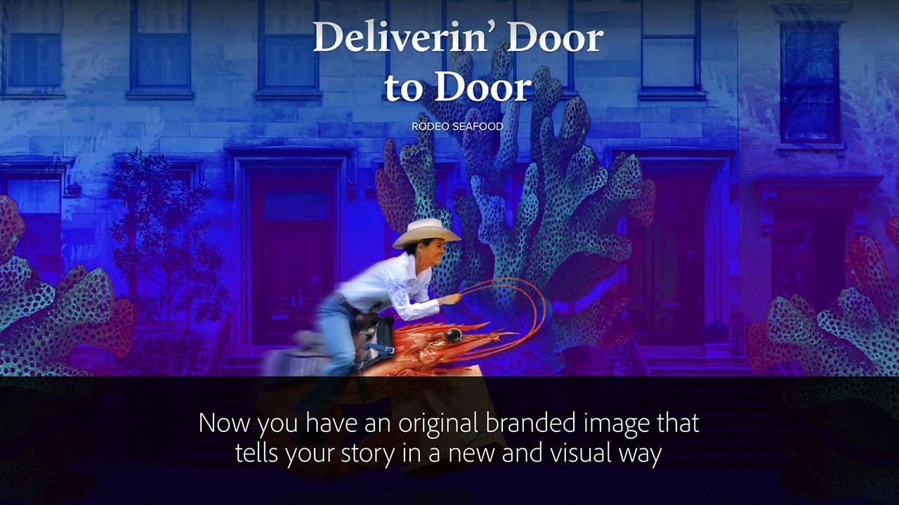
      </a>
      

      <a href="surrealcomposite.md"><strong>使用Adobe [!DNL Stock]</strong></a>建立半超現實複合
      

      <em>結合多重影像與色彩、移動和遮色片效果，建立令人難忘的編輯影像</em>
       
  </td>
   <td>
      
      

      <a href="surrealpattern.md"><strong>使用Adobe [!DNL Stock]</strong></a>建立半超現真實模式
      

      <em>根據Adobe超現實的影像建立精美的無縫圖樣[!DNL Stock]</em>
       
  </td>
   <td>
      
      

      <a href="productconfigurator.md"><strong>使用Adobe [!DNL Stock]</strong></a>建立互動式產品設定器
      

      <em>使用Adobe [!DNL Stock]的互動功能、動畫和可編輯的圖稿，以視覺化方式呈現財務資訊</em>
       
  </td>
  <td>
      <a href="interactivetourismphoto.md">
         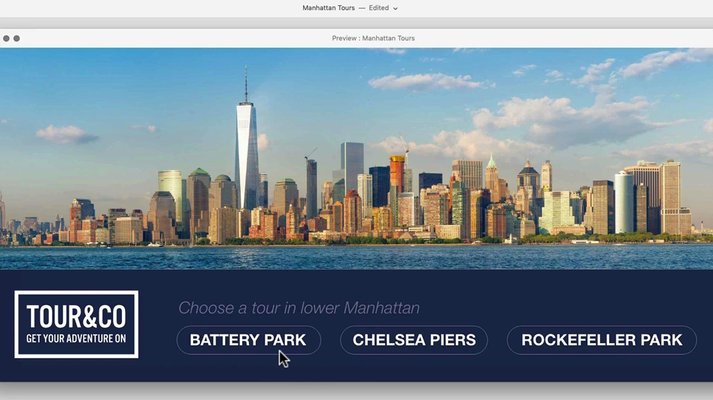
      </a>
      

      <a href="interactivetourismphoto.md"><strong>使用Adobe [!DNL Stock]和XD建立互動式旅遊像片</strong></a>
      

      <em>使用Adobe [!DNL Stock]和XD，在您的網站原型中快速建立互動式像片</em>
       
  </td>
</tr>
<tr>
 <td>
      
      

      <a href="animationemail.md"><strong>使用Adobe [!DNL Stock]和Photoshop為電子郵件製作動畫</strong></a>
      

      <em>使用Adobe [!DNL Stock]和Photoshop</em>來啟用電子郵件中的停止動作動畫
       
  </td>
  <td>
      <a href="brandgradients.md">
         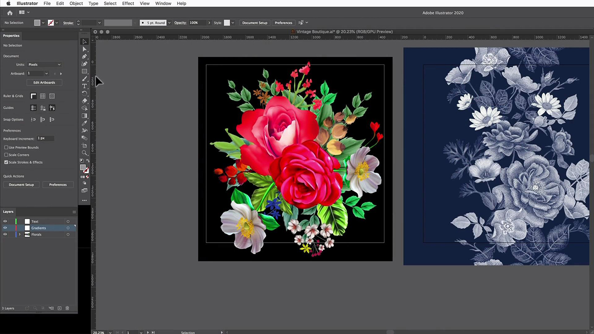
      </a>
      

      <a href="brandgradients.md"><strong>使用精美漸層和Adobe [!DNL Stock]資產建立有凝聚力的品牌形象</strong></a>
      

      <em>藉由在廣告行銷活動中結合色彩和漸層，建立不同影像的品牌統一</em>
       
   </td>
  <td>
      
      

      <a href="webgraphics.md"><strong>結合Adobe [!DNL Stock]影像與CSS</strong></a>，建立吸引人的網頁圖形
      

      <em>藉由在廣告行銷活動中結合色彩和漸層，建立不同影像的品牌統一</em>
       
  </td>
  <td>
      <a href="moodboard.md">
         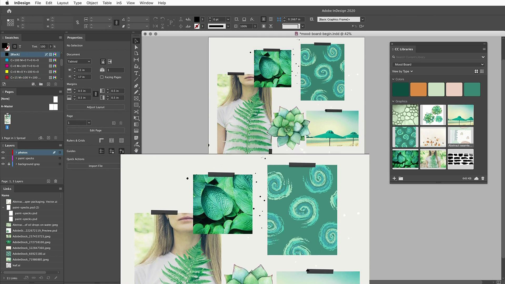
      </a>
      

      <a href="moodboard.md"><strong>使用Adobe [!DNL Stock]</strong></a>快速建立鼓舞人心的情境板
      

      <em>建立專案情境板，將資訊、想法、視覺效果和調色盤轉送給團隊/客戶</em>
       
  </td>
</tr>
<tr>
   <td>
      
      

      <a href="realisticcomposite.md"><strong>使用Adobe [!DNL Stock]影像建立逼真的合成像片</strong></a>
      

      <em>將兩張出色的Adobe [!DNL Stock]像片彙整在一起，吸引人們觀看您的社交貼文</em>
       
  </td>
   <td>
   <a href="loadingscreen.md">
      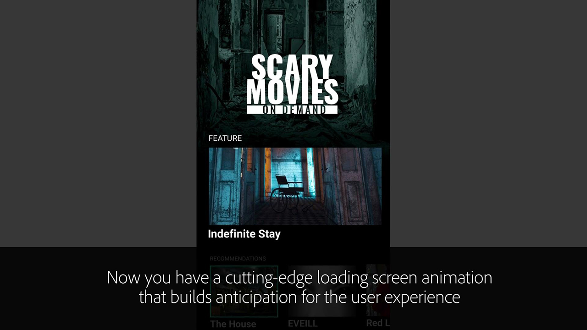
   </a>
    

   <a href="loadingscreen.md"><strong>使用Adobe [!DNL Stock]和XD自訂載入畫面動畫</strong></a>
    

    <em>從Adobe [!DNL Stock]自訂向量圖稿，為行動應用程式建立令人驚豔的載入畫面動畫</em>
     
  </td>
  <td>
   <a href="presentationtemplate.md">
      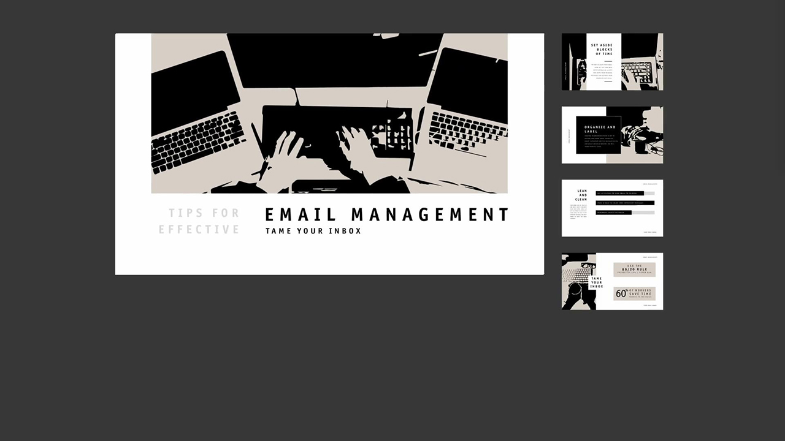
   </a>
    

   <a href="presentationtemplate.md"><strong>自訂Adobe [!DNL Stock]簡報範本，以提供專業又搶眼的外觀</strong></a>
    

    <em>使用Adobe [!DNL Stock]中的影像和範本及一些容易執行的特效，在幾分鐘內建立美觀又別具風格的簡報</em>
     
  </td>
   <td>
   <a href="customizecolors.md">
      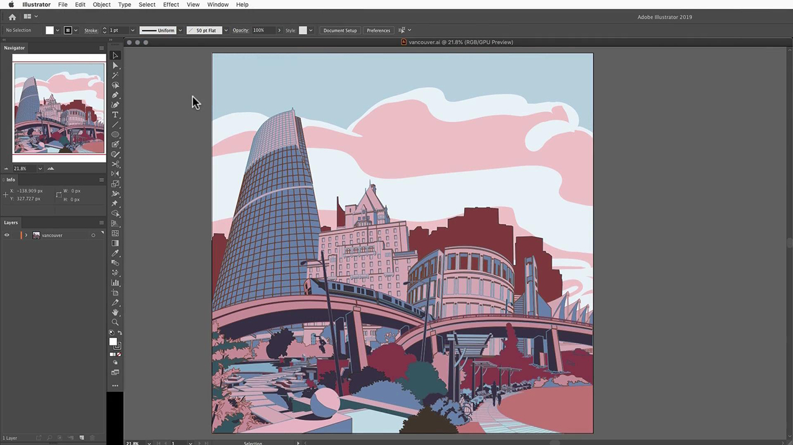
   </a>
    

   <a href="customizecolors.md"><strong>在Adobe [!DNL Stock]向量插圖中自訂顏色</strong></a>
    

    <em>為包含精美插圖的任何專案增加修飾。 在Adobe [!DNL Stock]中尋找完美向量，然後使用Adobe Illustrator</em>將顏色與您專案的調色盤相匹配
     
  </td>
</tr>
<tr>
   <td>
      
      

      <a href="assets/AddMotiontoStillImageswithAdobeStockandPhotoshop.pdf"><strong>使用Adobe [!DNL Stock]和Photoshop (PDF)將動畫新增至靜態影像</strong></a>
      

      <em>將視訊結合到靜止影像中，讓您的對象在任何熒幕上驚豔</em>
       
   </td>
   <td>
   
    

   <a href="assets/CreateacompositewithPhotoshopontheiPadandAdobeStockimages.pdf" target="_blank"><strong>在iPad和Photoshop [!DNL Stock]影像(PDF)上建立與Adobe的複合</strong></a>
    

    <em>瞭解如何在iPad上以Photoshop的強大功能，以全新的方式使用您最愛的Adobe Creative Cloud應用程式之一</em>
     
  </td>
   <td>
   
    

   在Photoshop (PDF)中將Adobe [!DNL Stock]向量插圖製作成動畫</strong></a><a href="assets/CreateaUniqueEditorialGraphicwithAfterEffectsandAdobeStock.pdf" target="_blank"><strong>
    

    <em>結合After Effects與Adobe [!DNL Stock]，您可以快速建立令人驚歎的特效，協助您以視覺化方式講述故事</em>
     
  </td>
   <td>
      <a href="assets/CreateUniqueGraphicsbyCombiningAdobeStockImages.pdf" target="_blank">
         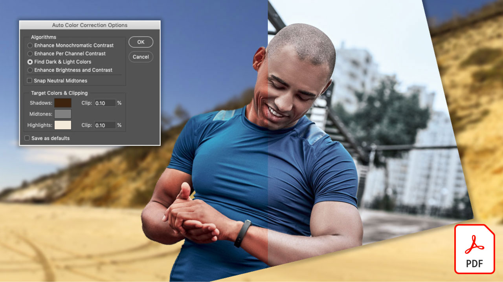
      </a>
      

      <a href="assets/CreateUniqueGraphicsbyCombiningAdobeStockImages.pdf" target="_blank"><strong>結合Adobe [!DNL Stock]影像(PDF)以建立唯一的圖形</strong></a>
      

      <em>將兩個不同的影像放在一起，為您的設計專案建立全新的場景。 Adobe [!DNL Stock]和Adobe Photoshop讓一切變得簡單</em>
       
   </td>
</tr>
<tr>
  <td>
      <a href="assets/CreatingaHalloweenCinemagraphwithPhotoshopCCandAdobeStock.pdf" target="_blank">
         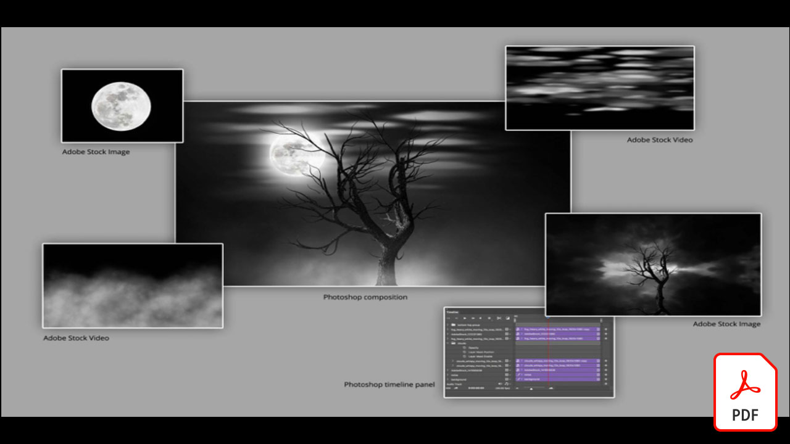
      </a>
      

      <a href="assets/CreatingaHalloweenCinemagraphwithPhotoshopCCandAdobeStock.pdf" target="_blank"><strong>使用Photoshop CC和Adobe [!DNL Stock] (PDF)建立萬聖節電影院</strong></a>
      

      <em>使用Adobe Photoshop合成影片、插圖和像片，以建立動態靜圖</em>
       
  </td>
   <td>
      <a href="assets/PutyourDatainMotionwithAdobeStockandPremierePro.pdf" target="_blank">
         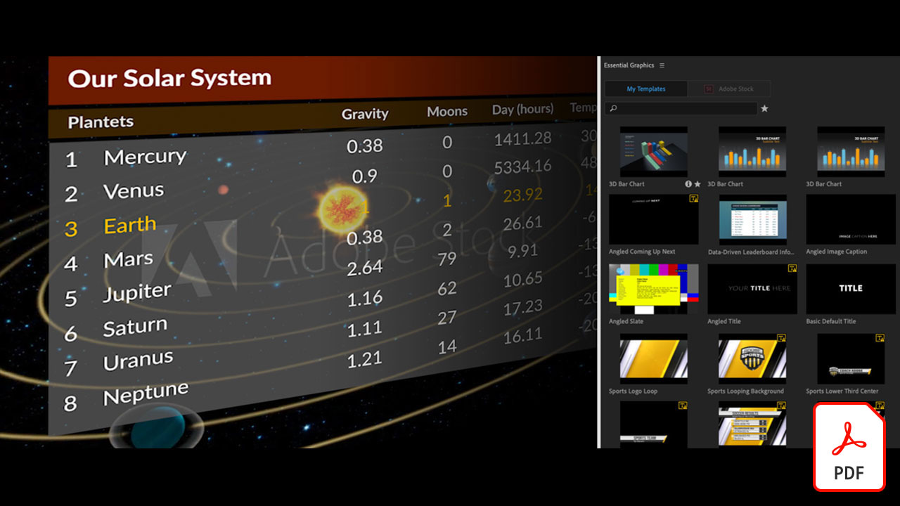
      </a>
      

      <a href="assets/PutyourDatainMotionwithAdobeStockandPremierePro.pdf" target="_blank"><strong>透過Adobe [!DNL Stock]和Premiere Pro (PDF)讓您的資料開始運作</strong></a>
      

      <em>使用Adobe [!DNL Stock]和Adobe Premiere Pro</em>，讓您的資料栩栩如生，訴說更有說服力的故事
       
  </td>
   <td>
      <a href="assets/RecolorAdobeStockVectorArtworkwithAdobeIllustratortoGetExactlytheLookYouWant.pdf" target="_blank">
         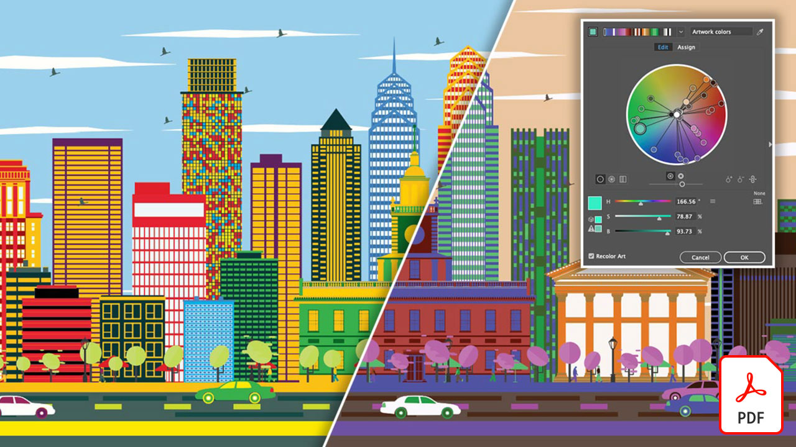
      </a>
      

      <a href="assets/RecolorAdobeStockVectorArtworkwithAdobeIllustratortoGetExactlytheLookYouWant.pdf" target="_blank"><strong>使用Adobe Illustrator重新上色Adobe [!DNL Stock]向量圖稿，以完全符合您的需求(PDF)</strong></a>
      

      <em>Adobe [!DNL Stock]可讓您輕鬆找到唯一的向量圖形，而Adobe Illustrator可讓您快速修改圖形，以符合您的創意願景</em>
       
   </td>
   <td>
      <a href="assets/ShowOffyourDesignWorkintheRealWorldwithAdobeStockandPhotoshop.pdf" target="_blank">
         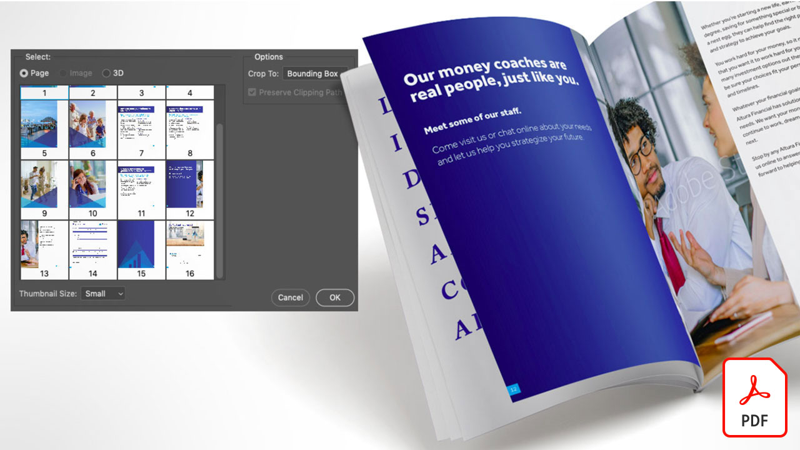
      </a>
      

      <a href="assets/ShowOffyourDesignWorkintheRealWorldwithAdobeStockandPhotoshop.pdf" target="_blank"><strong>透過Adobe [!DNL Stock]和Photoshop (PDF)在真實世界展示您的設計工作</strong></a>
      

      <em>請依照下列步驟，使用Adobe Photoshop在真實感十足的Adobe [!DNL Stock]範本中展示您的工作</em>
       
  </td>
 </tr> 
 <tr>
   <td>
      
      

      <a href="assets/UncoveramazingdetailsinAdobeStockimageswithLightroomformobile.pdf" target="_blank"><strong>使用Lightroom for mobile (PDF)在Adobe [!DNL Stock]影像中揭露令人驚豔的細節</strong></a>
      

      <em>探索行動裝置上Lightroom的強大功能，讓影像發揮最佳效果</em>
       
  </td>
  <td>
      <a href="assets/VisualizePosterDesignsintheRealWorldwithAdobeStockandPhotoshop.pdf" target="_blank">
         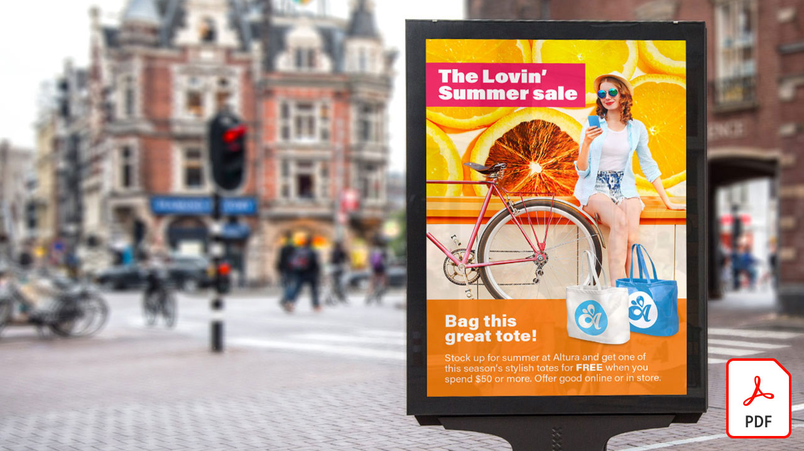
      </a>
      

      <a href="assets/VisualizePosterDesignsintheRealWorldwithAdobeStockandPhotoshop.pdf" target="_blank"><strong>使用Adobe [!DNL Stock]和Photoshop (PDF)在真實世界中視覺化海報設計</strong></a>
      

      <em>在真實環境中展示您的設計，以更清楚瞭解這些設計在世界上的外觀</em>
       
  </td>
  <td>
    
    

     
  </td>
</tr>
</table>
