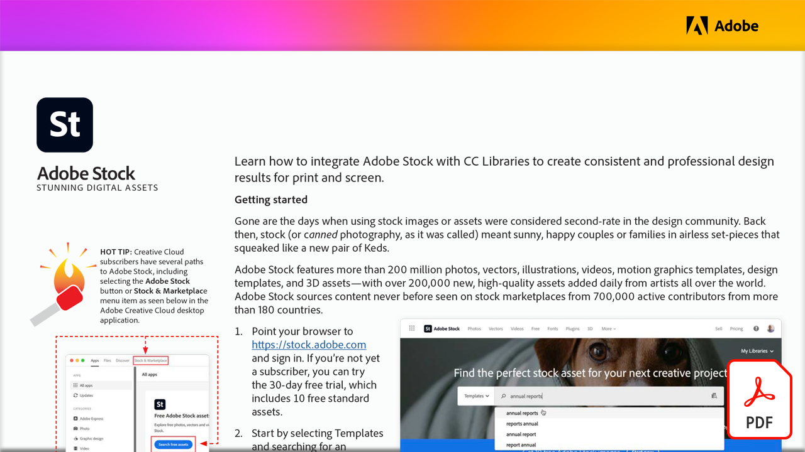

# 令人驚歎的數字資產

透過本實作教學課程，瞭解如何將Adobe Stock與CC Libraries整合，為印刷和螢幕製作一致且專業的設計成果。

選取下方的影像以檢視或下載此 PDF 教學課程。

[{“width=680”} 的第一頁影像](assets/Stunning-Digital-Assets.pdf){target="blank"}

>[!NOTE]
>
>Adobe Stock儲存至CC Libraries的資產可以無縫新增到 Microsoft PowerPoint 和 Word 中。 有關如何下載和安裝 Adobe Creative Cloud 載入宏的指示，請參閱 [這裡](https://helpx.adobe.com/tw/creative-cloud/help/libraries-addin-microsoft-office.html) 或在 Microsoft App Store 中。 此程式對於這兩個應用程式都很簡單，尤其是對於有在 Illustrator、InDesign 或 Photoshop 中使用 Adobe Stock 體驗的應用程式而言。 如需詳細資訊，請造訪 [探索 Microsoft Office 365 中的Adobe Stock整合式增效模組](https://helpx.adobe.com/tw/stock/help/microsoft-office-plug-ins.html)。
