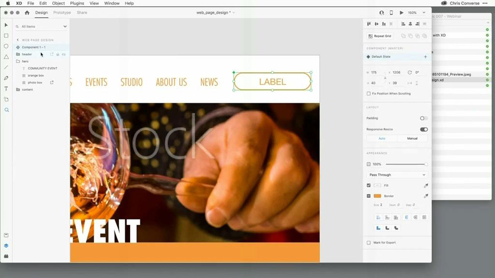
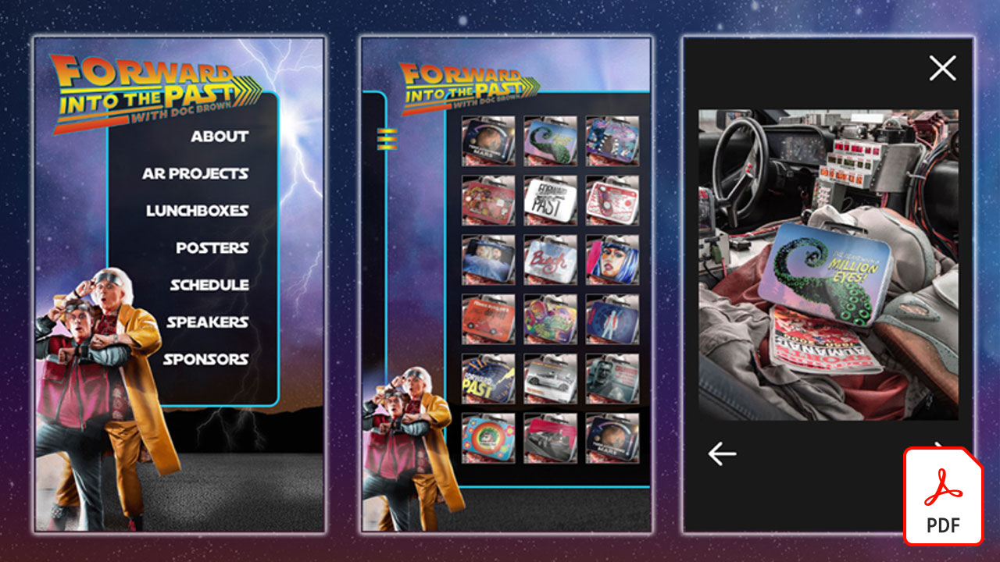
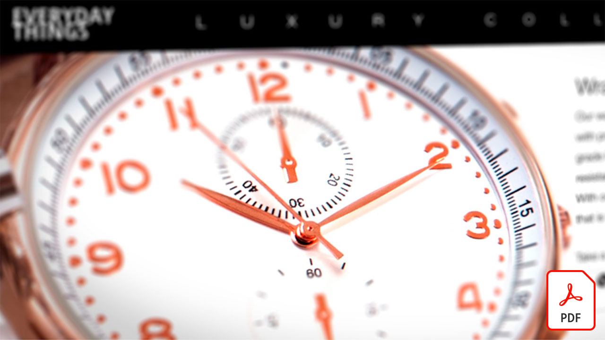
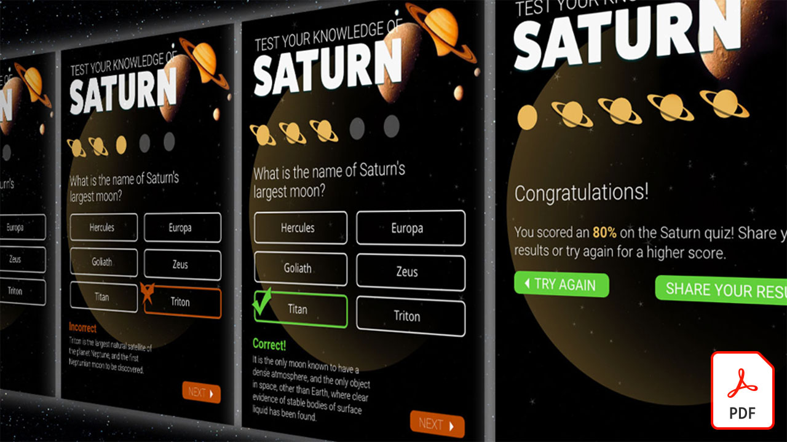
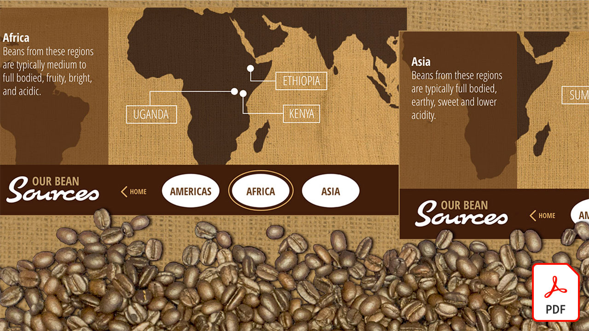
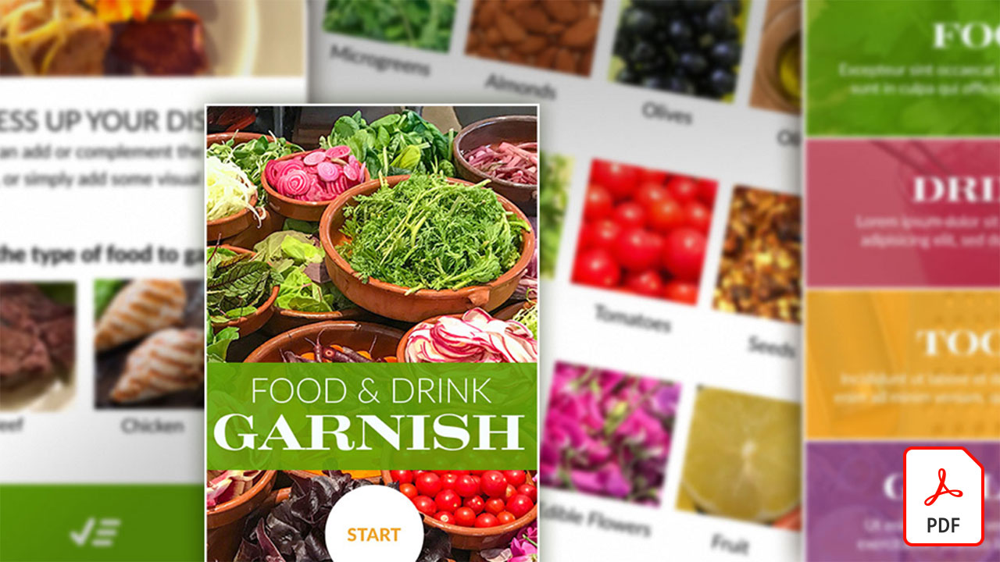
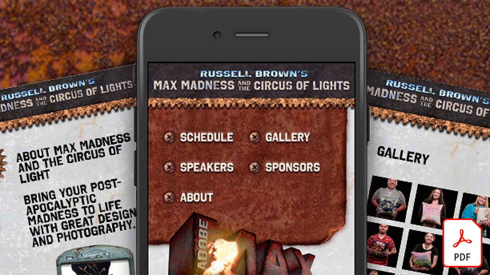
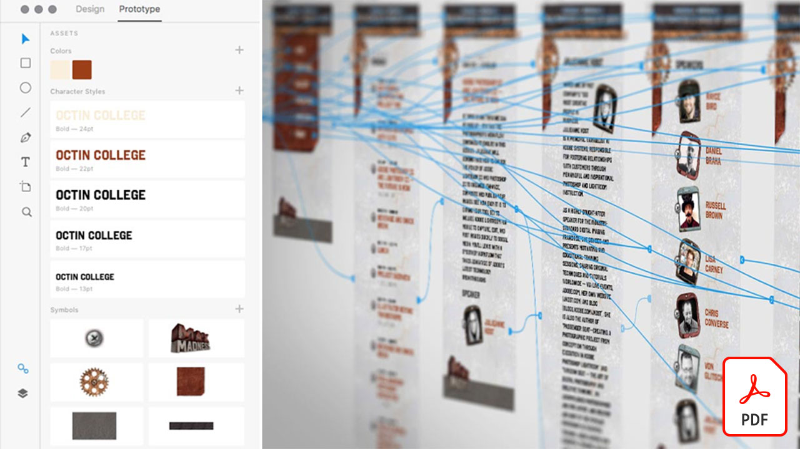
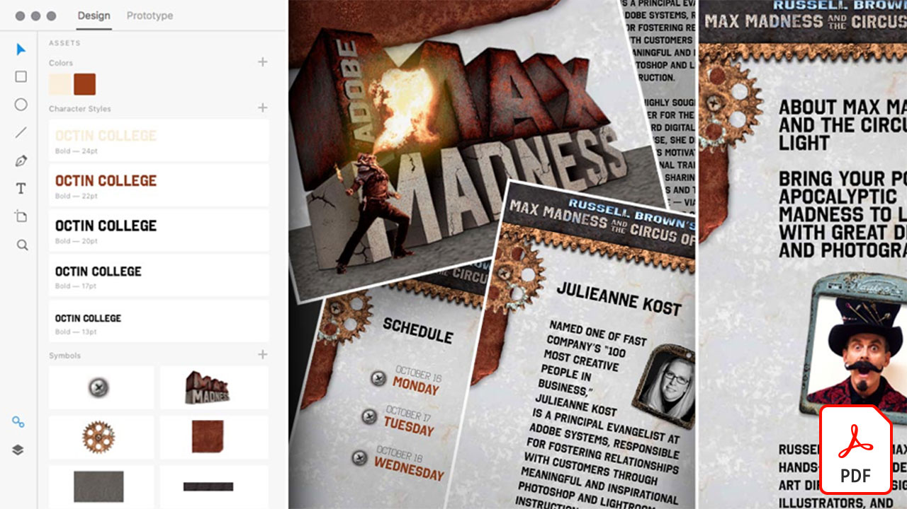

# Adobe XD教學課程

Adobe XD是使用者體驗設計和原型工具，用於設計網站、應用程式、語音介面、遊戲和其他型別的數位體驗。 選取影像以檢視教學課程。

<table>
<tr>
 <td>
   
    

   <a href="components.md"><strong>熟悉Adobe XD中的[！UICONTROL元件]</strong></a>
    

    <em>瞭解如何使用[！UICONTROL Components]，讓您在套用設計工作流程的速度和一致性時，擁有前所未有的彈性</em>
     
  </td>
  <td>
   
    

   <a href="assets/ControlMultipleXDArtboardswithNestedSymbols.pdf" target="_blank"><strong>使用巢狀符號控制多個XD工作區域(PDF)</strong></a>
    

    <em>符號是建立可重複使用之圖稿與文字的絕佳方式，可在專案中的工作區域上多次套用</em>
     
  </td>
  <td>
   
    

   <a href="assets/CreateaZoomableeCommercePhotowithXDandAdobeStock.pdf" target="_blank"><strong>使用XD和Adobe建立可縮放的電子商務像片[!DNL Stock] (PDF)</strong></a>
    

    <em>結合高解析度攝影與Adobe XD的自動製作動畫功能，讓您能夠為網站設計更吸引人的體驗</em>
     
  </td>
  <td>
   
    

   <a href="assets/CreatingaRotatingProductInterfaceforECommercewithAdobeXD.pdf" target="_blank"><strong>使用Adobe XD (PDF)建立E-Commerce的旋轉產品介面</strong></a>
    

    <em>設計介面以提供您產品的旋轉檢視，然後將您的設計轉換為互動式原型，以確切顯示體驗在網頁或行動裝置上的運作方式</em>
     
  </td>
</tr>
<tr>
  <td>
   
    

   <a href="assets/DesignandPrototypeanInteractiveQuizwithXD.pdf" target="_blank"><strong>使用XD (PDF)設計並製作互動式測驗的原型</strong></a>
    

    <em>設計使用者在專案期間會遇到的意見回饋</em>
     
  </td>
  <td>
   
    

   <a href="assets/DesignInteractiveProjectswithMicroAnimationsinXD.pdf" target="_blank"><strong>在XD (PDF)中使用微動畫設計互動式專案</strong></a>
    

    <em>瞭解如何使用Adobe XD建立設計的互動式動畫原型</em>
     
  </td>
  <td>
   
    

   從Photoshop (PSD)檔案(PDF)快速啟動您的XD專案</strong></a><a href="assets/JumpstartyourXDProjectfromaPhotoshopFile.pdf" target="_blank"><strong>
    

    <em>Adobe XD提供一些令人驚豔的互動式設計工具，可與您現有的工作流程搭配使用，讓您的互動式設計構想更上層樓</em>
     
  </td>
  <td>
   
    

   <a href="assets/MobileWebExperienceswithXD.pdf" target="_blank"><strong>使用XD (PDF)設計行動網站體驗</strong></a>
    

    <em>使用Adobe XD在幕後檢視Russell Brown MAX Madness行動網路相簿的設計程式</em>
     
  </td>
</tr>
<tr>
  <td>
   
    

   <a href="assets/PrototypeaMobileWebExperiencewithAdobeXD.pdf" target="_blank"><strong>使用Adobe XD (PDF)為行動網站體驗建立原型</strong></a>
    

    <em>體驗設計需要策略、設計和功能原型設計 — 而Adobe XD可讓您做所有工作</em>
     
  </td>
  <td>
   
    

   <a href="assets/PrototypeaMobileWebExperiencewithAdobeXD.pdf" target="_blank"><strong>使用外部文字和圖形(PDF)在XD中增加重複格線的額外負荷</strong></a>
    

    <em>結合重複格線與外部文字與圖形，以提升您的生產力</em>
     
  </td>
  <td>
   
    

   <a href="assets/BehindtheScenesofMAXMadnesswithAdobeXD.pdf" target="_blank"><strong>MAX與Adobe XD (PDF)瘋狂的幕後</strong></a>
    

    <em>提供最佳化的行動網站體驗，真能引起使用者的共鳴</em>
     
  </td>
  <td>
    
    

     
  </td>
</tr>
</table>
